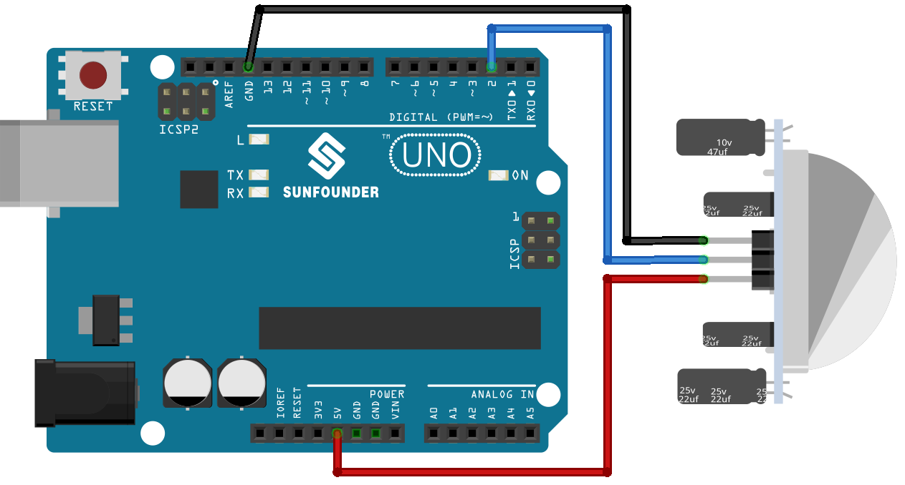

.. note:: 

    Ciao e benvenuto nella Community Facebook degli appassionati di SunFounder Raspberry Pi, Arduino ed ESP32! Approfondisci le tue conoscenze su Raspberry Pi, Arduino ed ESP32 insieme ad altri maker come te.

    **Perché unirsi?**

    - **Supporto Esperto**: Risolvi problemi post-vendita e affronta sfide tecniche grazie al supporto della nostra community e del nostro team.
    - **Impara e Condividi**: Scambia suggerimenti e tutorial per migliorare le tue competenze.
    - **Anteprime Esclusive**: Ottieni accesso anticipato agli annunci di nuovi prodotti e ad anteprime riservate.
    - **Sconti Speciali**: Approfitta di sconti esclusivi sui nostri prodotti più recenti.
    - **Promozioni Festive e Giveaway**: Partecipa a concorsi e promozioni speciali durante le festività.

    👉 Pronto a scoprire e creare con noi? Clicca su [|link_sf_facebook|] ed entra subito nel gruppo!

.. _uno_lesson12_pir_motion:

Lezione 12: Modulo Sensore di Movimento PIR (HC-SR501)
==============================================================

In questa lezione imparerai a utilizzare un sensore di movimento PIR (Passive Infrared) con Arduino Uno. Vedremo come il sensore rileva il movimento e invia un segnale ad Arduino, che a sua volta esegue una determinata azione. Questo progetto è perfetto per i principianti, in quanto offre un'esperienza pratica con ingressi digitali, comunicazione seriale e programmazione condizionale su piattaforma Arduino.

Componenti Necessari
--------------------------

Per questo progetto sono richiesti i seguenti componenti.

È sicuramente comodo acquistare un kit completo. Ecco il link:

.. list-table::
    :widths: 20 20 20
    :header-rows: 1

    *   - Nome	
        - CONTENUTO DEL KIT
        - LINK
    *   - Universal Maker Sensor Kit
        - 94
        - |link_umsk|

Puoi anche acquistare i singoli componenti separatamente dai link riportati di seguito.

.. list-table::
    :widths: 30 20
    :header-rows: 1

    *   - Descrizione del Componente
        - Link per l'acquisto

    *   - Arduino UNO R3 o R4
        - |link_Uno_R3_buy|
    *   - :ref:`cpn_pir_motion`
        - \-

Collegamenti
---------------------------

Codice
---------------------------

.. raw:: html

    <iframe src=https://create.arduino.cc/editor/sunfounder01/75947bcf-8e55-4737-b1b7-f17b4a28e775/preview?embed style="height:510px;width:100%;margin:10px 0" frameborder=0></iframe>

Analisi del Codice
---------------------------

1. Configurazione del Pin del Sensore PIR. Il pin del sensore PIR viene definito come pin 2. 

   .. code-block:: arduino

      const int pirPin = 2;
      int state = 0;

2. Inizializzazione del Sensore PIR. Nella funzione ``setup()``, il pin del sensore PIR viene impostato come ingresso. Questo consente ad Arduino di leggere lo stato del sensore.

   .. code-block:: arduino

      void setup() {
        pinMode(pirPin, INPUT);
        Serial.begin(9600);
      }

3. Lettura del Sensore PIR e Visualizzazione dei Risultati. Nella funzione ``loop()``, lo stato del sensore viene letto continuamente.

   .. code-block:: arduino

      void loop() {
        state = digitalRead(pirPin);
        if (state == HIGH) {
          Serial.println("Somebody here!");
        } else {
          Serial.println("Monitoring...");
          delay(100);
        }
      }

   Se lo stato è ``HIGH``, ovvero viene rilevato un movimento, sul monitor seriale verrà stampato "Somebody here!". In caso contrario, verrà mostrato "Monitoring...".
