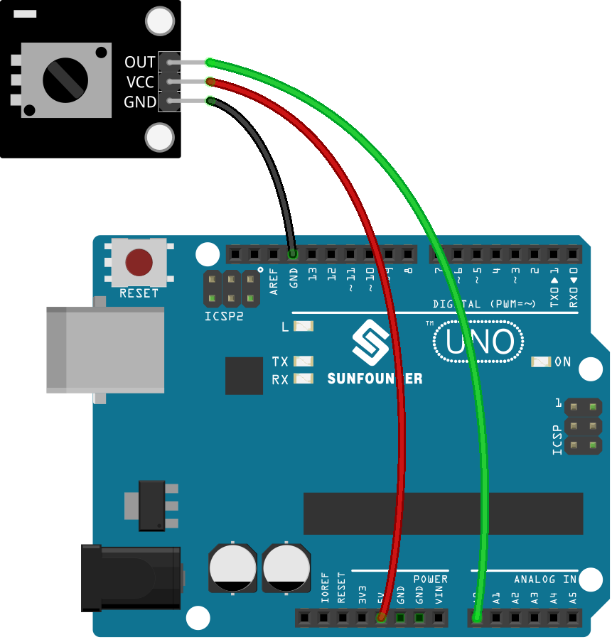

.. note:: 

    ¡Hola, bienvenido a la comunidad de entusiastas de SunFounder Raspberry Pi, Arduino y ESP32 en Facebook! Profundiza en Raspberry Pi, Arduino y ESP32 junto a otros entusiastas.

    **¿Por qué unirse?**

    - **Soporte experto**: Resuelve problemas postventa y desafíos técnicos con la ayuda de nuestra comunidad y equipo.
    - **Aprender y compartir**: Intercambia consejos y tutoriales para mejorar tus habilidades.
    - **Preestrenos exclusivos**: Accede de forma anticipada a anuncios de nuevos productos y avances.
    - **Descuentos especiales**: Disfruta de descuentos exclusivos en nuestros productos más nuevos.
    - **Promociones festivas y sorteos**: Participa en sorteos y promociones especiales.

    👉 ¿Listo para explorar y crear con nosotros? Haz clic en [|link_sf_facebook|] y únete hoy mismo!

.. _uno_lesson13_potentiometer:

Lección 13: Módulo Potenciómetro
==================================

En esta lección, aprenderás cómo leer el valor analógico de un potenciómetro con un Arduino Uno. Conectaremos el potenciómetro al pin A0 y utilizaremos el Arduino para medir su valor de 0 a 1023. Este tutorial te guiará a través de la configuración del circuito, la escritura del código para leer el sensor y la visualización de las lecturas en el monitor serial. Es un gran proyecto para principiantes, ya que ofrece una experiencia práctica con entradas analógicas y comunicación serial en la plataforma Arduino.

Componentes necesarios
--------------------------

En este proyecto, necesitamos los siguientes componentes.

Es definitivamente conveniente comprar un kit completo, aquí está el enlace:

.. list-table::
    :widths: 20 20 20
    :header-rows: 1

    *   - Nombre
        - ARTÍCULOS EN ESTE KIT
        - ENLACE
    *   - Kit de Sensores Universal Maker
        - 94
        - |link_umsk|

También puedes comprarlos por separado desde los enlaces a continuación.

.. list-table::
    :widths: 30 20
    :header-rows: 1

    *   - Introducción del componente
        - Enlace de compra

    *   - Arduino UNO R3 o R4
        - |link_Uno_R3_buy|
    *   - :ref:`cpn_potentiometer`
        - |link_potentiometer_sensor_module_buy|

Cableado
---------------------------

Código
---------------------------

.. raw:: html

    <iframe src=https://create.arduino.cc/editor/sunfounder01/ce0f8eac-f28f-4168-be2c-bcaabb1b4c78/preview?embed style="height:510px;width:100%;margin:10px 0" frameborder=0></iframe>

Análisis del Código
---------------------------

#. Esta línea de código define el número de pin al que se conecta el potenciómetro en la placa Arduino.

   .. code-block:: arduino

      const int sensorPin = A0;

#. La función ``setup()`` es una función especial en Arduino que se ejecuta solo una vez cuando el Arduino se enciende o reinicia. En este proyecto, el comando ``Serial.begin(9600)`` inicia la comunicación serial a una velocidad de 9600 baudios.

   .. code-block:: arduino

      void setup() {
        Serial.begin(9600);  
      }

#. La función ``loop()`` es la función principal en la que el programa se ejecuta repetidamente. En esta función, la función ``analogRead()`` lee el valor analógico del potenciómetro e imprime el valor en el monitor serial utilizando ``Serial.println()``. El comando ``delay(50)`` hace que el programa espere 50 milisegundos antes de realizar la siguiente lectura.

   .. code-block:: arduino

      void loop() {
        Serial.println(analogRead(sensorPin));  
        delay(50);
      }
