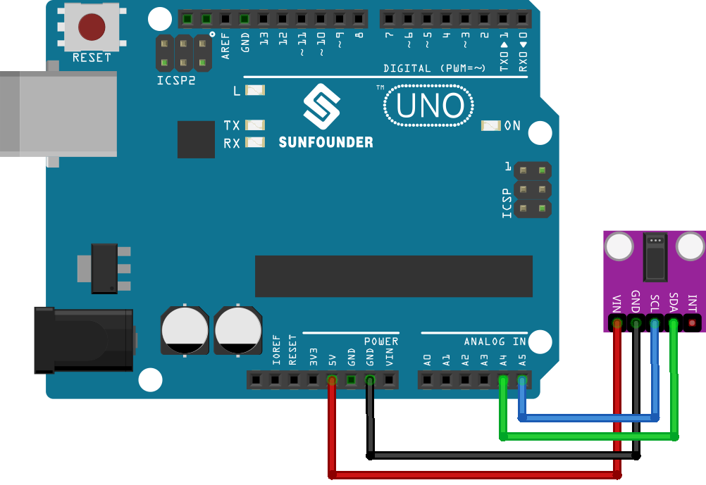

.. note:: 

    Ciao e benvenuto nella Community Facebook degli appassionati di SunFounder Raspberry Pi, Arduino ed ESP32! Approfondisci le tue competenze su Raspberry Pi, Arduino ed ESP32 insieme ad altri maker come te.

    **Perché unirsi?**

    - **Supporto Esperto**: Risolvi problemi post-vendita e affronta sfide tecniche con il supporto della nostra community e del nostro team.
    - **Impara e Condividi**: Scambia suggerimenti e tutorial per migliorare le tue competenze.
    - **Anteprime Esclusive**: Ottieni accesso anticipato ad annunci di nuovi prodotti e contenuti esclusivi.
    - **Sconti Speciali**: Approfitta di sconti esclusivi sui nostri prodotti più recenti.
    - **Promozioni Festive e Giveaway**: Partecipa a promozioni e concorsi a premi durante le festività.

    👉 Pronto a scoprire e creare con noi? Clicca su [|link_sf_facebook|] ed entra subito a far parte del gruppo!

.. _uno_lesson14_max30102:

Lezione 14: Modulo Sensore di Frequenza Cardiaca e Ossimetria (MAX30102)
===========================================================================

In questa lezione imparerai a misurare la frequenza cardiaca utilizzando un sensore MAX30102 con Arduino Uno. Vedremo come configurare il sensore, leggere i valori a infrarossi, calcolare i BPM e calcolare la media delle letture nel tempo. Questo progetto è perfetto per chi è interessato al monitoraggio della salute tramite Arduino, combinando interfacciamento hardware e logica software.

.. warning:: 
    Questo progetto rileva la frequenza cardiaca tramite un metodo ottico. Questo tipo di rilevamento è delicato e può restituire valori imprecisi. Pertanto, **NON** utilizzarlo per diagnosi mediche reali.

Componenti Necessari
---------------------------

Per questo progetto sono necessari i seguenti componenti.

È sicuramente comodo acquistare un kit completo. Ecco il link:

.. list-table::
    :widths: 20 20 20
    :header-rows: 1

    *   - Nome	
        - CONTENUTO DEL KIT
        - LINK
    *   - Universal Maker Sensor Kit
        - 94
        - |link_umsk|

Puoi anche acquistare i componenti singolarmente tramite i link sottostanti.

.. list-table::
    :widths: 30 10
    :header-rows: 1

    *   - Descrizione del Componente
        - Link per l'acquisto

    *   - Arduino UNO R3 o R4
        - |link_Uno_R3_buy|
    *   - :ref:`cpn_max30102`
        - |link_max30102_module_buy|

Collegamenti
---------------------------

Codice
---------------------------

.. note:: 
   Per installare la libreria, apri il Library Manager di Arduino, cerca **"SparkFun MAX3010x"** e installala.

.. raw:: html

    <iframe src=https://create.arduino.cc/editor/sunfounder01/448258fd-5114-4b94-b3fc-9c2fcc308899/preview?embed style="height:510px;width:100%;margin:10px 0" frameborder=0></iframe>

Analisi del Codice
---------------------------

1. **Inclusione delle Librerie e Inizializzazione delle Variabili Globali**:

   Vengono importate le librerie necessarie, viene creato l’oggetto sensore e inizializzate le variabili globali per la gestione dei dati.

   .. note:: 
      Per installare la libreria, apri il Library Manager di Arduino, cerca **"SparkFun MAX3010x"** e installala.

   .. code-block:: arduino

      #include <Wire.h>
      #include "MAX30105.h"
      #include "heartRate.h"
      MAX30105 particleSensor;
      // ... (altre variabili globali)

2. **Funzione Setup e Inizializzazione del Sensore**:

   La comunicazione seriale viene inizializzata a 9600 baud. Viene verificata la connessione del sensore e, se correttamente rilevato, si procede con l’inizializzazione. In caso contrario, viene mostrato un messaggio di errore.

   .. code-block:: arduino

      void setup() {
        Serial.begin(9600);
        if (!particleSensor.begin(Wire, I2C_SPEED_FAST)) {
          Serial.println("MAX30102 not found.");
          while (1) ;  // Loop infinito se il sensore non viene rilevato
        }
        // ... (altre configurazioni)
      }

3. **Lettura del Valore IR e Rilevamento del Battito Cardiaco**:

   Viene letto il valore a infrarossi, che rappresenta il flusso sanguigno. La funzione ``checkForBeat()`` valuta se è stato rilevato un battito.

   .. code-block:: arduino

      long irValue = particleSensor.getIR();
      if (checkForBeat(irValue) == true) {
          // ... (azioni in caso di battito rilevato)
      }

4. **Calcolo dei Battiti al Minuto (BPM)**:

   Quando viene rilevato un battito, i BPM vengono calcolati sulla base del tempo trascorso dall'ultimo battito rilevato. Il codice assicura che il valore sia entro un intervallo realistico prima di aggiornare la media.

   .. code-block:: arduino

      long delta = millis() - lastBeat;
      beatsPerMinute = 60 / (delta / 1000.0);
      if (beatsPerMinute < 255 && beatsPerMinute > 20) {
          // ... (salva e aggiorna la media BPM)
      }

5. **Stampa dei Valori sul Monitor Seriale**:

   I valori IR, BPM corrente e BPM medio vengono stampati sul Monitor Seriale. Inoltre, se il valore IR è troppo basso, il sistema presume che il dito non sia presente sul sensore.

   .. code-block:: arduino

      // Stampa IR, BPM attuale e BPM medio sul monitor seriale
      Serial.print("IR=");
      Serial.print(irValue);
      Serial.print(", BPM=");
      Serial.print(beatsPerMinute);
      Serial.print(", Avg BPM=");
      Serial.print(beatAvg);

      if (irValue < 50000)
        Serial.print(" No finger?");