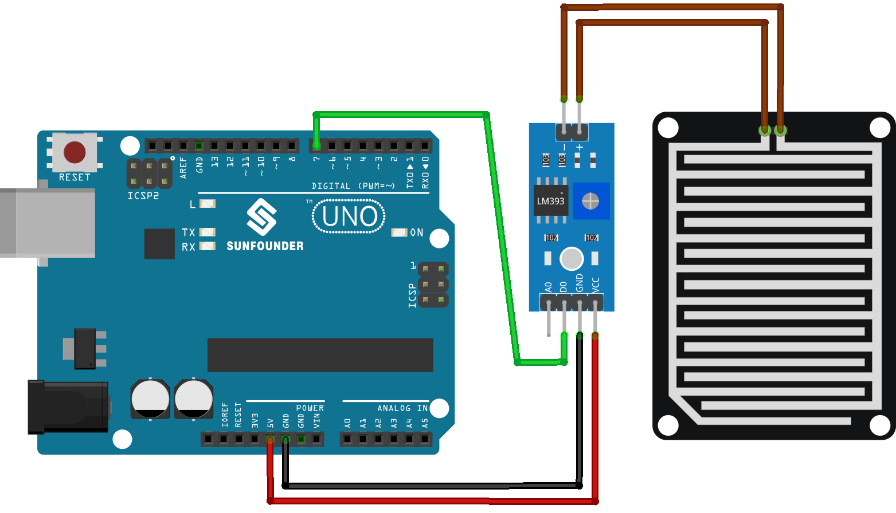

.. note::

    Bonjour, bienvenue dans la communauté des passionnés de SunFounder Raspberry Pi, Arduino et ESP32 sur Facebook ! Plongez plus profondément dans l'univers de Raspberry Pi, Arduino et ESP32 avec d'autres passionnés.

    **Pourquoi rejoindre ?**

    - **Support d'expert** : Résolvez les problèmes après-vente et les défis techniques avec l'aide de notre communauté et de notre équipe.
    - **Apprendre et partager** : Échangez des astuces et des tutoriels pour améliorer vos compétences.
    - **Aperçus exclusifs** : Obtenez un accès anticipé aux annonces de nouveaux produits et aux aperçus exclusifs.
    - **Réductions spéciales** : Profitez de réductions exclusives sur nos nouveaux produits.
    - **Promotions festives et cadeaux** : Participez à des cadeaux et promotions de fêtes.

    👉 Prêts à explorer et à créer avec nous ? Cliquez sur [|link_sf_facebook|] et rejoignez-nous aujourd'hui !

.. _uno_lesson15_raindrop:

Leçon 15 : Module de Détection de Pluie
===========================================

Dans cette leçon, vous apprendrez à utiliser un Module Capteur de Détection de Pluie avec un Arduino. Nous verrons comment le capteur détecte la pluie en mesurant les changements de résistance causés par les gouttes de pluie qui complètent des circuits sur sa surface nickelée.

Composants nécessaires
--------------------------

Pour ce projet, nous avons besoin des composants suivants.

Il est définitivement pratique d'acheter un kit complet, voici le lien :

.. list-table::
    :widths: 20 20 20
    :header-rows: 1

    *   - Nom	
        - ÉLÉMENTS DE CE KIT
        - LIEN
    *   - Kit capteur universel pour bricoleurs
        - 94
        - |link_umsk|

Vous pouvez également les acheter séparément via les liens ci-dessous.

.. list-table::
    :widths: 30 20
    :header-rows: 1

    *   - Introduction au composant
        - Lien d'achat

    *   - Arduino UNO R3 ou R4
        - |link_Uno_R3_buy|
    *   - :ref:`cpn_raindrop`
        - |link_raindrop_sensor_module_buy|

Câblage
---------------------------

Code
---------------------------

.. raw:: html

    <iframe src=https://create.arduino.cc/editor/sunfounder01/856a64c8-ecb6-455e-97e6-186cb8d159ea/preview?embed style="height:510px;width:100%;margin:10px 0" frameborder=0></iframe>

Analyse du code
---------------------------

1. Définition de la broche du capteur

   Ici, un entier constant nommé ``sensorPin`` est défini et attribué à la valeur 7. Cela correspond à la broche numérique sur la carte Arduino où le capteur de détection de gouttes de pluie est connecté.

   .. code-block:: arduino
   
       const int sensorPin = 7;

2. Configuration du mode de la broche et initiation de la communication série.

   Dans la fonction ``setup()``, deux étapes essentielles sont effectuées. Premièrement, ``pinMode()`` est utilisé pour définir ``sensorPin`` comme une entrée, ce qui nous permet de lire les valeurs numériques du capteur de pluie. Deuxièmement, la communication série est initiée avec un débit en baud de 9600.

   .. code-block:: arduino
   
       void setup() {
         pinMode(sensorPin, INPUT);
         Serial.begin(9600);
       }

3. Lecture de la valeur numérique et envoi à l'écran du moniteur série.

   La fonction ``loop()`` lit la valeur numérique du capteur de pluie à l'aide de ``digitalRead()``. Cette valeur (soit HIGH soit LOW) est imprimée sur le moniteur série. Lorsque des gouttes de pluie sont détectées, le moniteur série affichera 0 ; lorsqu'aucune goutte de pluie n'est détectée, il affichera 1. Le programme attend ensuite 50 millisecondes avant la prochaine lecture.

   .. code-block:: arduino
   
       void loop() {
         Serial.println(digitalRead(sensorPin));
         delay(50);
       }
