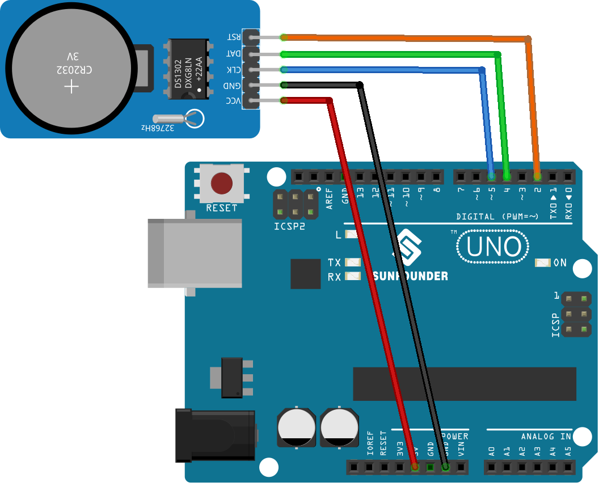

.. note:: 

    ¡Hola, bienvenido a la comunidad de entusiastas de SunFounder Raspberry Pi, Arduino y ESP32 en Facebook! Profundiza en Raspberry Pi, Arduino y ESP32 junto a otros entusiastas.

    **¿Por qué unirse?**

    - **Soporte experto**: Resuelve problemas postventa y desafíos técnicos con la ayuda de nuestra comunidad y equipo.
    - **Aprender y compartir**: Intercambia consejos y tutoriales para mejorar tus habilidades.
    - **Preestrenos exclusivos**: Accede de forma anticipada a anuncios de nuevos productos y avances.
    - **Descuentos especiales**: Disfruta de descuentos exclusivos en nuestros productos más nuevos.
    - **Promociones festivas y sorteos**: Participa en sorteos y promociones especiales.

    👉 ¿Listo para explorar y crear con nosotros? Haz clic en [|link_sf_facebook|] y únete hoy mismo!

.. _uno_lesson16_ds1306:

Lección 16: Módulo de Reloj en Tiempo Real (DS1302)
=====================================================

En esta lección, aprenderás cómo configurar y utilizar un módulo de Reloj en Tiempo Real (RTC) con un Arduino. Veremos cómo inicializar el módulo RTC DS1302, mostrar la fecha y hora actuales en el monitor serial y garantizar una medición precisa del tiempo. Esta sesión es ideal para quienes estén interesados en operaciones basadas en el tiempo en sistemas embebidos, ofreciendo una experiencia práctica en la gestión de configuraciones de fecha y hora, el uso de bibliotecas RTC y la solución de problemas comunes. Este proyecto es adecuado para aprendices intermedios familiarizados con los fundamentos de Arduino.

Componentes necesarios
--------------------------

En este proyecto, necesitamos los siguientes componentes.

Es definitivamente conveniente comprar un kit completo, aquí está el enlace:

.. list-table::
    :widths: 20 20 20
    :header-rows: 1

    *   - Nombre
        - ARTÍCULOS EN ESTE KIT
        - ENLACE
    *   - Kit de Sensores Universal Maker
        - 94
        - |link_umsk|

También puedes comprarlos por separado desde los enlaces a continuación.

.. list-table::
    :widths: 30 20
    :header-rows: 1

    *   - Introducción del componente
        - Enlace de compra

    *   - Arduino UNO R3 o R4
        - |link_Uno_R3_buy|
    *   - :ref:`cpn_rtc_ds1302`
        - |link_ds1302_module_buy|

Cableado
---------------------------

Código
---------------------------

.. note:: 
   Para instalar la biblioteca, utiliza el Administrador de Bibliotecas de Arduino y busca **"Rtc by Makuna"** para instalarla.

.. raw:: html

    <iframe src=https://create.arduino.cc/editor/sunfounder01/9b509afa-545f-4fb6-b8f0-0d87b7cf4992/preview?embed style="height:510px;width:100%;margin:10px 0" frameborder=0></iframe>

Análisis del Código
---------------------------

1. **Inicialización e Inclusión de Bibliotecas**:

   .. note:: 
      Para instalar la biblioteca, utiliza el Administrador de Bibliotecas de Arduino y busca **"Rtc by Makuna"** para instalarla.

   Aquí, se incluyen las bibliotecas necesarias para el módulo RTC DS1302.

   .. code-block:: arduino
    
      #include <ThreeWire.h>
      #include <RtcDS1302.h>
   
2. **Definir pines y Crear Instancia del RTC**:

   Se definen los pines para la comunicación y se crea una instancia del RTC.

   .. code-block:: arduino

      const int IO = 4;    // DAT
      const int SCLK = 5;  // CLK
      const int CE = 2;    // RST

      ThreeWire myWire(4, 5, 2);  // IO, SCLK, CE
      RtcDS1302<ThreeWire> Rtc(myWire);

3. Función ``setup()``:

   Esta función inicializa la comunicación serial y configura el módulo RTC. Se realizan varias comprobaciones para asegurarse de que el RTC funcione correctamente.

   .. code-block:: arduino

      void setup() {
        Serial.begin(9600);
      
        Serial.print("compiled: ");
        Serial.print(__DATE__);
        Serial.println(__TIME__);
      
        Rtc.Begin();
      
        RtcDateTime compiled = RtcDateTime(__DATE__, __TIME__);
        printDateTime(compiled);
        Serial.println();
      
        if (!Rtc.IsDateTimeValid()) {
          // Causas comunes:
          //    1) primera vez que se ejecuta y el dispositivo aún no estaba funcionando
          //    2) la batería del dispositivo está baja o incluso falta
      
          Serial.println("RTC lost confidence in the DateTime!");
          Rtc.SetDateTime(compiled);
        }
      
        if (Rtc.GetIsWriteProtected()) {
          Serial.println("RTC was write protected, enabling writing now");
          Rtc.SetIsWriteProtected(false);
        }
      
        if (!Rtc.GetIsRunning()) {
          Serial.println("RTC was not actively running, starting now");
          Rtc.SetIsRunning(true);
        }
      
        RtcDateTime now = Rtc.GetDateTime();
        if (now < compiled) {
          Serial.println("RTC is older than compile time!  (Updating DateTime)");
          Rtc.SetDateTime(compiled);
        } else if (now > compiled) {
          Serial.println("RTC is newer than compile time. (this is expected)");
        } else if (now == compiled) {
          Serial.println("RTC is the same as compile time! (not expected but all is fine)");
        }
      }

4. Función ``loop()``:

   Esta función obtiene periódicamente la fecha y hora actuales del RTC y las imprime en el monitor serial. También comprueba si el RTC sigue manteniendo una fecha y hora válidas.

   .. code-block:: arduino

      void loop() {
        RtcDateTime now = Rtc.GetDateTime();
      
        printDateTime(now);
        Serial.println();
      
        if (!now.IsValid()) {
          // Causas comunes:
          //    1) la batería del dispositivo está baja o incluso falta y la línea de alimentación fue desconectada
          Serial.println("RTC lost confidence in the DateTime!");
        }
      
        delay(5000);  // cinco segundos
      }

5. Función de Impresión de Fecha y Hora:

   Una función auxiliar que toma un objeto ``RtcDateTime`` e imprime la fecha y hora formateadas en el monitor serial.

   .. code-block:: arduino

      void printDateTime(const RtcDateTime& dt) {
        char datestring[20];
      
        snprintf_P(datestring,
                   countof(datestring),
                   PSTR("%02u/%02u/%04u %02u:%02u:%02u"),
                   dt.Month(),
                   dt.Day(),
                   dt.Year(),
                   dt.Hour(),
                   dt.Minute(),
                   dt.Second());
        Serial.print(datestring);
      }