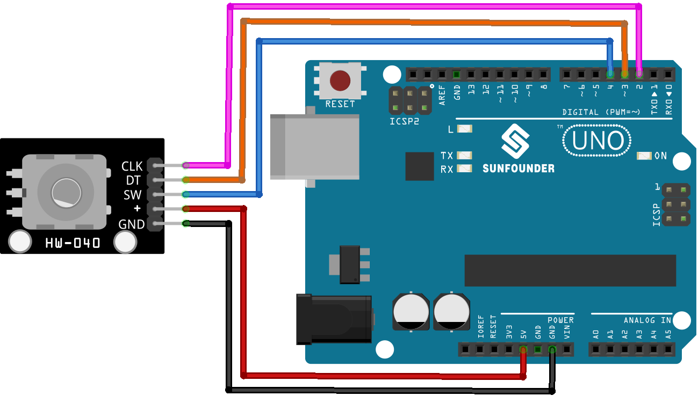

.. note::

    Bonjour, bienvenue dans la communauté des passionnés de SunFounder Raspberry Pi, Arduino et ESP32 sur Facebook ! Plongez plus profondément dans l'univers du Raspberry Pi, Arduino, et ESP32 avec d'autres passionnés.

    **Pourquoi rejoindre ?**

    - **Support d'expert** : Résolvez les problèmes après-vente et les défis techniques avec l'aide de notre communauté et de notre équipe.
    - **Apprendre et partager** : Échangez des astuces et des tutoriels pour améliorer vos compétences.
    - **Aperçus exclusifs** : Accédez en avant-première aux annonces de nouveaux produits.
    - **Réductions spéciales** : Profitez de réductions exclusives sur nos nouveaux produits.
    - **Promotions festives et cadeaux** : Participez à des tirages au sort et à des promotions de fêtes.

    👉 Prêt à explorer et créer avec nous ? Cliquez sur [|link_sf_facebook|] et rejoignez-nous aujourd'hui !

.. _uno_lesson17_rotary_encoder:

Leçon 17 : Module encodeur rotatif
=====================================

Dans cette leçon, vous apprendrez à surveiller et contrôler un encodeur rotatif avec un Arduino Uno. Nous couvrirons le suivi de la direction de rotation (dans le sens des aiguilles d'une montre ou dans le sens inverse), le comptage des rotations, et la détection des pressions sur le bouton du module d'encodeur. Ce projet est idéal pour ceux qui cherchent à approfondir leur compréhension des encodeurs rotatifs et des opérations d'entrée/sortie sur Arduino, offrant un aperçu pratique des systèmes de contrôle physique.

Composants nécessaires
---------------------------

Pour ce projet, nous avons besoin des composants suivants.

Il est certainement pratique d'acheter un kit complet, voici le lien :

.. list-table::
    :widths: 20 20 20
    :header-rows: 1

    *   - Nom	
        - ARTICLES DE CE KIT
        - LIEN
    *   - Kit capteur universel pour bricoleurs
        - 94
        - |link_umsk|

Vous pouvez également les acheter séparément via les liens ci-dessous.

.. list-table::
    :widths: 30 20
    :header-rows: 1

    *   - Introduction du composant
        - Lien d'achat

    *   - Arduino UNO R3 ou R4
        - |link_Uno_R3_buy|
    *   - :ref:`cpn_rotary_encoder`
        - \-

* Arduino UNO R3 or R4
* :ref:`cpn_rotary_encoder`

Câblage
---------------------------

Code
---------------------------

.. raw:: html

    <iframe src=https://create.arduino.cc/editor/sunfounder01/d72d6a5f-72c7-4f94-ad4e-f7dc83b127de/preview?embed style="height:510px;width:100%;margin:10px 0" frameborder=0></iframe>

Analyse du code
---------------------------

1. **Configuration et initialisation**

   .. code-block:: arduino

      void setup() {
        pinMode(CLK, INPUT);
        pinMode(DT, INPUT);
        pinMode(SW, INPUT_PULLUP);
        Serial.begin(9600);
        lastStateCLK = digitalRead(CLK);
      }

   Dans la fonction setup, les broches numériques connectées aux CLK et DT de l'encodeur sont configurées en entrées. La broche SW, connectée au bouton, est configurée en entrée avec une résistance de tirage interne. Cette configuration évite la nécessité d'une résistance de tirage externe. La communication série est démarrée à un débit de 9600 bauds pour permettre la visualisation des données sur le moniteur série. L'état initial de la broche CLK est lu et stocké.

2. **Boucle principale : Lecture de l'état de l'encodeur et du bouton**

   .. code-block:: arduino

      void loop() {
        currentStateCLK = digitalRead(CLK);
        if (currentStateCLK != lastStateCLK && currentStateCLK == 1) {
          if (digitalRead(DT) != currentStateCLK) {
            counter--;
            currentDir = "CCW";
          } else {
            counter++;
            currentDir = "CW";
          }
          Serial.print("Direction: ");
          Serial.print(currentDir);
          Serial.print(" | Counter: ");
          Serial.println(counter);
        }
        lastStateCLK = currentStateCLK;
        int btnState = digitalRead(SW);
        if (btnState == LOW) {
          if (millis() - lastButtonPress > 50) {
            Serial.println("Button pressed!");
          }
          lastButtonPress = millis();
        }
        delay(1);
      }

   Dans la fonction loop, le programme lit continuellement l'état actuel de la broche CLK. Si un changement d'état est détecté, cela implique une rotation. La direction de rotation est déterminée en comparant les états des broches CLK et DT. Si elles sont différentes, cela indique une rotation dans le sens antihoraire (CCW) ; sinon, c'est dans le sens horaire (CW). Le compteur de l'encodeur est incrémenté ou décrémenté en conséquence. Ces informations sont ensuite envoyées au moniteur série.

   L'état du bouton est lu à partir de la broche SW. Si elle est en position BASSE (pressée), un mécanisme d'anti-rebond est mis en place en vérifiant le temps écoulé depuis la dernière pression du bouton. Si plus de 50 millisecondes se sont écoulées, cela est considéré comme une pression valide, et un message est envoyé au moniteur série. Le `delay(1)` à la fin aide à l'anti-rebond.
