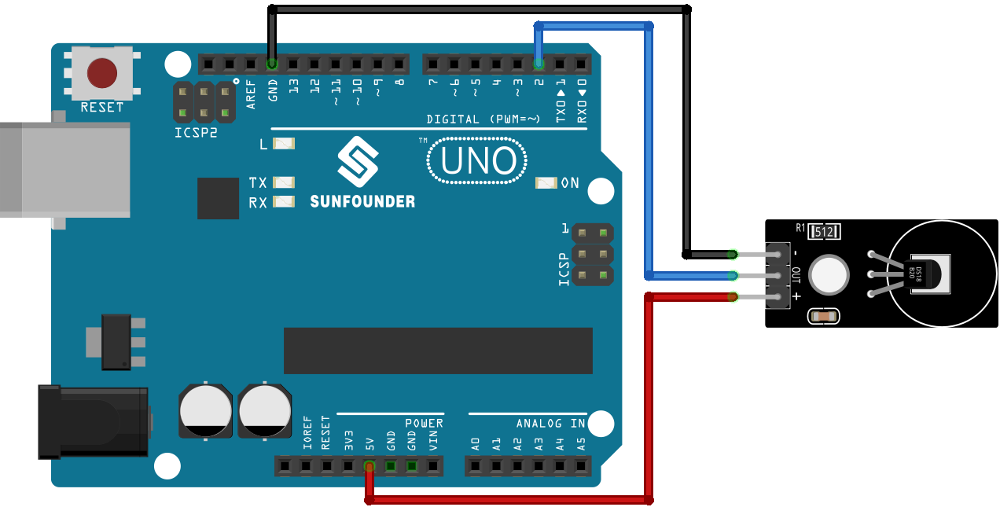

.. note::

    Bonjour, bienvenue dans la communauté des passionnés de SunFounder Raspberry Pi, Arduino et ESP32 sur Facebook ! Plongez plus profondément dans l'univers du Raspberry Pi, Arduino, et ESP32 avec d'autres passionnés.

    **Pourquoi rejoindre ?**

    - **Support d'expert** : Résolvez les problèmes après-vente et les défis techniques avec l'aide de notre communauté et de notre équipe.
    - **Apprendre et partager** : Échangez des astuces et des tutoriels pour améliorer vos compétences.
    - **Aperçus exclusifs** : Accédez en avant-première aux annonces de nouveaux produits.
    - **Réductions spéciales** : Profitez de réductions exclusives sur nos nouveaux produits.
    - **Promotions festives et cadeaux** : Participez à des tirages au sort et à des promotions de fêtes.

    👉 Prêts à explorer et créer avec nous ? Cliquez sur [|link_sf_facebook|] et rejoignez-nous aujourd'hui !

.. _uno_lesson18_ds18b20:

Leçon 18 : Module de capteur de température (DS18B20)
========================================================

Dans cette leçon, vous apprendrez à lire les données de température d'un capteur DS18B20 en utilisant un Arduino. Nous couvrirons l'utilisation de la bibliothèque DallasTemperature pour communiquer avec le capteur et afficher les lectures en Celsius et en Fahrenheit sur le moniteur série. Ce projet est idéal pour les débutants sur Arduino, offrant une expérience pratique avec les capteurs de température et le traitement des données.

Composants nécessaires
--------------------------

Pour ce projet, nous avons besoin des composants suivants. 

Il est vraiment pratique d'acheter un kit complet, voici le lien : 

.. list-table::
    :widths: 20 20 20
    :header-rows: 1

    *   - Nom	
        - ARTICLES DE CE KIT
        - LIEN
    *   - Kit capteur universel pour bricoleurs
        - 94
        - |link_umsk|

Vous pouvez également les acheter séparément via les liens ci-dessous.

.. list-table::
    :widths: 30 20
    :header-rows: 1

    *   - Introduction du composant
        - Lien d'achat

    *   - Arduino UNO R3 ou R4
        - |link_Uno_R3_buy|
    *   - :ref:`cpn_ds18b20`
        - \-

Câblage
---------------------------

Code
---------------------------

.. note:: 
   Pour installer la bibliothèque, utilisez le gestionnaire de bibliothèques Arduino et recherchez **"DallasTemperature"** puis installez-la.

.. raw:: html

    <iframe src=https://create.arduino.cc/editor/sunfounder01/7619d902-81b3-4faa-bdf4-29b4429ccd54/preview?embed style="height:510px;width:100%;margin:10px 0" frameborder=0></iframe>

Analyse du code
---------------------------

1. Inclusion des bibliothèques

   Inclut les bibliothèques OneWire et DallasTemperature pour communiquer avec le capteur DS18B20.

   .. note:: 
      Pour installer la bibliothèque, utilisez le gestionnaire de bibliothèques Arduino et recherchez **"DallasTemperature"** et installez-la.

   .. code-block:: arduino

      #include <OneWire.h>
      #include <DallasTemperature.h>

2. Définition du pin du capteur

   Le DS18B20 est connecté au pin numérique 2 de l'Arduino.

   .. code-block:: arduino

      #define ONE_WIRE_BUS 2

3. Initialisation du capteur

   Crée une instance de OneWire et un objet DallasTemperature, puis les initialise.

   .. code-block:: arduino

      OneWire oneWire(ONE_WIRE_BUS);	
      DallasTemperature sensors(&oneWire);

4. Fonction setup

   Initialise le capteur et configure la communication série.

   .. code-block:: arduino

      void setup(void)
      {
         sensors.begin();	// Démarrage de la bibliothèque
         Serial.begin(9600);
      }

5. Boucle principale

   Demande les lectures de température et les affiche en Celsius et Fahrenheit.

   .. code-block:: arduino

      void loop(void)
      { 
         sensors.requestTemperatures();
         Serial.print("Temperature: ");
         Serial.print(sensors.getTempCByIndex(0));
         Serial.print("℃ | ");
         Serial.print((sensors.getTempCByIndex(0) * 9.0) / 5.0 + 32.0);
         Serial.println("℉");
         delay(500);
      }