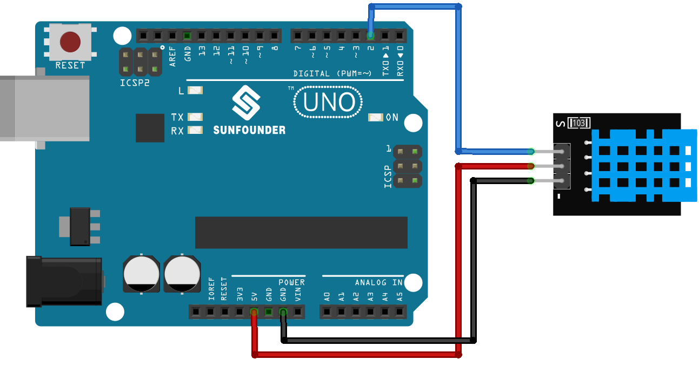
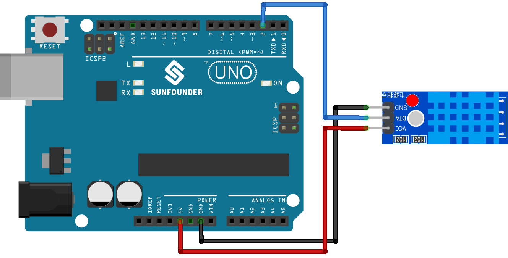

.. note:: 

    Ciao e benvenuto nella Community Facebook degli appassionati di SunFounder Raspberry Pi, Arduino ed ESP32! Approfondisci le tue competenze su Raspberry Pi, Arduino ed ESP32 insieme ad altri maker come te.

    **Perché unirsi?**

    - **Supporto Esperto**: Risolvi problemi post-vendita e affronta sfide tecniche con l’aiuto del nostro team e della nostra community.
    - **Impara e Condividi**: Scambia consigli e tutorial per migliorare le tue abilità.
    - **Anteprime Esclusive**: Accedi in anteprima a nuovi annunci di prodotto e contenuti esclusivi.
    - **Sconti Speciali**: Approfitta di sconti esclusivi sui nostri prodotti più recenti.
    - **Promozioni Festive e Giveaway**: Partecipa a concorsi e iniziative speciali durante le festività.

    👉 Pronto a esplorare e creare con noi? Clicca su [|link_sf_facebook|] ed entra oggi stesso!

.. _uno_lesson19_dht11:

Lezione 19: Modulo Sensore di Temperatura e Umidità (DHT11)
====================================================================

In questa lezione imparerai a misurare temperatura e umidità, nonché a calcolare l’indice di calore utilizzando un sensore DHT11 con Arduino Uno. Vedremo come leggere e interpretare i dati dal sensore DHT11, visualizzando i valori insieme all’indice di calore sia in Celsius che in Fahrenheit sul monitor seriale. Questo progetto è perfetto per i principianti di Arduino e offre un’esperienza pratica con sensori e gestione dei dati in modo semplice e coinvolgente.

Componenti Necessari
--------------------------

Per questo progetto sono necessari i seguenti componenti.

È sicuramente comodo acquistare un kit completo. Ecco il link:

.. list-table::
    :widths: 20 20 20
    :header-rows: 1

    *   - Nome	
        - CONTENUTO DEL KIT
        - LINK
    *   - Universal Maker Sensor Kit
        - 94
        - |link_umsk|

Puoi anche acquistare i singoli componenti tramite i link sottostanti.

.. list-table::
    :widths: 30 10
    :header-rows: 1

    *   - Descrizione del Componente
        - Link per l'acquisto

    *   - Arduino UNO R3 o R4
        - |link_Uno_R3_buy|
    *   - :ref:`cpn_dht11`
        - |link_dht11_humiture_buy|

Collegamenti
---------------------------

.. note:: 
   Il kit potrebbe includere versioni diverse del modulo DHT11. Verifica il metodo di collegamento in base alla versione in tuo possesso.

.. csv-table:: 
   :header: "module", "diagram"
   :widths: 25, 75

   |dht11_module|, |dht11_module_circuit|
   |dht11_module_withLED|, |dht11_module_withLED_circuit|

.. |dht11_module| image:: img/dht11_module.png 
   :width: 100px

.. |dht11_module_withLED| image:: img/dht11_module_withLED.png
   :width: 150px

Codice
---------------------------

.. note:: 
   Per installare la libreria, apri l’Arduino Library Manager, cerca **"DHT sensor library"** e installala.

.. raw:: html

    <iframe src=https://create.arduino.cc/editor/sunfounder01/ca143284-4649-4f76-a6f0-d6b8f3cb4c73/preview?embed style="height:510px;width:100%;margin:10px 0" frameborder=0></iframe>

Analisi del Codice
---------------------------

#. Inclusione delle librerie necessarie e definizione delle costanti.
   Questa parte include la libreria del sensore DHT e definisce il pin e il tipo di sensore utilizzato nel progetto.

   .. note:: 
      Per installare la libreria, apri l’Arduino Library Manager, cerca **"DHT sensor library"** e installala.

   .. code-block:: arduino

      #include <DHT.h>
      #define DHTPIN 2       // Definizione del pin collegato al sensore
      #define DHTTYPE DHT11  // Definizione del tipo di sensore

#. Creazione dell’oggetto DHT.
   Qui viene creato un oggetto DHT utilizzando il pin e il tipo di sensore definiti.

   .. code-block:: arduino

      DHT dht(DHTPIN, DHTTYPE);  // Crea un oggetto DHT

#. Questa funzione viene eseguita una sola volta all’avvio di Arduino. Inizializza la comunicazione seriale e il sensore DHT.

   .. code-block:: arduino

      void setup() {
        Serial.begin(9600);
        Serial.println(F("DHT11 test!"));
        dht.begin();  // Inizializza il sensore DHT
      }

#. Ciclo principale.
   La funzione ``loop()`` viene eseguita continuamente dopo il setup. Qui vengono letti i valori di temperatura e umidità, calcolato l’indice di calore e stampati tutti i valori sul monitor seriale. Se la lettura fallisce (restituisce NaN), viene stampato un messaggio di errore.

   .. note::
    
      Il |link_heat_index| è un modo per misurare quanto caldo percepiamo combinando temperatura e umidità. Viene anche chiamato "temperatura percepita" o "temperatura apparente".

   .. code-block:: arduino

      void loop() {
        delay(2000);
        float h = dht.readHumidity();
        float t = dht.readTemperature();
        float f = dht.readTemperature(true);
        if (isnan(h) || isnan(t) || isnan(f)) {
          Serial.println(F("Failed to read from DHT sensor!"));
          return;
        }
        float hif = dht.computeHeatIndex(f, h);
        float hic = dht.computeHeatIndex(t, h, false);
        Serial.print(F("Humidity: "));
        Serial.print(h);
        Serial.print(F("%  Temperature: "));
        Serial.print(t);
        Serial.print(F("°C "));
        Serial.print(f);
        Serial.print(F("°F  Heat index: "));
        Serial.print(hic);
        Serial.print(F("°C "));
        Serial.print(hif);
        Serial.println(F("°F"));
      }