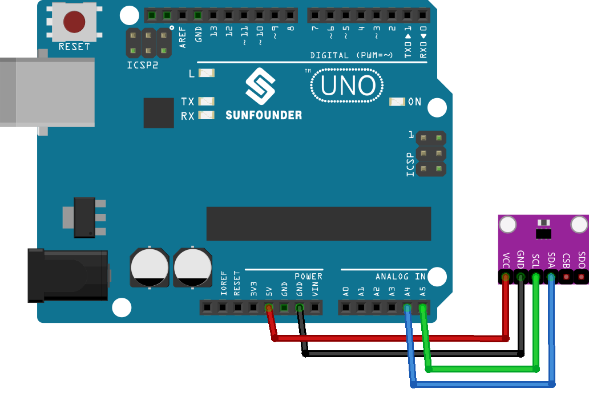

.. note::

    Bonjour, bienvenue dans la communauté des passionnés de SunFounder Raspberry Pi, Arduino et ESP32 sur Facebook ! Plongez plus profondément dans l'univers du Raspberry Pi, de l'Arduino et de l'ESP32 avec d'autres passionnés.

    **Pourquoi rejoindre ?**

    - **Support d'experts** : Résolvez les problèmes après-vente et les défis techniques avec l'aide de notre communauté et de notre équipe.
    - **Apprendre & Partager** : Échangez des astuces et des tutoriels pour améliorer vos compétences.
    - **Aperçus exclusifs** : Accédez en avant-première aux nouvelles annonces de produits et aux coups d'œil exclusifs.
    - **Réductions spéciales** : Profitez de réductions exclusives sur nos derniers produits.
    - **Promotions festives et cadeaux** : Participez à des tirages au sort et à des promotions festives.

    👉 Prêt à explorer et à créer avec nous ? Cliquez sur [|link_sf_facebook|] et rejoignez-nous aujourd'hui !

.. _uno_lesson20_bmp280:

Leçon 20 : Capteur de température, d'humidité et de pression (BMP280)
========================================================================

Dans cette leçon, vous apprendrez à utiliser le capteur BMP280 avec un Arduino Uno pour lire la pression atmosphérique, la température et approximer l'altitude. Nous aborderons l'intégration du capteur avec Arduino en utilisant la bibliothèque Adafruit BMP280 et afficherons les lectures sur le moniteur série. Cette session est idéale pour les débutants en électronique et en programmation qui souhaitent comprendre l'interfaçage des capteurs et l'acquisition de données sur la plateforme Arduino.

Composants nécessaires
--------------------------

Pour ce projet, nous avons besoin des composants suivants.

Il est vraiment pratique d'acheter un kit complet, voici le lien :

.. list-table::
    :widths: 20 20 20
    :header-rows: 1

    *   - Nom	
        - ARTICLES DE CE KIT
        - LIEN
    *   - Kit capteur universel pour bricoleurs
        - 94
        - |link_umsk|

Vous pouvez également les acheter séparément via les liens ci-dessous.

.. list-table::
    :widths: 30 20
    :header-rows: 1

    *   - Introduction du composant
        - Lien d'achat

    *   - Arduino UNO R3 ou R4
        - |link_Uno_R3_buy|
    *   - :ref:`cpn_bmp280`
        - |link_bmp280_module_buy|

Câblage
---------------------------

Code
---------------------------

.. note:: 
   Pour installer la bibliothèque, utilisez le gestionnaire de bibliothèques Arduino et recherchez **"Adafruit BMP280"** puis installez-la.

.. raw:: html

    <iframe src=https://create.arduino.cc/editor/sunfounder01/96357754-fa67-4a69-82dc-156650454e41/preview?embed style="height:510px;width:100%;margin:10px 0" frameborder=0></iframe>

Analyse du code
---------------------------

1. Inclusion des bibliothèques et initialisation. Les bibliothèques nécessaires sont incluses et le capteur BMP280 est initialisé pour la communication via l'interface I2C.

   .. note:: 
      Pour installer la bibliothèque, utilisez le gestionnaire de bibliothèques Arduino et recherchez **"Adafruit BMP280"** et installez-la.

   - Bibliothèque Adafruit BMP280 : Cette bibliothèque offre une interface facile à utiliser pour le capteur BMP280, permettant à l'utilisateur de lire la température, la pression et l'altitude.
   - Wire.h : Utilisé pour la communication I2C.

   .. raw:: html
    
     

   .. code-block:: arduino
    
      #include <Wire.h>
      #include <Adafruit_BMP280.h>
      #define BMP280_ADDRESS 0x76
      Adafruit_BMP280 bmp;  // utilise l'interface I2C

2. Fonction ``setup()``. Cette fonction initialise la communication série, vérifie le capteur BMP280 et configure le capteur avec les paramètres par défaut.

   .. code-block:: arduino

      void setup() {
        Serial.begin(9600);
        while (!Serial) delay(100);
        Serial.println(F("BMP280 test"));
        unsigned status;
        status = bmp.begin(BMP280_ADDRESS);
        // ... (reste du code de configuration)

3. Fonction ``loop()``. Cette fonction lit les données du capteur BMP280 concernant la température, la pression et l'altitude. Ces données sont imprimées sur le moniteur série.

   .. code-block:: arduino

      void loop() {
        // ... (lire et imprimer les données de température, de pression et d'altitude)
        delay(2000);  // Délai de 2 secondes entre les lectures.
      }
