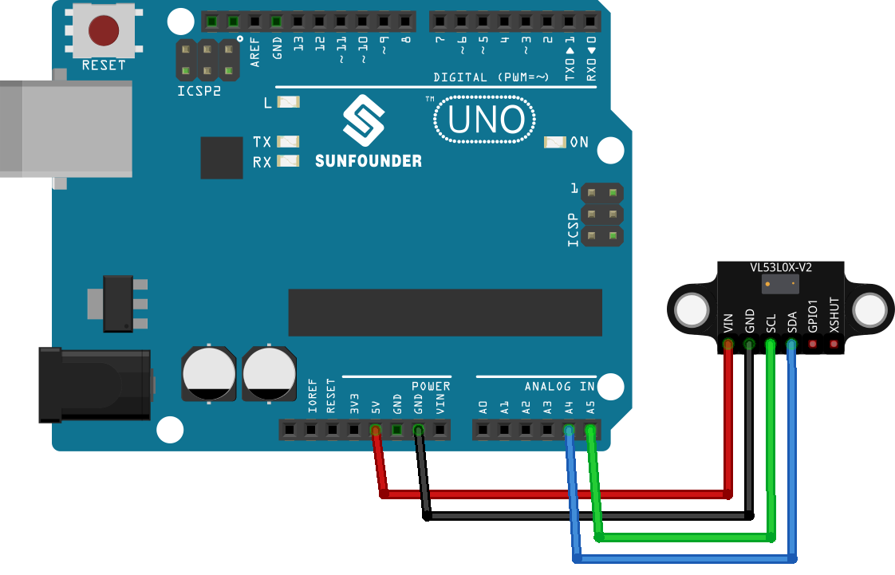

.. note:: 

    Ciao e benvenuto nella Community Facebook degli appassionati di SunFounder Raspberry Pi, Arduino ed ESP32! Approfondisci le tue competenze su Raspberry Pi, Arduino ed ESP32 insieme ad altri maker come te.

    **Perché unirsi?**

    - **Supporto Esperto**: Risolvi problemi post-vendita e affronta sfide tecniche con l’aiuto del nostro team e della nostra community.
    - **Impara e Condividi**: Scambia suggerimenti e tutorial per migliorare le tue abilità.
    - **Anteprime Esclusive**: Accedi in anteprima ai nuovi annunci di prodotto e alle anticipazioni.
    - **Sconti Speciali**: Approfitta di sconti esclusivi sui nostri prodotti più recenti.
    - **Promozioni e Giveaway Festivi**: Partecipa a omaggi e promozioni stagionali.

    👉 Pronto a esplorare e creare con noi? Clicca su [|link_sf_facebook|] ed entra oggi stesso!

.. _uno_lesson21_vl53l0x:

Lezione 21: Sensore di Distanza Time of Flight Micro-LIDAR (VL53L0X)
========================================================================

In questa lezione imparerai a utilizzare il sensore di distanza Time of Flight VL53L0X con Arduino Uno. Vedremo le basi del collegamento del sensore per misurare distanze in millimetri e visualizzeremo le letture sul monitor seriale. Questo progetto offre un'esperienza pratica con sensori avanzati e le loro applicazioni nel mondo reale, migliorando le tue competenze su Arduino.

Componenti Necessari
--------------------------

Per questo progetto sono richiesti i seguenti componenti.

È sicuramente comodo acquistare un kit completo. Ecco il link:

.. list-table::
    :widths: 20 20 20
    :header-rows: 1

    *   - Nome	
        - CONTENUTO DEL KIT
        - LINK
    *   - Universal Maker Sensor Kit
        - 94
        - |link_umsk|

Puoi anche acquistare i singoli componenti dai link seguenti.

.. list-table::
    :widths: 30 10
    :header-rows: 1

    *   - Descrizione del Componente
        - Link per l'acquisto

    *   - Arduino UNO R3 o R4
        - |link_Uno_R3_buy|
    *   - :ref:`cpn_VL53L0X`
        - |link_vl53l0x_module_buy|

Collegamenti
---------------------------

Codice
---------------------------

.. note:: 
   Per installare la libreria, apri l’Arduino Library Manager, cerca **"Adafruit_VL53L0X"** e installala.

.. raw:: html

    <iframe src=https://create.arduino.cc/editor/sunfounder01/72c81822-13e0-4a33-8da0-acf3c966bf57/preview?embed style="height:510px;width:100%;margin:10px 0" frameborder=0></iframe>

Analisi del Codice
---------------------------

#. Inclusione della libreria necessaria e inizializzazione dell’oggetto sensore. Si inizia includendo la libreria per il sensore VL53L0X e creando un’istanza della classe Adafruit_VL53L0X.

   .. note:: 
      Per installare la libreria, apri l’Arduino Library Manager, cerca **"Adafruit_VL53L0X"** e installala.

   .. code-block:: arduino

      #include <Adafruit_VL53L0X.h>
      Adafruit_VL53L0X lox = Adafruit_VL53L0X();

#. Inizializzazione nella funzione ``setup()``. Qui si imposta la comunicazione seriale e si inizializza il sensore di distanza. Se il sensore non viene rilevato, il programma si blocca.

   .. code-block:: arduino

      void setup() {
        Serial.begin(115200);
        while (!Serial) {
          delay(1);
        }
        Serial.println("Adafruit VL53L0X test");
        if (!lox.begin()) {
          Serial.println(F("Failed to boot VL53L0X"));
          while (1)
            ;
        }
        Serial.println(F("VL53L0X API Simple Ranging example\n\n"));
      }

#. Rilevamento e visualizzazione delle misurazioni nella funzione ``loop()``. L’Arduino rileva continuamente la distanza usando il metodo ``rangingTest()``. Se la misurazione è valida, viene stampata sul monitor seriale.

   .. code-block:: arduino
       
      void loop() {
        VL53L0X_RangingMeasurementData_t measure;
        Serial.print("Reading a measurement... ");
        lox.rangingTest(&measure, false);
        if (measure.RangeStatus != 4) {
          Serial.print("Distance (mm): ");
          Serial.println(measure.RangeMilliMeter);
        } else {
          Serial.println(" out of range ");
        }
        delay(100);
      }