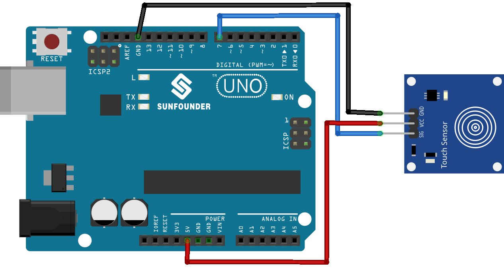

.. note:: 

    Ciao e benvenuto nella Community Facebook degli appassionati di SunFounder Raspberry Pi, Arduino ed ESP32! Approfondisci le tue competenze su Raspberry Pi, Arduino ed ESP32 insieme ad altri maker come te.

    **Perché unirsi?**

    - **Supporto Esperto**: Risolvi problemi post-vendita e sfide tecniche con l’aiuto del nostro team e della nostra community.
    - **Impara e Condividi**: Scambia suggerimenti e tutorial per migliorare le tue competenze.
    - **Anteprime Esclusive**: Ottieni accesso anticipato agli annunci dei nuovi prodotti e anteprime esclusive.
    - **Sconti Speciali**: Approfitta di sconti esclusivi sui nostri prodotti più recenti.
    - **Promozioni e Giveaway Festivi**: Partecipa a omaggi e promozioni durante le festività.

    👉 Pronto a esplorare e creare con noi? Clicca su [|link_sf_facebook|] ed entra oggi stesso!

.. _uno_lesson22_touch_sensor:

Lezione 22: Modulo Sensore Tattile
=====================================

In questa lezione imparerai a integrare un sensore tattile con Arduino Uno. Ci concentreremo sulla lettura degli input provenienti dal sensore collegato all’Arduino e su come questi influenzano il flusso del programma. Scoprirai come utilizzare istruzioni condizionali per rilevare eventi di tocco e rispondere con azioni e messaggi appropriati. Questo progetto è eccellente per i principianti, poiché fornisce una comprensione chiara dell’uso degli ingressi digitali e dei concetti base della programmazione Arduino.

Componenti Necessari
--------------------------

Per questo progetto sono necessari i seguenti componenti.

È sicuramente comodo acquistare un kit completo. Ecco il link:

.. list-table::
    :widths: 20 20 20
    :header-rows: 1

    *   - Nome	
        - CONTENUTO DEL KIT
        - LINK
    *   - Universal Maker Sensor Kit
        - 94
        - |link_umsk|

Puoi anche acquistare i componenti singolarmente dai link sottostanti.

.. list-table::
    :widths: 30 20
    :header-rows: 1

    *   - Descrizione del Componente
        - Link per l'acquisto

    *   - Arduino UNO R3 o R4
        - |link_Uno_R3_buy|
    *   - :ref:`cpn_touch`
        - |link_touch_buy|

Collegamenti
---------------------------

Codice
---------------------------

.. raw:: html

    <iframe src=https://create.arduino.cc/editor/sunfounder01/a0d962e5-5d21-4f26-88db-c38f8e9fb90c/preview?embed style="height:510px;width:100%;margin:10px 0" frameborder=0></iframe>

Analisi del Codice
---------------------------

#. Impostazione delle variabili necessarie. Iniziamo definendo il numero del pin a cui è collegato il sensore tattile.

   .. code-block:: arduino

      const int sensorPin = 7;

#. Inizializzazione nella funzione ``setup()``. Qui specifichiamo che il pin del sensore sarà utilizzato come input, il LED integrato come output, e avviamo la comunicazione seriale per inviare messaggi al monitor seriale.

   .. code-block:: arduino

      void setup() {
        pinMode(sensorPin, INPUT);
        pinMode(LED_BUILTIN, OUTPUT);
        Serial.begin(9600);
      }

#. Arduino controlla continuamente se il sensore tattile è attivato. Se viene toccato, accende il LED e invia il messaggio "Touch detected!". In caso contrario, spegne il LED e invia "No touch detected...". Un ritardo viene introdotto per evitare letture troppo rapide del sensore.

   .. code-block:: arduino

      void loop() {
        if (digitalRead(sensorPin) == 1) {
          digitalWrite(LED_BUILTIN, HIGH);
          Serial.println("Touch detected!");
        } else {
          digitalWrite(LED_BUILTIN, LOW);
          Serial.println("No touch detected...");
        }
        delay(100);
      }