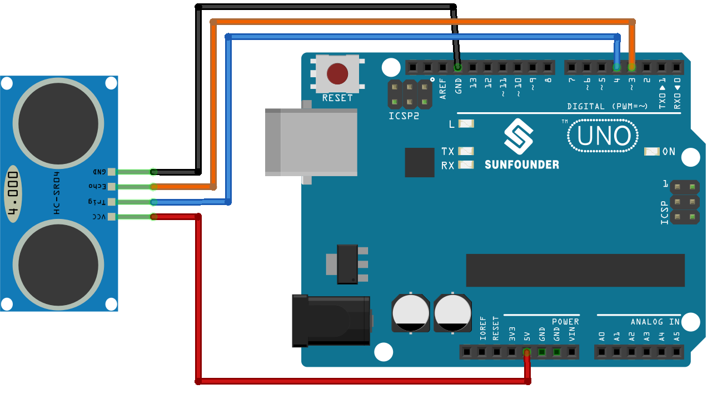

.. note:: 

    ¡Hola, bienvenido a la comunidad de entusiastas de SunFounder Raspberry Pi, Arduino y ESP32 en Facebook! Profundiza en Raspberry Pi, Arduino y ESP32 junto a otros entusiastas.

    **¿Por qué unirse?**

    - **Soporte experto**: Resuelve problemas postventa y desafíos técnicos con la ayuda de nuestra comunidad y equipo.
    - **Aprender y compartir**: Intercambia consejos y tutoriales para mejorar tus habilidades.
    - **Preestrenos exclusivos**: Accede de forma anticipada a anuncios de nuevos productos y avances.
    - **Descuentos especiales**: Disfruta de descuentos exclusivos en nuestros productos más nuevos.
    - **Promociones festivas y sorteos**: Participa en sorteos y promociones especiales.

    👉 ¿Listo para explorar y crear con nosotros? Haz clic en [|link_sf_facebook|] y únete hoy mismo!

.. _uno_lesson23_ultrasonic:

Lección 23: Módulo Sensor Ultrasónico (HC-SR04)
================================================

En esta lección, aprenderás a usar un sensor ultrasónico con Arduino para medir distancias. Cubriremos cómo conectar el sensor HC-SR04 a la placa Arduino Uno R4 y usarlo para calcular y mostrar las mediciones de distancia en centímetros. Este proyecto es ideal para principiantes, proporcionando experiencia práctica con la comunicación serial de Arduino y el procesamiento de datos de sensores. Obtendrás una valiosa comprensión de cómo trabajar con señales digitales y entender los conceptos básicos de la tecnología de sensores ultrasónicos.

Componentes necesarios
--------------------------

En este proyecto, necesitamos los siguientes componentes.

Es definitivamente conveniente comprar un kit completo, aquí está el enlace:

.. list-table::
    :widths: 20 20 20
    :header-rows: 1

    *   - Nombre
        - ARTÍCULOS EN ESTE KIT
        - ENLACE
    *   - Kit de Sensores Universal Maker
        - 94
        - |link_umsk|

También puedes comprarlos por separado desde los enlaces a continuación.

.. list-table::
    :widths: 30 20
    :header-rows: 1

    *   - Introducción del componente
        - Enlace de compra

    *   - Arduino UNO R3 o R4
        - |link_Uno_R3_buy|
    *   - :ref:`cpn_ultrasonic`
        - |link_ultrasonic_buy|

Cableado
---------------------------

Código
---------------------------

.. raw:: html

    <iframe src=https://create.arduino.cc/editor/sunfounder01/633ae8f5-4b15-4888-b4cb-b1eb24f3e2ef/preview?embed style="height:510px;width:100%;margin:10px 0" frameborder=0></iframe>

Análisis del código
---------------------------

1. Declaración de pines:

   Comenzamos definiendo los pines para el sensor ultrasónico. Se declaran ``echoPin`` y ``trigPin`` como enteros, y sus valores se configuran para coincidir con la conexión física en la placa de Arduino.

   .. code-block:: arduino

      const int echoPin = 3;
      const int trigPin = 4;

2. Función ``setup()``:

   La función ``setup()`` inicializa la comunicación serial, configura los modos de los pines y muestra un mensaje para indicar que el sensor ultrasónico está listo.

   .. code-block:: arduino

      void setup() {
        Serial.begin(9600);
        pinMode(echoPin, INPUT);
        pinMode(trigPin, OUTPUT);
        Serial.println("Ultrasonic sensor:");
      }

3. Función ``loop()``:

   La función ``loop()`` lee la distancia del sensor y la imprime en el monitor serial, luego hace una pausa de 400 milisegundos antes de repetir.

   .. code-block:: arduino

      void loop() {
        float distance = readDistance();
        Serial.print(distance);
        Serial.println(" cm");
        delay(400);
      }

4. Función ``readDistance()``:

   La función ``readDistance()`` activa el sensor ultrasónico y calcula la distancia basándose en el tiempo que tarda en rebotar la señal.

   Para más detalles, consulta el :ref:`principle <cpn_ultrasonic_principle>` del módulo sensor ultrasónico.

   .. code-block:: arduino

      float readDistance() {
        digitalWrite(trigPin, LOW);   // Establecer el pin trig en bajo para asegurar un pulso limpio
        delayMicroseconds(2);         // Espera de 2 microsegundos
        digitalWrite(trigPin, HIGH);  // Enviar un pulso de 10 microsegundos configurando el pin trig en alto
        delayMicroseconds(10);
        digitalWrite(trigPin, LOW);  // Establecer el pin trig en bajo
        float distance = pulseIn(echoPin, HIGH) / 58.00;  // Fórmula: (340m/s * 1us) / 2
        return distance;
      }
