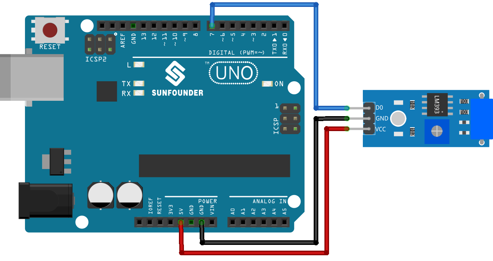

.. note::

    Bonjour, bienvenue dans la communauté des passionnés de SunFounder Raspberry Pi, Arduino et ESP32 sur Facebook ! Plongez au cœur de l'univers du Raspberry Pi, d'Arduino et de l'ESP32 avec d'autres passionnés.

    **Pourquoi nous rejoindre ?**

    - **Support d'experts** : Résolvez les problèmes après-vente et relevez des défis techniques grâce à l'aide de notre communauté et de notre équipe.
    - **Apprendre & Partager** : Échangez des astuces et des tutoriels pour améliorer vos compétences.
    - **Aperçus exclusifs** : Accédez en avant-première aux annonces et aperçus des nouveaux produits.
    - **Réductions spéciales** : Profitez de promotions exclusives sur nos derniers produits.
    - **Promotions festives et cadeaux** : Participez à des tirages au sort et événements promotionnels spéciaux.

    👉 Prêt à explorer et créer avec nous ? Cliquez sur [|link_sf_facebook|] et rejoignez-nous dès aujourd'hui !

.. _uno_lesson24_vibration_sensor:

Leçon 24 : Module Capteur de Vibration (SW-420)
=================================================

Dans cette leçon, vous apprendrez à détecter des vibrations à l'aide d'un capteur de vibration et d'un Arduino Uno. Nous verrons comment le capteur signale la présence de vibrations à l'Arduino, qui déclenche alors l'affichage d'un message. Ce projet est idéal pour les débutants souhaitant comprendre le traitement des entrées numériques et la communication série avec Arduino. Vous acquerrez une expérience pratique en lisant des données de capteurs et en appliquant une logique conditionnelle dans vos croquis.

Composants nécessaires
--------------------------

Pour ce projet, nous avons besoin des composants suivants.

Il est plus pratique d'acheter un kit complet, voici le lien :

.. list-table::
    :widths: 20 20 20
    :header-rows: 1

    *   - Nom	
        - ARTICLES DANS CE KIT
        - LIEN
    *   - Kit capteur universel pour bricoleurs
        - 94
        - |link_umsk|

Vous pouvez également les acheter séparément via les liens ci-dessous.

.. list-table::
    :widths: 30 20
    :header-rows: 1

    *   - Introduction du composant
        - Lien d'achat

    *   - Arduino UNO R3 ou R4
        - |link_Uno_R3_buy|
    *   - :ref:`cpn_vibration`
        - |link_sw420_vibration_module_buy|

Câblage
---------------------------

Code
---------------------------

.. raw:: html

    <iframe src=https://create.arduino.cc/editor/sunfounder01/a04cb423-f55b-465a-bef3-100260eef067/preview?embed style="height:510px;width:100%;margin:10px 0" frameborder=0></iframe>

Analyse du code
---------------------------

1. Déclaration de la broche du capteur de vibration

   Cette ligne de code définit une constante ``sensorPin`` associée à la broche numérique 7, où le capteur de vibration est connecté.

   .. code-block:: arduino

      const int sensorPin = 7;

2. Initialisation dans la fonction ``setup()``

   La fonction ``setup()`` initialise la communication série avec un débit de 9600 bauds pour afficher les lectures du capteur de vibration sur le moniteur série. Elle configure également la broche du capteur en entrée.

   .. code-block:: arduino

      void setup() {
        Serial.begin(9600);         // Démarrer la communication série à 9600 bauds
        pinMode(sensorPin, INPUT);  // Définir sensorPin en entrée
      }

3. Lecture des vibrations dans la fonction ``loop()``

   La fonction ``loop()`` vérifie en continu si des vibrations sont détectées par le capteur. Si une vibration est détectée, le message "Vibration détectée..." s'affiche. Sinon, il affiche "…". La boucle se répète toutes les 100 millisecondes.

   .. code-block:: arduino

      void loop() {
        if (digitalRead(sensorPin)) {               // Vérifier si une vibration est détectée
          Serial.println("Detected vibration...");  // Afficher "Vibration détectée..." si le capteur détecte une vibration
        } 
        else {
          Serial.println("...");  // Afficher "..." sinon
        }
        // Ajouter un délai pour éviter de saturer le moniteur série
        delay(100);
      }