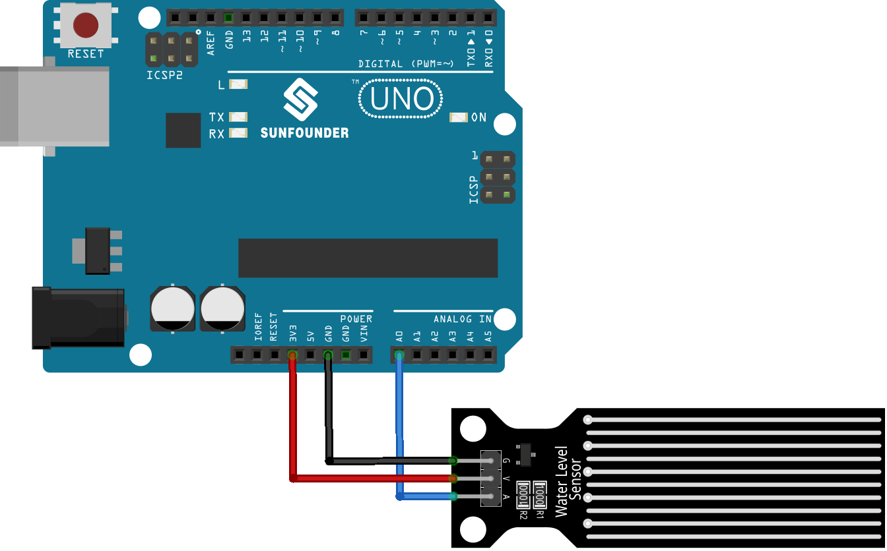

.. note:: 

    ¡Hola, bienvenido a la comunidad de entusiastas de SunFounder Raspberry Pi, Arduino y ESP32 en Facebook! Profundiza en Raspberry Pi, Arduino y ESP32 junto con otros entusiastas.

    **¿Por qué unirse?**

    - **Soporte experto**: Resuelve problemas postventa y desafíos técnicos con la ayuda de nuestra comunidad y equipo.
    - **Aprender y compartir**: Intercambia consejos y tutoriales para mejorar tus habilidades.
    - **Preestrenos exclusivos**: Accede de forma anticipada a anuncios de nuevos productos y avances.
    - **Descuentos especiales**: Disfruta de descuentos exclusivos en nuestros productos más nuevos.
    - **Promociones festivas y sorteos**: Participa en sorteos y promociones especiales.

    👉 ¿Listo para explorar y crear con nosotros? Haz clic en [|link_sf_facebook|] y únete hoy mismo!

.. _uno_lesson25_water_level:

Lección 25: Módulo Sensor de Nivel de Agua
=============================================

En esta lección, aprenderás cómo medir los niveles de agua utilizando Arduino. Veremos cómo un sensor de nivel de agua puede generar diferentes niveles de voltaje según la altura del agua y cómo el Arduino lee estos niveles de voltaje. Este proyecto es ideal para principiantes, ya que proporciona experiencia práctica con sensores analógicos e introduce conceptos básicos sobre el procesamiento de datos de sensores en la plataforma Arduino.

Componentes necesarios
--------------------------

En este proyecto, necesitamos los siguientes componentes. 

Es definitivamente conveniente comprar un kit completo, aquí está el enlace:

.. list-table::
    :widths: 20 20 20
    :header-rows: 1

    *   - Nombre
        - ARTÍCULOS EN ESTE KIT
        - ENLACE
    *   - Kit de Sensores Universal Maker
        - 94
        - |link_umsk|

También puedes comprarlos por separado desde los enlaces a continuación.

.. list-table::
    :widths: 30 20
    :header-rows: 1

    *   - Introducción del componente
        - Enlace de compra

    *   - Arduino UNO R3 o R4
        - |link_Uno_R3_buy|
    *   - :ref:`cpn_water_level`
        - \-

Cableado
---------------------------

Código
---------------------------

.. raw:: html

    <iframe src=https://create.arduino.cc/editor/sunfounder01/268011b0-8c0c-42b0-8d21-253a37de0dc8/preview?embed style="height:510px;width:100%;margin:10px 0" frameborder=0></iframe>

Análisis del código
---------------------------

1. **Inicialización del pin del sensor**:

   Antes de usar el sensor de nivel de agua, su número de pin se define mediante una variable constante. Esto hace que el código sea más legible y fácil de modificar.

   .. code-block:: arduino

      const int sensorPin = A0;

2. **Configuración de la comunicación serial**:

   En la función ``setup()``, se establece la velocidad de baudios para la comunicación serial. Esto es crucial para que el Arduino se comunique con el monitor serial de la computadora.

   .. code-block:: arduino

      void setup() {
        Serial.begin(9600);  // Iniciar la comunicación serial a 9600 baudios
      }

3. **Lectura de datos del sensor y salida al monitor serial**:

   La función ``loop()`` lee continuamente el valor analógico del sensor utilizando ``analogRead()`` y lo imprime en el monitor serial utilizando ``Serial.println()``. La función ``delay(100)`` hace que el Arduino espere 100 milisegundos antes de repetir el ciclo, controlando la tasa de lectura y transmisión de datos.

   .. code-block:: arduino
    
      void loop() {
        Serial.println(analogRead(sensorPin));  // Leer el valor analógico del sensor e imprimirlo en el monitor serial
        delay(100);                             // Esperar 100 milisegundos
      }