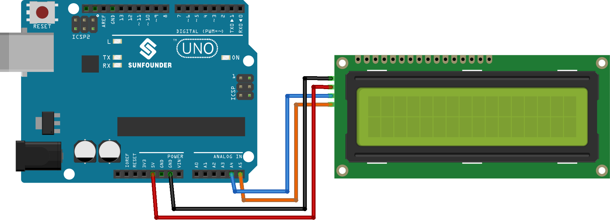

.. note::

    Bonjour, bienvenue dans la communauté des passionnés de SunFounder Raspberry Pi, Arduino et ESP32 sur Facebook ! Plongez dans l’univers du Raspberry Pi, d’Arduino et de l’ESP32 avec d’autres passionnés.

    **Pourquoi nous rejoindre ?**

    - **Support d’experts** : Résolvez vos problèmes après-vente et relevez des défis techniques avec l’aide de notre communauté et de notre équipe.
    - **Apprendre & Partager** : Échangez des astuces et des tutoriels pour améliorer vos compétences.
    - **Aperçus exclusifs** : Accédez en avant-première aux annonces et aperçus des nouveaux produits.
    - **Réductions spéciales** : Profitez d’offres exclusives sur nos derniers produits.
    - **Promotions festives et cadeaux** : Participez à des concours et événements promotionnels spéciaux.

    👉 Prêt à explorer et à créer avec nous ? Cliquez sur [|link_sf_facebook|] et rejoignez-nous dès aujourd’hui !

.. _uno_lesson26_lcd:

Leçon 26 : Écran LCD 1602 avec Interface I2C
==============================================

Dans cette leçon, vous apprendrez à configurer et afficher des messages sur un écran LCD 16x2 avec une interface I2C à l’aide d’un Arduino. Nous verrons les bases de l’utilisation de la bibliothèque LiquidCrystal I2C pour initialiser l’écran, afficher du texte et contrôler le rétroéclairage. Vous apprendrez à afficher « Hello world! » et « LCD Tutorial » sur l’écran, ce qui constitue une introduction pratique à l’interfaçage des écrans LCD avec Arduino. Ce tutoriel est parfait pour les débutants, offrant une expérience concrète dans le contrôle des affichages électroniques.

Composants nécessaires
-----------------------

Pour ce projet, nous avons besoin des composants suivants.

Il est plus pratique d’acheter un kit complet, voici le lien :

.. list-table::
    :widths: 20 20 20
    :header-rows: 1

    *   - Nom	
        - ARTICLES DANS CE KIT
        - LIEN
    *   - Kit capteur universel pour bricoleurs
        - 94
        - |link_umsk|

Vous pouvez également les acheter séparément via les liens ci-dessous.

.. list-table::
    :widths: 30 20
    :header-rows: 1

    *   - Introduction du composant
        - Lien d'achat

    *   - Arduino UNO R3 ou R4
        - |link_Uno_R3_buy|
    *   - :ref:`cpn_i2c_lcd1602`
        - |link_i2clcd1602_buy|

Câblage
---------

Code
-------

.. note:: 
   Pour installer la bibliothèque, utilisez le gestionnaire de bibliothèques d’Arduino et recherchez **"LiquidCrystal I2C"**, puis installez-la.  

.. raw:: html

    <iframe src=https://create.arduino.cc/editor/sunfounder01/48a64786-bcfc-4497-a12d-495c283e09ce/preview?embed style="height:510px;width:100%;margin:10px 0" frameborder=0></iframe>

Analyse du code
-----------------

1. Inclusion de la bibliothèque et initialisation de l’écran LCD :

   La bibliothèque LiquidCrystal I2C est incluse pour fournir les fonctions et méthodes nécessaires à l’interfaçage de l’écran LCD. Ensuite, un objet LCD est créé en utilisant la classe LiquidCrystal_I2C, en précisant l’adresse I2C, le nombre de colonnes et de lignes.

   .. note:: 
      Pour installer la bibliothèque, utilisez le gestionnaire de bibliothèques d’Arduino et recherchez **"LiquidCrystal I2C"**, puis installez-la.  

   .. code-block:: arduino

      #include <LiquidCrystal_I2C.h>
      LiquidCrystal_I2C lcd(0x27, 16, 2);

2. Fonction setup() :

   La fonction ``setup()`` s’exécute une seule fois au démarrage de l’Arduino. Elle initialise l’écran LCD, le nettoie et active le rétroéclairage. Ensuite, deux messages sont affichés sur l’écran.

   .. code-block:: arduino

      void setup() {
        lcd.init();       // Initialiser l’écran LCD
        lcd.clear();      // Effacer l’affichage de l’écran LCD
        lcd.backlight();  // Activer le rétroéclairage
      
        // Afficher un message sur les deux lignes de l’écran LCD
        lcd.setCursor(2, 0);  // Placer le curseur au caractère 2 de la ligne 0
        lcd.print("Hello world!");
      
        lcd.setCursor(2, 1);  // Déplacer le curseur au caractère 2 de la ligne 1
        lcd.print("LCD Tutorial");
      }