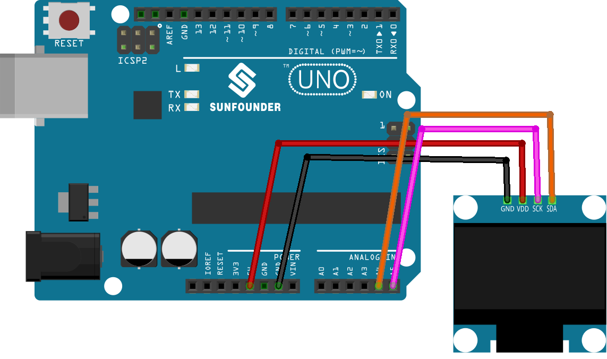

.. note::

    Bonjour, bienvenue dans la communauté des passionnés de SunFounder Raspberry Pi, Arduino et ESP32 sur Facebook ! Plongez dans l’univers du Raspberry Pi, d’Arduino et de l’ESP32 avec d’autres passionnés.

    **Pourquoi nous rejoindre ?**

    - **Support d’experts** : Résolvez vos problèmes après-vente et relevez des défis techniques avec l’aide de notre communauté et de notre équipe.
    - **Apprendre & Partager** : Échangez des astuces et des tutoriels pour améliorer vos compétences.
    - **Aperçus exclusifs** : Accédez en avant-première aux annonces et aperçus des nouveaux produits.
    - **Réductions spéciales** : Profitez d’offres exclusives sur nos derniers produits.
    - **Promotions festives et cadeaux** : Participez à des concours et événements promotionnels spéciaux.

    👉 Prêt à explorer et à créer avec nous ? Cliquez sur [|link_sf_facebook|] et rejoignez-nous dès aujourd’hui !

.. _uno_lesson27_oled:

Leçon 27 : Module d'affichage OLED (SSD1306)
==============================================

Dans cette leçon, vous apprendrez à programmer une carte Arduino Uno pour contrôler un écran OLED (SSD1306). Nous aborderons l’utilisation des bibliothèques Adafruit SSD1306 et GFX pour afficher du texte, des nombres et créer des animations de défilement à l’écran. Ce projet est idéal pour ceux qui souhaitent approfondir leurs connaissances sur l’affichage graphique et textuel sur de petits écrans dans l’environnement Arduino.

Composants nécessaires
-------------------------

Pour ce projet, nous avons besoin des composants suivants.

Il est plus pratique d’acheter un kit complet, voici le lien :

.. list-table::
    :widths: 20 20 20
    :header-rows: 1

    *   - Nom	
        - ARTICLES DANS CE KIT
        - LIEN
    *   - Kit capteur universel pour bricoleurs
        - 94
        - |link_umsk|

Vous pouvez également les acheter séparément via les liens ci-dessous.

.. list-table::
    :widths: 30 20
    :header-rows: 1

    *   - Introduction du composant
        - Lien d'achat

    *   - Arduino UNO R3 ou R4
        - |link_Uno_R3_buy|
    *   - :ref:`cpn_oled`
        - \-

Câblage
-----------

Code
-------

.. note:: 
   Pour installer la bibliothèque, utilisez le gestionnaire de bibliothèques d’Arduino et recherchez **"Adafruit SSD1306"** et **"Adafruit GFX"**, puis installez-les.

.. raw:: html

    <iframe src=https://create.arduino.cc/editor/sunfounder01/b2617291-5326-4d12-812b-78c45ced7516/preview?embed style="height:510px;width:100%;margin:10px 0" frameborder=0></iframe>

Analyse du code
--------------------

1. **Inclusion des bibliothèques et définitions initiales** :

   Les bibliothèques nécessaires pour l’interface avec l’OLED sont incluses. Ensuite, les définitions concernant les dimensions de l’écran OLED et son adresse I2C sont définies.

   - **Adafruit SSD1306** : Cette bibliothèque facilite l’interfaçage avec l’écran OLED SSD1306. Elle fournit des méthodes pour initialiser l’écran, configurer ses paramètres et afficher du contenu.
   - **Adafruit GFX Library** : Cette bibliothèque graphique de base permet d’afficher du texte, de générer des couleurs, de dessiner des formes, etc., sur différents écrans, y compris les OLED.

   .. note:: 
      Pour installer la bibliothèque, utilisez le gestionnaire de bibliothèques d’Arduino et recherchez **"Adafruit SSD1306"** et **"Adafruit GFX"**, puis installez-les.

   .. code-block:: arduino

      #include <SPI.h>
      #include <Wire.h>
      #include <Adafruit_GFX.h>
      #include <Adafruit_SSD1306.h>

      #define SCREEN_WIDTH 128  // Largeur de l'écran OLED en pixels
      #define SCREEN_HEIGHT 64  // Hauteur de l'écran OLED en pixels

      #define OLED_RESET -1
      #define SCREEN_ADDRESS 0x3C

2. **Données bitmap** :

   Les données bitmap permettent d'afficher une icône personnalisée sur l'écran OLED. Ces données représentent une image dans un format que l'écran peut interpréter.

   Vous pouvez utiliser cet outil en ligne appelé |link_image2cpp| pour convertir votre image en un tableau de données.

   Le mot-clé ``PROGMEM`` indique que le tableau est stocké dans la mémoire programme du microcontrôleur Arduino. Stocker des données en mémoire programme (PROGMEM) plutôt que dans la RAM est utile lorsque vous avez de grandes quantités de données, ce qui permet d’économiser la mémoire vive.

   .. code-block:: arduino

      static const unsigned char PROGMEM sunfounderIcon[] = {...};

3. **Fonction setup (Initialisation et affichage)** :

   La fonction ``setup()`` initialise l’écran OLED et affiche une série de motifs, de textes et d’animations.

   .. code-block:: arduino

      void setup() {
         ...  // Initialisation du port série et de l'objet OLED
         ...  // Affichage de divers textes, nombres et animations
      }