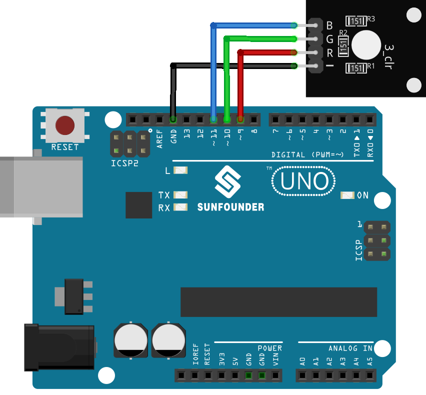

.. note::

    Bonjour, bienvenue dans la communauté des passionnés de SunFounder Raspberry Pi, Arduino et ESP32 sur Facebook ! Plongez dans l’univers du Raspberry Pi, d’Arduino et de l’ESP32 avec d’autres passionnés.

    **Pourquoi nous rejoindre ?**

    - **Support d’experts** : Résolvez vos problèmes après-vente et relevez des défis techniques avec l’aide de notre communauté et de notre équipe.
    - **Apprendre & Partager** : Échangez des astuces et des tutoriels pour améliorer vos compétences.
    - **Aperçus exclusifs** : Accédez en avant-première aux annonces et aperçus des nouveaux produits.
    - **Réductions spéciales** : Profitez d’offres exclusives sur nos derniers produits.
    - **Promotions festives et cadeaux** : Participez à des concours et événements promotionnels spéciaux.

    👉 Prêt à explorer et à créer avec nous ? Cliquez sur [|link_sf_facebook|] et rejoignez-nous dès aujourd’hui !

.. _uno_lesson28_rgb_module:

Leçon 28 : Module LED RGB
============================

Dans cette leçon, vous apprendrez à contrôler une LED RGB avec Arduino. Nous verrons comment configurer la LED, afficher les couleurs primaires et créer un spectre arc-en-ciel dynamique. Ce projet pratique est idéal pour les débutants, offrant une expérience concrète sur la gestion des sorties et le mélange des couleurs dans l’environnement Arduino.

Composants nécessaires
-------------------------

Pour ce projet, nous avons besoin des composants suivants.

Il est plus pratique d’acheter un kit complet, voici le lien :

.. list-table::
    :widths: 20 20 20
    :header-rows: 1

    *   - Nom	
        - ARTICLES DANS CE KIT
        - LIEN
    *   - Kit capteur universel pour bricoleurs
        - 94
        - |link_umsk|

Vous pouvez également les acheter séparément via les liens ci-dessous.

.. list-table::
    :widths: 30 20
    :header-rows: 1

    *   - Introduction du composant
        - Lien d'achat

    *   - Arduino UNO R3 ou R4
        - |link_Uno_R3_buy|
    *   - :ref:`cpn_rgb`
        - \-

Câblage
-----------

Code
-------

.. raw:: html

    <iframe src=https://create.arduino.cc/editor/sunfounder01/69d51b96-ad16-4c16-aa97-6dab559929d3/preview?embed style="height:510px;width:100%;margin:10px 0" frameborder=0></iframe>

Analyse du code
------------------

1. Déclaration et initialisation des broches :

   La première section du code définit les broches auxquelles chaque canal de couleur de la LED RGB est connecté.

   .. code-block:: arduino
       
      const int rledPin = 9;  // Broche connectée au canal rouge
      const int gledPin = 10; // Broche connectée au canal vert
      const int bledPin = 11; // Broche connectée au canal bleu

2. Initialisation dans la fonction ``setup()`` :

   La fonction ``setup()`` définit ces broches comme des sorties. Cela signifie que nous enverrons des signaux VERS la LED RGB.

   .. code-block:: arduino
   
      void setup() {
        pinMode(rledPin, OUTPUT);
        pinMode(gledPin, OUTPUT);
        pinMode(bledPin, OUTPUT);
      }

3. Affichage des couleurs dans la boucle ``loop()`` :

   La fonction ``loop()`` appelle ``setColor()`` avec différents paramètres pour afficher plusieurs couleurs. La fonction ``delay()`` permet de maintenir chaque couleur pendant 1000 millisecondes (1 seconde) avant de passer à la suivante.

   .. code-block:: arduino
   
      void loop() {
        setColor(255, 0, 0);  // Définit la LED RGB en rouge
        delay(1000);
        setColor(0, 255, 0);  // Définit la LED RGB en vert
        delay(1000);
        // Suite des couleurs...
      }

4. Fonction ``setColor()`` et gestion de la luminosité :

   La fonction ``setColor()`` utilise ``analogWrite()`` pour ajuster l’intensité lumineuse de chaque canal de couleur de la LED RGB. La modulation de largeur d’impulsion (PWM) permet de simuler des tensions variables et ainsi de mélanger différentes couleurs.

   .. code-block:: arduino

      void setColor(int R, int G, int B) {
        analogWrite(rledPin, R);  // Contrôle l'intensité du rouge
        analogWrite(gledPin, G);  // Contrôle l'intensité du vert
        analogWrite(bledPin, B);  // Contrôle l'intensité du bleu
      }
