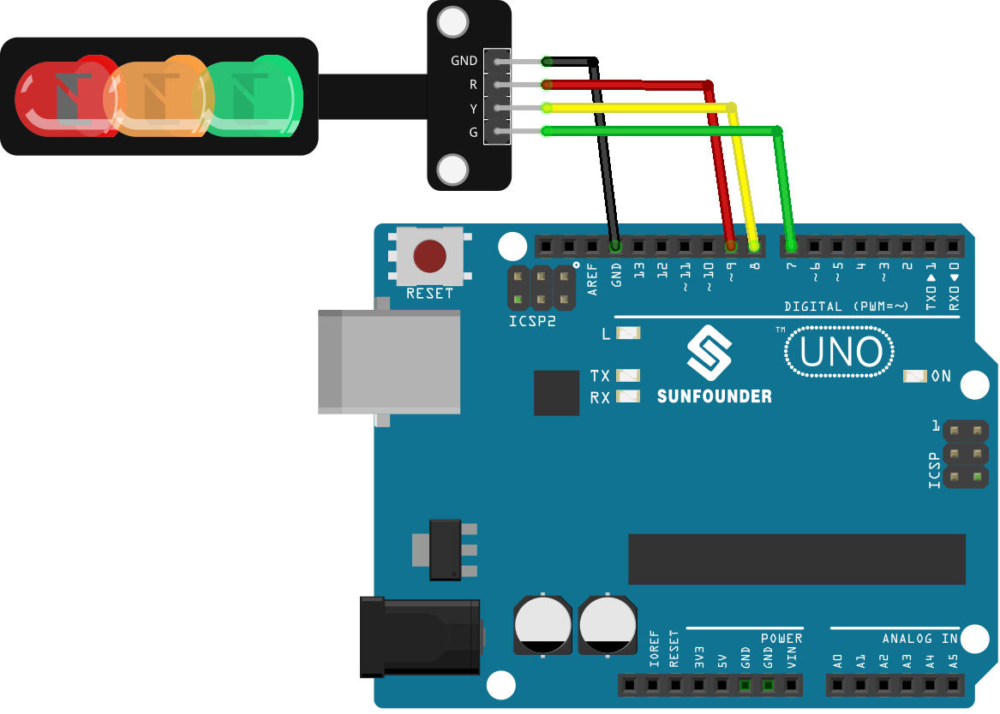

.. note:: 

    Ciao, benvenuto nella Community Facebook di SunFounder dedicata agli appassionati di Raspberry Pi, Arduino ed ESP32! Approfondisci il mondo di Raspberry Pi, Arduino ed ESP32 insieme ad altri maker come te.

    **Perché unirsi?**

    - **Supporto Esperto**: Risolvi problemi post-vendita e sfide tecniche grazie all'aiuto della nostra community e del nostro team.
    - **Impara e Condividi**: Scambia suggerimenti e tutorial per migliorare le tue competenze.
    - **Anteprime Esclusive**: Ottieni l'accesso anticipato agli annunci dei nuovi prodotti e alle anteprime.
    - **Sconti Speciali**: Approfitta di sconti esclusivi sui nostri prodotti più recenti.
    - **Promozioni e Giveaway Festivi**: Partecipa a concorsi e promozioni durante le festività.

    👉 Pronto a esplorare e creare con noi? Clicca su [|link_sf_facebook|] e unisciti oggi stesso!

.. _uno_lesson29_traffic_light_module:

Lezione 29: Modulo Semaforo LED
==================================

In questa lezione imparerai a utilizzare Arduino per controllare un mini semaforo a LED. Vedremo come programmare Arduino Uno per alternare i LED verde, giallo e rosso, simulando il funzionamento di un vero semaforo. Questo progetto è ideale per i principianti, poiché offre un'esperienza pratica nella programmazione di sequenze luminose e nel controllo dei tempi.

Componenti Necessari
--------------------------

Per questo progetto sono richiesti i seguenti componenti.

È sicuramente comodo acquistare un kit completo. Ecco il link:

.. list-table::
    :widths: 20 20 20
    :header-rows: 1

    *   - Nome	
        - COMPONENTI NEL KIT
        - LINK
    *   - Universal Maker Sensor Kit
        - 94
        - |link_umsk|

Puoi anche acquistare i componenti separatamente dai link seguenti.

.. list-table::
    :widths: 30 20
    :header-rows: 1

    *   - Descrizione del Componente
        - Link Acquisto

    *   - Arduino UNO R3 o R4
        - |link_Uno_R3_buy|
    *   - :ref:`cpn_traffic`
        - |link_traffic_light_module_buy|

* Arduino UNO R3 o R4  
* :ref:`cpn_traffic`

Collegamenti
---------------------------

Codice
---------------------------

.. raw:: html

    <iframe src=https://create.arduino.cc/editor/sunfounder01/48f3abf4-1a9c-405f-9247-7dbd61e64f75/preview?embed style="height:510px;width:100%;margin:10px 0" frameborder=0></iframe>

Analisi del Codice
---------------------------

1. Prima di ogni operazione, definiamo delle costanti per i pin a cui sono collegati i LED. Questo rende il codice più leggibile e facile da modificare.

  .. code-block:: arduino

     const int rledPin = 9;  // rosso
     const int yledPin = 8;  // giallo
     const int gledPin = 7;  // verde

2. Qui specifichiamo le modalità dei pin LED. Tutti sono impostati su ``OUTPUT`` perché devono inviare tensione.

  .. code-block:: arduino

     void setup() {
       pinMode(rledPin, OUTPUT);
       pinMode(yledPin, OUTPUT);
       pinMode(gledPin, OUTPUT);
     }

3. Qui viene implementata la logica del ciclo semaforico. La sequenza delle operazioni è la seguente:

    * Accende il LED verde per 5 secondi.
    * Fa lampeggiare il LED giallo tre volte (ogni lampeggio dura 0,5 secondi).
    * Accende il LED rosso per 5 secondi.

  .. code-block:: arduino

     void loop() {
       digitalWrite(gledPin, HIGH);
       delay(5000);
       digitalWrite(gledPin, LOW);
       
       digitalWrite(yledPin, HIGH);
       delay(500);
       digitalWrite(yledPin, LOW);
       delay(500);
       digitalWrite(yledPin, HIGH);
       delay(500);
       digitalWrite(yledPin, LOW);
       delay(500);
       digitalWrite(yledPin, HIGH);
       delay(500);
       digitalWrite(yledPin, LOW);
       delay(500);
       
       digitalWrite(rledPin, HIGH);
       delay(5000);
       digitalWrite(rledPin, LOW);
     }

