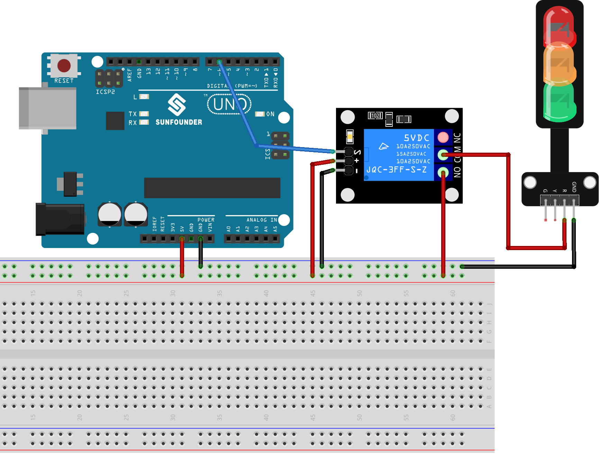

.. note:: 

    Ciao, benvenuto nella Community Facebook di SunFounder dedicata agli appassionati di Raspberry Pi, Arduino ed ESP32! Approfondisci le tue conoscenze su Raspberry Pi, Arduino ed ESP32 insieme ad altri appassionati.

    **Perché unirsi?**

    - **Supporto Esperto**: Risolvi problemi post-vendita e difficoltà tecniche con l’aiuto della community e del nostro team.
    - **Impara e Condividi**: Scambia suggerimenti e tutorial per migliorare le tue competenze.
    - **Anteprime Esclusive**: Accedi in anticipo agli annunci dei nuovi prodotti e alle anteprime.
    - **Sconti Speciali**: Approfitta di sconti esclusivi sui nostri prodotti più recenti.
    - **Promozioni Festive e Giveaway**: Partecipa a concorsi e promozioni speciali durante le festività.

    👉 Pronto per esplorare e creare con noi? Clicca su [|link_sf_facebook|] e unisciti oggi stesso!

.. _uno_lesson30_relay_module:

Lezione 30: Modulo Relè
==================================

In questa lezione imparerai a utilizzare un relè insieme ad Arduino Uno per controllare un modulo semaforico. Dimostreremo come accendere e spegnere la luce rossa del semaforo utilizzando il relè. Questo progetto è perfetto per chi è agli inizi con Arduino, poiché offre un’esperienza pratica nel controllo di moduli esterni e una comprensione di base del funzionamento dei relè.

Componenti Necessari
--------------------------

Per questo progetto sono richiesti i seguenti componenti.

È sicuramente comodo acquistare un kit completo. Ecco il link:

.. list-table::
    :widths: 20 20 20
    :header-rows: 1

    *   - Nome	
        - COMPONENTI NEL KIT
        - LINK
    *   - Universal Maker Sensor Kit
        - 94
        - |link_umsk|

Puoi anche acquistare i componenti separatamente dai link sottostanti.

.. list-table::
    :widths: 30 20
    :header-rows: 1

    *   - Descrizione del Componente
        - Link Acquisto

    *   - Arduino UNO R3 o R4
        - |link_Uno_R3_buy|
    *   - :ref:`cpn_breadboard`
        - |link_breadboard_buy|
    *   - :ref:`cpn_relay`
        - \-
    *   - :ref:`cpn_traffic`
        - |link_traffic_light_module_buy|

Collegamenti
---------------------------

Codice
---------------------------

.. raw:: html

    <iframe src=https://create.arduino.cc/editor/sunfounder01/304bb1cc-7b9e-4290-b63a-baec5ed90521/preview?embed style="height:510px;width:100%;margin:10px 0" frameborder=0></iframe>

Analisi del Codice
---------------------------

#. Impostazione del pin per il relè:

   - Il modulo relè è collegato al pin 6 di Arduino. Questo pin è definito come ``relayPin`` per semplificare il codice.

   .. raw:: html

       

   .. code-block:: arduino
    
      const int relayPin = 6;

#. Configurazione del pin del relè come output:

   - Nella funzione ``setup()``, il pin del relè viene impostato come OUTPUT tramite ``pinMode()``, indicando che Arduino invierà segnali a questo pin.

   .. raw:: html

       

   .. code-block:: arduino

      void setup() {
        pinMode(relayPin, OUTPUT);
      }

#. Attivazione e disattivazione del relè:

   - Nella funzione ``loop()``, il relè viene prima spento con ``digitalWrite(relayPin, LOW)`` e rimane spento per 3 secondi (``delay(3000)``).
   - Successivamente, il relè viene acceso con ``digitalWrite(relayPin, HIGH)`` per altri 3 secondi.
   - Questo ciclo si ripete all’infinito.

   .. raw:: html

       

   .. code-block:: arduino

      void loop() {
        digitalWrite(relayPin, LOW);
        delay(3000);

        digitalWrite(relayPin, HIGH);
        delay(3000);
      }