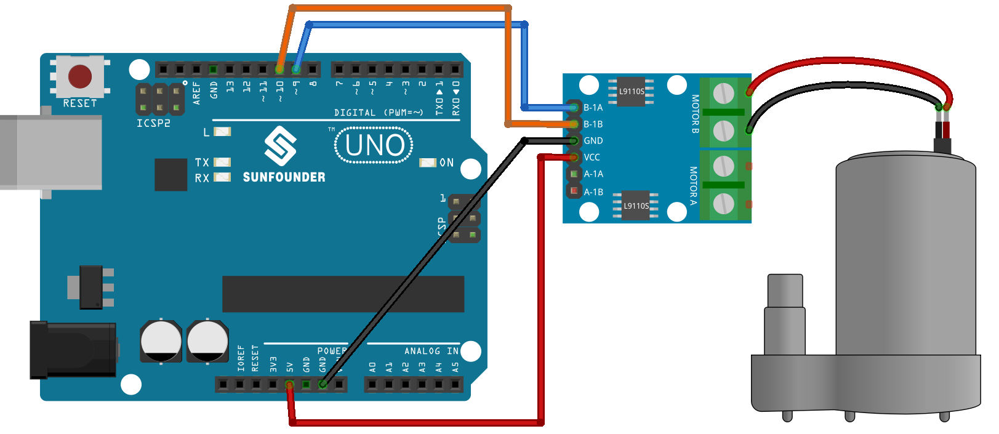

.. note:: 

    ¡Hola, bienvenido a la comunidad de entusiastas de SunFounder Raspberry Pi & Arduino & ESP32 en Facebook! Profundiza en Raspberry Pi, Arduino y ESP32 con otros aficionados.

    **Why Join?**

    - **Expert Support**: Resuelve problemas posventa y desafíos técnicos con la ayuda de nuestra comunidad y equipo.
    - **Learn & Share**: Intercambia consejos y tutoriales para mejorar tus habilidades.
    - **Exclusive Previews**: Obtén acceso anticipado a anuncios de nuevos productos y avances exclusivos.
    - **Special Discounts**: Disfruta de descuentos exclusivos en nuestros productos más recientes.
    - **Festive Promotions and Giveaways**: Participa en sorteos y promociones festivas.

    👉 ¿Listo para explorar y crear con nosotros? Haz clic en [|link_sf_facebook|] y únete hoy mismo!

.. _uno_lesson31_pump:

Lección 31: Bomba Centrífuga
==================================

En esta lección, aprenderás a controlar una bomba centrífuga con un Arduino Uno R3 o R4 y una placa de control de motor L9110. Descubrirás cómo configurar y programar el Arduino para iniciar la bomba en una dirección, hacerla funcionar durante un tiempo específico y luego detenerla. Esta experiencia práctica es ideal para principiantes y ofrece una visión fundamental sobre la gestión de operaciones de motores y la comprensión de los controles de salida en proyectos de Arduino.

Componentes Necesarios
--------------------------

Para este proyecto, necesitaremos los siguientes componentes.

Es definitivamente conveniente comprar un kit completo, aquí está el enlace:

.. list-table::
    :widths: 20 20 20
    :header-rows: 1

    *   - Nombre	
        - ELEMENTOS EN ESTE KIT
        - ENLACE
    *   - Kit Universal de Sensores para Creadores
        - 94
        - |link_umsk|

También puedes comprarlos por separado en los siguientes enlaces.

.. list-table::
    :widths: 30 20
    :header-rows: 1

    *   - Introducción del Componente
        - Enlace de Compra

    *   - Arduino UNO R3 o R4
        - |link_Uno_R3_buy|
    *   - :ref:`cpn_pump`
        - \-
    *   - :ref:`cpn_l9110`
        - \-

* Arduino UNO R3 o R4
* :ref:`cpn_pump`
* :ref:`cpn_l9110`

Conexiones
---------------------------

Código
---------------------------

.. raw:: html

    <iframe src=https://create.arduino.cc/editor/sunfounder01/f5fad7fa-4b2c-4630-a832-d3a5e077d9fa/preview?embed style="height:510px;width:100%;margin:10px 0" frameborder=0></iframe>

Análisis del Código
---------------------------

1. Se definen dos pines para controlar el motor, específicamente ``motorB_1A`` y ``motorB_2A``. Estos pines se conectarán a la placa de control del motor L9110 para controlar la dirección y velocidad del motor.
  
   .. code-block:: arduino
   
      const int motorB_1A = 9;
      const int motorB_2A = 10;

2. Configuración de los pines y control del motor:

   - La función ``setup()`` inicializa los pines como ``OUTPUT`` lo que significa que pueden enviar señales a la placa de control del motor.

   - La función ``analogWrite()`` se utiliza para establecer la velocidad del motor. Aquí, configurar un pin en ``HIGH`` y el otro en ``LOW`` hace que la bomba gire en una dirección. Después de un retraso de 5 segundos, ambos pines se establecen en 0, apagando el motor.

   .. raw:: html

       
   
   .. code-block:: arduino
   
      void setup() {
         pinMode(motorB_1A, OUTPUT);  // configurar pin 1 de la bomba como salida
         pinMode(motorB_2A, OUTPUT);  // configurar pin 2 de la bomba como salida
         analogWrite(motorB_1A, HIGH); 
         analogWrite(motorB_2A, LOW);
         delay(5000);// esperar 5 segundos
         analogWrite(motorB_1A, 0);  // apagar la bomba
         analogWrite(motorB_2A, 0);
      }
