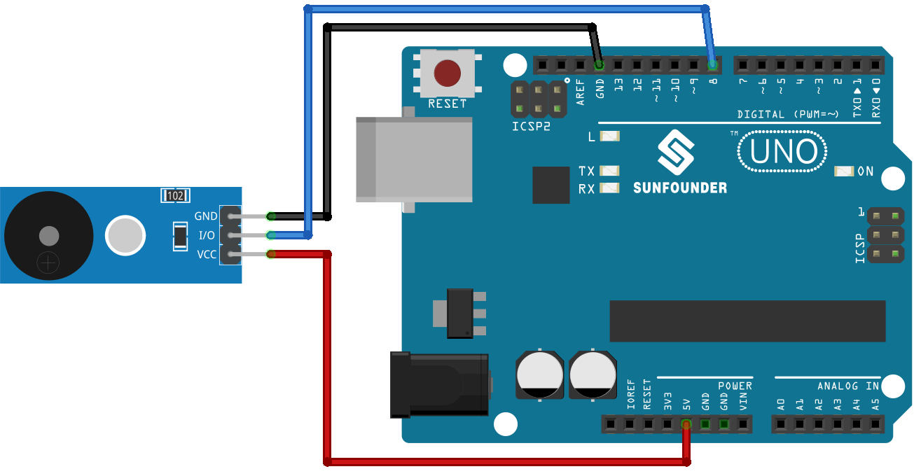

.. note::

    Bonjour, bienvenue dans la communauté des passionnés de SunFounder Raspberry Pi, Arduino et ESP32 sur Facebook ! Plongez dans l’univers du Raspberry Pi, d’Arduino et de l’ESP32 avec d’autres passionnés.

    **Pourquoi nous rejoindre ?**

    - **Support d’experts** : Résolvez vos problèmes après-vente et relevez des défis techniques avec l’aide de notre communauté et de notre équipe.
    - **Apprendre & Partager** : Échangez des astuces et des tutoriels pour améliorer vos compétences.
    - **Aperçus exclusifs** : Accédez en avant-première aux annonces et aperçus des nouveaux produits.
    - **Réductions spéciales** : Profitez d’offres exclusives sur nos derniers produits.
    - **Promotions festives et cadeaux** : Participez à des concours et événements promotionnels spéciaux.

    👉 Prêt à explorer et à créer avec nous ? Cliquez sur [|link_sf_facebook|] et rejoignez-nous dès aujourd’hui !

.. _uno_lesson32_passive_buzzer:

Leçon 32 : Module Buzzer Passif
===================================

Dans cette leçon, vous apprendrez à jouer une mélodie sur un module buzzer passif à l’aide d’un Arduino. Nous verrons comment programmer l’Arduino pour contrôler le buzzer et générer différentes durées de notes. Ce projet est idéal pour les débutants car il offre une expérience pratique dans la production de sons et la compréhension des notes musicales appliquées aux composants électroniques. Vous découvrirez également comment utiliser la carte Arduino Uno et le module buzzer passif.

Composants nécessaires
------------------------

Pour ce projet, nous avons besoin des composants suivants.

Il est plus pratique d’acheter un kit complet, voici le lien :

.. list-table::
    :widths: 20 20 20
    :header-rows: 1

    *   - Nom	
        - ARTICLES DANS CE KIT
        - LIEN
    *   - Kit capteur universel pour bricoleurs
        - 94
        - |link_umsk|

Vous pouvez également les acheter séparément via les liens ci-dessous.

.. list-table::
    :widths: 30 20
    :header-rows: 1

    *   - Introduction du composant
        - Lien d'achat

    *   - Arduino UNO R3 ou R4
        - |link_Uno_R3_buy|
    *   - :ref:`cpn_buzzer`
        - |link_passive_buzzer_module_buy|

Câblage
---------

Code
------

.. raw:: html

    <iframe src=https://create.arduino.cc/editor/sunfounder01/eebc46ab-2a9d-4731-8778-3c8f07b0003b/preview?embed style="height:510px;width:100%;margin:10px 0" frameborder=0></iframe>

Analyse du code
------------------

1. Inclusion de la bibliothèque des fréquences musicales :
   Cette bibliothèque fournit les valeurs de fréquence pour différentes notes musicales, permettant d’utiliser une notation musicale directement dans le code.

   .. code-block:: arduino

      #include "pitches.h"

2. Définition des constantes et des tableaux :

   * ``buzzerPin`` correspond à la broche numérique de l’Arduino à laquelle le buzzer est connecté.
   * ``melody[]`` est un tableau contenant la séquence de notes à jouer.
   * ``noteDurations[]`` est un tableau indiquant la durée de chaque note dans la mélodie.
   
      .. raw:: html
      
        

   .. code-block:: arduino

      const int buzzerPin = 8;
      int melody[] = {
        NOTE_C4, NOTE_G3, NOTE_G3, NOTE_A3, NOTE_G3, 0, NOTE_B3, NOTE_C4
      };
      int noteDurations[] = {
        4, 8, 8, 4, 4, 4, 4, 4
      };

3. Lecture et exécution de la mélodie :

   * La boucle ``for`` parcourt chaque note de la mélodie.

   * La fonction ``tone()`` joue une note sur le buzzer pendant une durée spécifique.

   * Un délai est ajouté entre chaque note pour les différencier clairement.

   * La fonction ``noTone()`` arrête la production sonore après chaque note.

      .. raw:: html
      
        

   .. code-block:: arduino

      void setup() {
        for (int thisNote = 0; thisNote < 8; thisNote++) {
          int noteDuration = 1000 / noteDurations[thisNote];
          tone(buzzerPin, melody[thisNote], noteDuration);
          int pauseBetweenNotes = noteDuration * 1.30;
          delay(pauseBetweenNotes);
          noTone(buzzerPin);
        }
      }

4. Fonction loop vide :
   La mélodie étant jouée une seule fois dans setup(), la fonction loop() reste vide.
