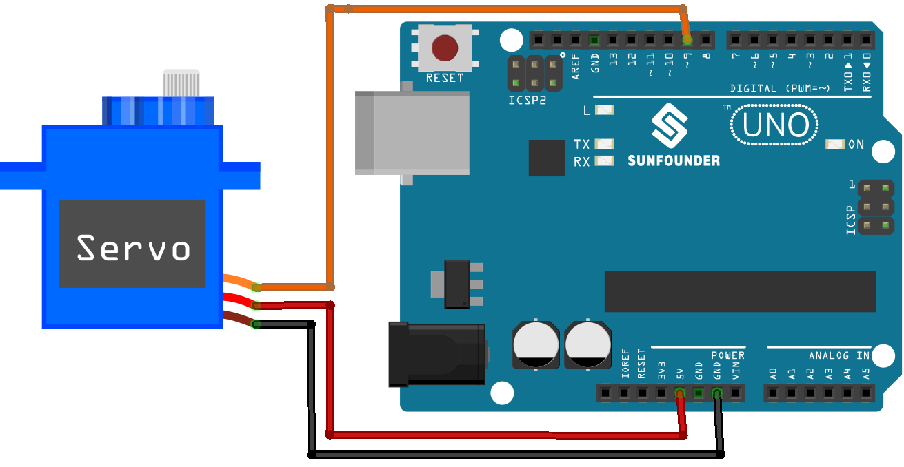

.. note:: 

    ¡Hola, bienvenido a la comunidad de entusiastas de SunFounder Raspberry Pi & Arduino & ESP32 en Facebook! Profundiza en Raspberry Pi, Arduino y ESP32 con otros aficionados.

    **Why Join?**

    - **Expert Support**: Resuelve problemas posventa y desafíos técnicos con la ayuda de nuestra comunidad y equipo.
    - **Learn & Share**: Intercambia consejos y tutoriales para mejorar tus habilidades.
    - **Exclusive Previews**: Obtén acceso anticipado a anuncios de nuevos productos y avances exclusivos.
    - **Special Discounts**: Disfruta de descuentos exclusivos en nuestros productos más recientes.
    - **Festive Promotions and Giveaways**: Participa en sorteos y promociones festivas.

    👉 ¿Listo para explorar y crear con nosotros? Haz clic en [|link_sf_facebook|] y únete hoy mismo!

.. _uno_lesson33_servo:

Lección 33: Motor Servo (SG90)
==================================

En esta lección, aprenderás a usar Arduino para controlar un motor servo y hacerlo rotar de 0 a 180 grados y viceversa. Cubriremos el uso de la biblioteca Servo, definiendo y utilizando variables para el control del servo, así como la implementación de un bucle for para un movimiento gradual. Este proyecto es ideal para principiantes, ya que proporciona experiencia práctica con control de motores y principios básicos de programación en Arduino.

Componentes Necesarios
--------------------------

Para este proyecto, necesitaremos los siguientes componentes.

Es definitivamente conveniente comprar un kit completo, aquí está el enlace:

.. list-table::
    :widths: 20 20 20
    :header-rows: 1

    *   - Nombre	
        - ELEMENTOS EN ESTE KIT
        - ENLACE
    *   - Kit Universal de Sensores para Creadores
        - 94
        - |link_umsk|

También puedes comprarlos por separado en los siguientes enlaces.

.. list-table::
    :widths: 30 20
    :header-rows: 1

    *   - Introducción del Componente
        - Enlace de Compra

    *   - Arduino UNO R3 o R4
        - |link_Uno_R3_buy|
    *   - :ref:`cpn_servo`
        - |link_servo_buy|

Conexiones
---------------------------

Código
---------------------------

.. raw:: html

    <iframe src=https://create.arduino.cc/editor/sunfounder01/12bb5427-6260-4b46-88a7-4b98f9db3ace/preview?embed style="height:510px;width:100%;margin:10px 0" frameborder=0></iframe>

Análisis del Código
---------------------------

1. Aquí, se incluye la biblioteca ``Servo``, que permite un control fácil del motor servo. También se definen el pin conectado al servo y el ángulo inicial del servo.

   .. code-block:: arduino

      #include <Servo.h>
      const int servoPin = 9;  // Define el pin del servo
      int angle = 0;           // Inicializa la variable del ángulo a 0 grados
      Servo servo;             // Crea un objeto servo

2. La función ``setup()`` se ejecuta una vez cuando el Arduino se inicia. El servo se conecta al pin definido usando la función ``attach()``.

   .. code-block:: arduino

      void setup() {
        servo.attach(servoPin);
      }

3. El bucle principal tiene dos bucles ``for``. El primer bucle aumenta el ángulo de 0 a 180 grados, y el segundo bucle disminuye el ángulo de 180 a 0 grados. El comando ``servo.write(angle)`` establece el servo en el ángulo especificado. El ``delay(15)`` hace que el servo espere 15 milisegundos antes de moverse al siguiente ángulo, controlando la velocidad del movimiento de barrido.

   .. code-block:: arduino

      void loop() {
        // escaneo de 0 a 180 grados
        for (angle = 0; angle < 180; angle++) {
          servo.write(angle);
          delay(15);
        }
        // ahora escaneo de vuelta de 180 a 0 grados
        for (angle = 180; angle > 0; angle--) {
          servo.write(angle);
          delay(15);
        }
      }