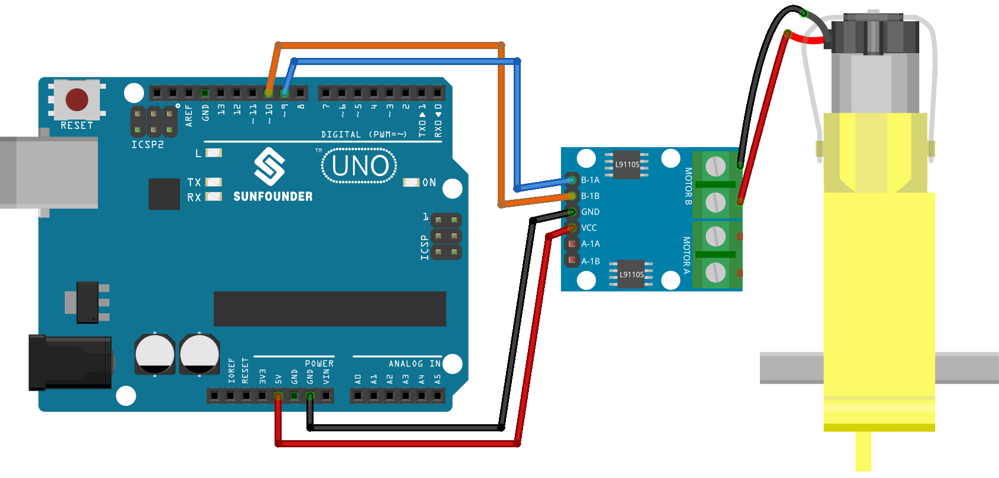

.. note:: 

    ¡Hola, bienvenido a la comunidad de entusiastas de SunFounder Raspberry Pi & Arduino & ESP32 en Facebook! Profundiza en Raspberry Pi, Arduino y ESP32 con otros aficionados.

    **Why Join?**

    - **Expert Support**: Resuelve problemas posventa y desafíos técnicos con la ayuda de nuestra comunidad y equipo.
    - **Learn & Share**: Intercambia consejos y tutoriales para mejorar tus habilidades.
    - **Exclusive Previews**: Obtén acceso anticipado a anuncios de nuevos productos y avances exclusivos.
    - **Special Discounts**: Disfruta de descuentos exclusivos en nuestros productos más recientes.
    - **Festive Promotions and Giveaways**: Participa en sorteos y promociones festivas.

    👉 ¿Listo para explorar y crear con nosotros? Haz clic en [|link_sf_facebook|] y únete hoy mismo!

.. _uno_lesson34_motor:

Lección 34: Motor TT
==================================

En esta lección, aprenderás a controlar un motor utilizando un Arduino Uno R3 o R4 y una placa de control de motor L9110. Cubriremos la definición de los pines del motor y la configuración de su velocidad mediante programación. Este tutorial te guiará a través del proceso de conexión y control de un motor, demostrando los principios básicos de la operación y control de motores en proyectos de Arduino. Orientada a principiantes, esta lección proporciona un enfoque práctico para comprender las operaciones de salida en la plataforma Arduino.

Componentes Necesarios
--------------------------

Para este proyecto, necesitaremos los siguientes componentes.

Es definitivamente conveniente comprar un kit completo, aquí está el enlace:

.. list-table::
    :widths: 20 20 20
    :header-rows: 1

    *   - Nombre	
        - ELEMENTOS EN ESTE KIT
        - ENLACE
    *   - Kit Universal de Sensores para Creadores
        - 94
        - |link_umsk|

También puedes comprarlos por separado en los siguientes enlaces.

.. list-table::
    :widths: 30 20
    :header-rows: 1

    *   - Introducción del Componente
        - Enlace de Compra

    *   - Arduino UNO R3 o R4
        - |link_Uno_R3_buy|
    *   - :ref:`cpn_ttmotor`
        - \-
    *   - :ref:`cpn_l9110`
        - \-

Conexiones
---------------------------

Código
---------------------------

.. raw:: html

    <iframe src=https://create.arduino.cc/editor/sunfounder01/89894de5-2114-4056-a064-0c495c6de447/preview?embed style="height:510px;width:100%;margin:10px 0" frameborder=0></iframe>

Análisis del Código
---------------------------

1. La primera parte del código define los pines de control del motor. Estos están conectados a la placa de control de motor L9110.

   .. code-block:: arduino
   
      // Definir los pines del motor
      const int motorB_1A = 9;
      const int motorB_2A = 10;

2. La función ``setup()`` inicializa los pines de control del motor como salida usando la función ``pinMode()``. Luego utiliza ``analogWrite()`` para establecer la velocidad del motor. El valor pasado a ``analogWrite()`` puede variar de 0 (apagado) a 255 (velocidad máxima). Una función ``delay()`` se utiliza luego para pausar el código durante 5000 milisegundos (o 5 segundos), después de lo cual la velocidad del motor se establece en 0 (apagado).

   .. code-block:: arduino
   
      void setup() {
        pinMode(motorB_1A, OUTPUT);  // configurar el pin 1 del motor como salida
        pinMode(motorB_2A, OUTPUT);  // configurar el pin 2 del motor como salida
   
        analogWrite(motorB_1A, 255);  // establecer la velocidad del motor (0-255)
        analogWrite(motorB_2A, 0);
   
        delay(5000);
   
        analogWrite(motorB_1A, 0);  
        analogWrite(motorB_2A, 0);
      }
