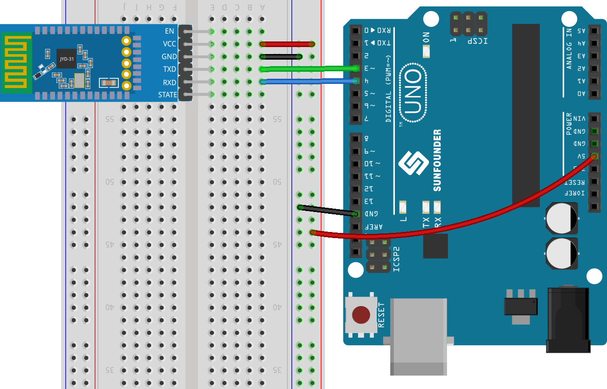
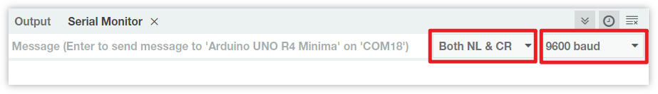

.. note:: 

    ¡Hola, bienvenido a la comunidad de entusiastas de SunFounder Raspberry Pi & Arduino & ESP32 en Facebook! Profundiza en Raspberry Pi, Arduino y ESP32 con otros aficionados.

    **Why Join?**

    - **Expert Support**: Resuelve problemas posventa y desafíos técnicos con la ayuda de nuestra comunidad y equipo.
    - **Learn & Share**: Intercambia consejos y tutoriales para mejorar tus habilidades.
    - **Exclusive Previews**: Obtén acceso anticipado a anuncios de nuevos productos y avances exclusivos.
    - **Special Discounts**: Disfruta de descuentos exclusivos en nuestros productos más recientes.
    - **Festive Promotions and Giveaways**: Participa en sorteos y promociones festivas.

    👉 ¿Listo para explorar y crear con nosotros? Haz clic en [|link_sf_facebook|] y únete hoy mismo!

.. _uno_lesson36_bluetooth:

Lección 36: Introducción al Módulo Bluetooth
===================================================

En este proyecto, demostraremos cómo comunicarse con un módulo Bluetooth a través de Arduino.

Primero, necesitamos configurar el circuito y utilizar la comunicación serial por software. Conecta el pin TX del módulo Bluetooth al pin 3 de la placa Uno, y el pin RX del módulo Bluetooth al pin 4 de la placa Uno.

Componentes Necesarios
--------------------------

Para este proyecto, necesitaremos los siguientes componentes.

Es definitivamente conveniente comprar un kit completo, aquí está el enlace:

.. list-table::
    :widths: 20 20 20
    :header-rows: 1

    *   - Nombre	
        - ELEMENTOS EN ESTE KIT
        - ENLACE
    *   - Kit Universal de Sensores para Creadores
        - 94
        - |link_umsk|

También puedes comprarlos por separado en los enlaces a continuación.

.. list-table::
    :widths: 30 20
    :header-rows: 1

    *   - Introducción del Componente
        - Enlace de Compra

    *   - Arduino UNO R3 o R4
        - |link_Uno_R3_buy|
    *   - :ref:`cpn_jdy31`
        - |link_jdy31_bluetooth_module_buy|
    *   - :ref:`cpn_breadboard`
        - |link_breadboard_buy|

1. Construir el Circuito
-----------------------------

2. Subir el código
-----------------------------

El código establece una comunicación serial por software utilizando la biblioteca SoftwareSerial de Arduino, permitiendo que el Arduino se comunique con el módulo Bluetooth JDY-31 a través de sus pines digitales 3 y 4 (como Rx y Tx). Verifica la transferencia de datos entre ellos, reenviando los mensajes recibidos de uno a otro a una tasa de baudios de 9600. **Con este código, puedes usar el monitor serial de Arduino para enviar comandos AT al módulo Bluetooth JDY-31 y recibir sus respuestas**.

.. raw:: html
    
    <iframe src=https://create.arduino.cc/editor/sunfounder01/ae75dbe4-f50d-41a4-915a-b2a30b0f4ebe/preview?embed style="height:510px;width:100%;margin:10px 0" frameborder=0></iframe>

3. Configurar el módulo Bluetooth
-----------------------------------------

Haz clic en el icono de la lupa (Monitor Serial) en la esquina superior derecha y establece la tasa de baudios en ``9600``. Luego, selecciona ``both NL & CR`` de la opción desplegable de ``New Line``.

Los siguientes son algunos ejemplos de uso de comandos AT para configurar módulos Bluetooth: Ingresa ``AT+NAME`` para obtener el nombre del dispositivo Bluetooth. Si deseas modificar el nombre del Bluetooth, añade un nuevo nombre después de ``AT+NAME``.

* **Consultar el nombre de un dispositivo Bluetooth:** ``AT+NAME`` 

  .. image:: img/Lesson_36_bluetooth_serial_2.gif

* **Establecer el nombre del dispositivo Bluetooth:** ``AT+NAME`` (seguido del nuevo nombre). ``+OK`` significa que la configuración fue exitosa. Puedes enviar ``AT+NAME`` nuevamente para verificar.

  .. image:: img/Lesson_36_bluetooth_serial_3.gif 

.. note::
   Para garantizar la consistencia en la experiencia de aprendizaje, se recomienda no modificar la tasa de baudios predeterminada del módulo Bluetooth y **mantenerla en su valor predeterminado de 4 (es decir, 9600 baudios)**. En cursos relevantes, nos comunicamos con Bluetooth usando una tasa de baudios de 9600.

* **Establecer la tasa de baudios del Bluetooth:** ``AT+BAUD`` (seguido del número que indica la tasa de baudios). 

    * 4 == 9600
    * 5 == 19200
    * 6 == 38400
    * 7 == 57600
    * 8 == 115200
    * 9 == 128000

Consulta la tabla a continuación para más comandos AT.

+------------+--------------------------------------------------+------------+
|   Command  |               Function                           |   Default  |
+============+==================================================+============+
| AT+VERSION | Versión del Número                               |JDY-31-V1.2 |
+------------+--------------------------------------------------+------------+
| AT+RESET   | Reinicio suave                                   |            |
+------------+--------------------------------------------------+------------+
| AT+DISC    | Desconectar (válido cuando conectado)            |            |
+------------+--------------------------------------------------+------------+
| AT+LADDR   | Consultar la dirección MAC del módulo            |            |
+------------+--------------------------------------------------+------------+
| AT+PIN     | Establecer o consultar la contraseña de conexión | 1234       |
+------------+--------------------------------------------------+------------+
| AT+BAUD    | Establecer o consultar la tasa de baudios        | 9600       |
+------------+--------------------------------------------------+------------+
| AT+NAME    | Establecer o consultar el nombre de difusión     | JDY-31-SPP |
+------------+--------------------------------------------------+------------+
| AT+DEFAULT | Restablecimiento de fábrica                      |            |
+------------+--------------------------------------------------+------------+
| AT+ENLOG   | Salida de estado del puerto serial               | 1          |
+------------+--------------------------------------------------+------------+

4. Comunicación a través de herramientas de depuración Bluetooth en teléfonos móviles
----------------------------------------------------------------------------------------

Podemos usar una aplicación llamada "Serial Bluetooth Terminal" para enviar mensajes desde el módulo Bluetooth al Arduino, simulando el proceso de interacción Bluetooth. El módulo Bluetooth enviará mensajes recibidos al Arduino a través del puerto serial, y de manera similar, Arduino también puede enviar mensajes al módulo Bluetooth a través del puerto serial.

a. **Instalar Serial Bluetooth Terminal**

   Ve a Google Play para descargar e instalar |link_serial_bluetooth_terminal|.

b. **Conectar Bluetooth**

   Inicialmente, activa **Bluetooth** en tu smartphone.
   
      .. image:: img/Lesson_36_app_1_shadow.png
         :width: 60%
         :align: center
   
   Navega a los **ajustes de Bluetooth** en tu smartphone y busca nombres como **JDY-31-SPP**.
   
      .. image:: img/Lesson_36_app_2_shadow.png
         :width: 60%
         :align: center
   
   Después de hacer clic en él, acepta la solicitud de **Emparejamiento** en la ventana emergente. Si se solicita un código de emparejamiento, ingresa "1234".
   
      .. image:: img/Lesson_36_app_3_shadow.png
         :width: 60%
         :align: center
   

c. **Comunicarse con el módulo Bluetooth**

   Abre el Serial Bluetooth Terminal. Conéctate a "JDY-31-SPP".

   .. image:: img/Lesson_36_bluetooth_serial_4_shadow.png 

   Tras la conexión exitosa, puedes ver el aviso de conexión exitosa en el monitor del puerto serial.

   .. image:: img/Lesson_36_bluetooth_serial_5_shadow.png 

   Introduce el mensaje en el monitor serial y envíalo al módulo Bluetooth.

   .. image:: img/Lesson_36_bluetooth_serial_6_shadow.png 

   Tras enviarlo, puedes ver este mensaje en la APP Serial Bluetooth Terminal. De manera similar, los datos pueden enviarse a Arduino a través de Bluetooth en la APP **Serial Bluetooth Terminal**.

   .. image:: img/Lesson_36_bluetooth_serial_7_shadow.png

   Puedes ver este mensaje desde Bluetooth en el monitor serial.

   .. image:: img/Lesson_36_bluetooth_serial_8_shadow.png