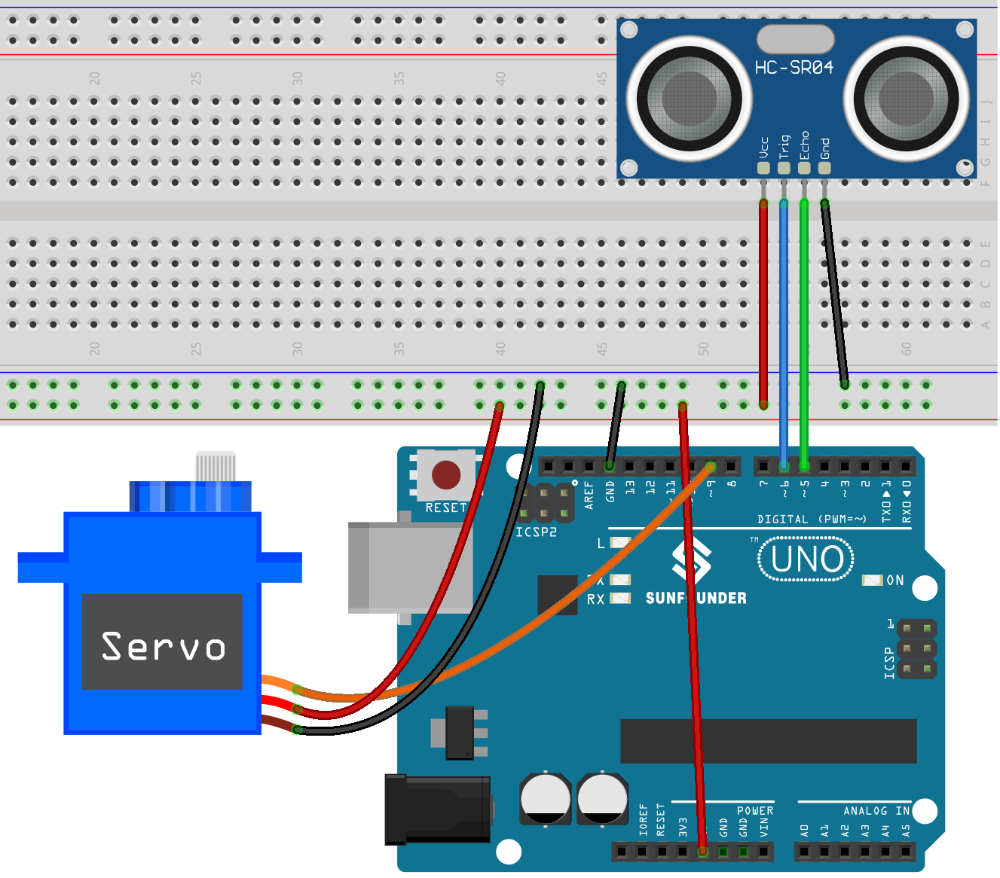

.. note::

    Bonjour et bienvenue dans la communauté des passionnés de Raspberry Pi, Arduino et ESP32 sur Facebook de SunFounder ! Plongez plus profondément dans l'univers du Raspberry Pi, Arduino et ESP32 avec d'autres enthousiastes.

    **Pourquoi rejoindre ?**

    - **Support d'experts** : Résolvez les problèmes après-vente et les défis techniques avec l'aide de notre communauté et de notre équipe.
    - **Apprendre & Partager** : Échangez des astuces et des tutoriels pour améliorer vos compétences.
    - **Aperçus exclusifs** : Accédez en avant-première aux annonces de nouveaux produits et aux aperçus.
    - **Réductions spéciales** : Profitez de remises exclusives sur nos nouveaux produits.
    - **Promotions festives et cadeaux** : Participez à des cadeaux et promotions de fêtes.

    👉 Prêt à explorer et à créer avec nous ? Cliquez sur [|link_sf_facebook|] et rejoignez-nous aujourd'hui !

.. _uno_lesson37_trashcan:

Leçon 37 : Poubelle intelligente
====================================

Ce projet est centré autour du concept d'une poubelle intelligente. L'objectif principal est que le couvercle de la poubelle s'ouvre automatiquement lorsqu'un objet s'approche à une distance définie (20 cm dans ce cas). Cette fonctionnalité est rendue possible grâce à l'utilisation d'un capteur de distance ultrasonique associé à un moteur servo. La distance entre l'objet et le capteur est mesurée en continu. Si l'objet est suffisamment proche, le moteur servo est activé pour ouvrir le couvercle.

Composants requis
--------------------------

Pour ce projet, nous avons besoin des composants suivants.

Il est certainement pratique d'acheter un kit complet, voici le lien :

.. list-table::
    :widths: 20 20 20
    :header-rows: 1

    *   - Nom	
        - ARTICLES DANS CE KIT
        - LIEN
    *   - Kit de capteurs universel pour bricoleurs
        - 94
        - |link_umsk|

Vous pouvez également les acheter séparément via les liens ci-dessous.

.. list-table::
    :widths: 30 20
    :header-rows: 1

    *   - Introduction du composant
        - Lien d'achat

    *   - Arduino UNO R3 ou R4
        - |link_Uno_R3_buy|
    *   - :ref:`cpn_ultrasonic`
        - |link_ultrasonic_buy|
    *   - :ref:`cpn_servo`
        - |link_servo_buy|
    *   - :ref:`cpn_breadboard`
        - |link_breadboard_buy|

Câblage
---------------------------

Code
---------------------------

.. raw:: html

    <iframe src=https://create.arduino.cc/editor/sunfounder01/f9aacc6c-809f-4fd2-9246-23bb4bdf78a2/preview?embed style="height:510px;width:100%;margin:10px 0" frameborder=0></iframe>

Analyse du code
---------------------------

Le projet repose sur la surveillance en temps réel de la distance entre un objet et une poubelle. Un capteur ultrasonique mesure continuellement cette distance, et si un objet s'approche à moins de 20 cm, la poubelle interprète cela comme une intention de jeter des déchets et ouvre automatiquement son couvercle. Cette automatisation ajoute de l'intelligence et de la commodité à une poubelle ordinaire.

#. Configuration initiale et déclaration de variables

   Ici, nous incluons la bibliothèque ``Servo`` et définissons les constantes et variables que nous utiliserons. Les broches pour le servo et le capteur ultrasonique sont déclarées. Nous avons également un tableau ``averDist`` pour conserver les trois mesures de distance.

   .. code-block:: arduino
       
      #include <Servo.h>
      Servo servo;
      const int servoPin = 9;
      const int openAngle = 0;
      const int closeAngle = 90;
      const int trigPin = 6;
      const int echoPin = 5;
      long distance, averageDistance;
      long averDist[3];
      const int distanceThreshold = 20;

#. Fonction ``setup()``

   La fonction ``setup()`` initialise la communication série, configure les broches du capteur ultrasonique, et positionne initialement le servo en position fermée.

   .. code-block:: arduino
   
      void setup() {
        Serial.begin(9600);
        pinMode(trigPin, OUTPUT);
        pinMode(echoPin, INPUT);
        servo.attach(servoPin);
        servo.write(closeAngle);
        delay(100);
      }

#. Fonction ``loop()``

   La fonction ``loop()`` est responsable de mesurer continuellement la distance, de calculer sa moyenne, puis de prendre une décision quant à l'ouverture ou la fermeture du couvercle de la poubelle basée sur cette distance moyenne.

   .. code-block:: arduino
   
      void loop() {
        for (int i = 0; i <= 2; i++) {
          distance = readDistance();
          averDist[i] = distance;
          delay(10);
        }
        averageDistance = (averDist[0] + averDist[1] + averDist[2]) / 3;
        Serial.println(averageDistance);
        if (averageDistance <= distanceThreshold) {
          servo.write(openAngle);
          delay(3500);
        } else {
          servo.write(closeAngle);
          delay(1000);
        }
      }

#. Fonction de lecture de distance

   Cette fonction, ``readDistance()``, est celle qui interagit réellement avec le capteur ultrasonique. Elle envoie une impulsion et attend un écho. Le temps pris pour l'écho est ensuite utilisé pour calculer la distance entre le capteur et tout objet devant lui.

   Vous pouvez vous référer au :ref:`cpn_ultrasonic_principle` du capteur ultrasonique.

   .. code-block:: arduino
   
      float readDistance() {
        digitalWrite(trigPin, LOW);
        delayMicroseconds(2);
        digitalWrite(trigPin, HIGH);
        delayMicroseconds(10);
        digitalWrite(trigPin, LOW);
        float distance = pulseIn(echoPin, HIGH) / 58.00;
        return distance;
      }