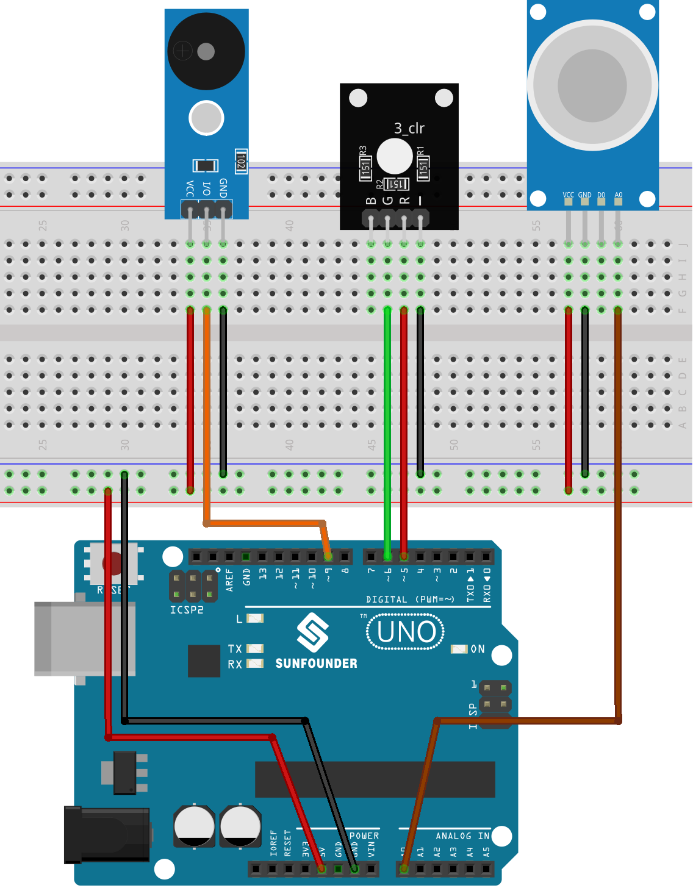

.. note::

    Ciao, benvenuto nella Community SunFounder dedicata agli appassionati di Raspberry Pi, Arduino ed ESP32 su Facebook! Approfondisci le tue conoscenze su Raspberry Pi, Arduino ed ESP32 insieme ad altri appassionati.

    **Perché unirti?**

    - **Supporto Esperto**: Risolvi problemi post-vendita e sfide tecniche con il supporto del nostro team e della community.
    - **Impara e Condividi**: Scambia suggerimenti e tutorial per sviluppare le tue competenze.
    - **Anteprime Esclusive**: Ottieni accesso anticipato alle novità sui prodotti e agli sneak peek.
    - **Sconti Speciali**: Approfitta di offerte esclusive sui nostri prodotti più recenti.
    - **Promozioni Festive e Giveaway**: Partecipa a concorsi e promozioni durante le festività.

    👉 Pronto a esplorare e creare con noi? Clicca su [|link_sf_facebook|] ed entra subito a far parte della community!

.. _uno_lesson38_gas_leak_alarm:

Lezione 38: Allarme per perdita di gas
==========================================

Questo progetto simula uno scenario di rilevamento di perdite di gas utilizzando una scheda Arduino Uno. Incorporando un sensore di gas MQ-2 e un LED RGB, la dimostrazione legge continuamente la concentrazione di gas. Se tale concentrazione supera una soglia predefinita, si attiva un allarme (buzzer) e il LED RGB si accende di rosso. Se la concentrazione rimane al di sotto della soglia, l’allarme resta disattivato e il LED si illumina di verde. È importante sottolineare che si tratta di una dimostrazione illustrativa e non sostituisce un vero sistema di rilevamento gas.

Componenti Necessari
--------------------------

Per questo progetto sono necessari i seguenti componenti.

È sicuramente più comodo acquistare un kit completo, ecco il link:

.. list-table::
    :widths: 20 20 20
    :header-rows: 1

    *   - Nome
        - COMPONENTI INCLUSI NEL KIT
        - LINK
    *   - Universal Maker Sensor Kit
        - 94
        - |link_umsk|

In alternativa, puoi acquistarli singolarmente dai link seguenti:

.. list-table::
    :widths: 30 20
    :header-rows: 1

    *   - Descrizione Componente
        - Link per l'acquisto

    *   - Arduino UNO R3 o R4
        - |link_Uno_R3_buy|
    *   - :ref:`cpn_gas`
        - |link_mq2_gas_sensor_module_buy|
    *   - :ref:`cpn_buzzer`
        - |link_passive_buzzer_module_buy|
    *   - :ref:`cpn_rgb`
        - \-
    *   - :ref:`cpn_breadboard`
        - |link_breadboard_buy|

Collegamenti
---------------------------

Codice
---------------------------

.. raw:: html

    <iframe src=https://create.arduino.cc/editor/sunfounder01/314a351a-9c54-4938-bb72-1471f1807adb/preview?embed style="height:510px;width:100%;margin:10px 0" frameborder=0></iframe>

Analisi del Codice
---------------------------

Il principio alla base del progetto consiste nel monitorare costantemente la concentrazione di gas. Quando il valore rilevato supera una certa soglia, viene attivato un allarme e il LED cambia colore in rosso. Questo serve come sistema di avviso simulato per condizioni potenzialmente pericolose. Se la concentrazione scende sotto la soglia, l’allarme viene disattivato e il LED si accende di verde, indicando un ambiente sicuro.

1. Definizione di Costanti e Variabili

   Qui vengono dichiarati e inizializzati i pin dei vari componenti. ``sensorPin`` rappresenta il pin analogico a cui è collegato il sensore MQ-2. ``sensorValue`` memorizza il valore analogico letto. ``buzzerPin`` indica il pin digitale collegato al buzzer. ``RPin`` e ``GPin`` controllano i canali rosso e verde del LED RGB.

   .. code-block:: arduino

      // Definizione dei pin per il sensore di gas
      const int sensorPin = A0;
      int sensorValue;

      // Definizione del pin per il buzzer
      const int buzzerPin = 9;

      // Definizione dei pin per il LED RGB
      const int RPin = 5;  // Canale rosso
      const int GPin = 6;  // Canale verde

2. Inizializzazione nella funzione ``setup()``

   La funzione ``setup()`` configura la comunicazione seriale e imposta i pin del buzzer e del LED RGB come ``OUTPUT``.

   .. code-block:: arduino

      void setup() {
        Serial.begin(9600);  // Avvia la comunicazione seriale a 9600 baud

        // Imposta i pin del buzzer e del LED RGB come output
        pinMode(buzzerPin, OUTPUT);
        pinMode(RPin, OUTPUT);
        pinMode(GPin, OUTPUT);
      }

3. Ciclo Principale: Lettura del sensore e attivazione dell’allarme

   La funzione ``loop()`` legge costantemente il valore del sensore. Il valore viene visualizzato nel Serial Monitor. In base alla lettura:

   - Se il valore supera 300, il buzzer si attiva con ``tone()``, e il LED si illumina di rosso.
   - Se il valore è inferiore, l’allarme viene disattivato con ``noTone()`` e il LED passa al verde.

   Una pausa di 50 millisecondi viene introdotta per regolare la frequenza di lettura.

   .. code-block:: arduino

      void loop() {
        // Legge il valore analogico del sensore di gas
        sensorValue = analogRead(sensorPin);

        // Visualizza il valore nel monitor seriale
        Serial.print("Analog output: ");
        Serial.println(sensorValue);

        // Se supera la soglia, attiva l’allarme e illumina il LED di rosso
        if (sensorValue > 300) {
          tone(buzzerPin, 500, 300);
          digitalWrite(GPin, LOW);
          digitalWrite(RPin, HIGH);
        } else {
          // Se è sotto la soglia, disattiva l’allarme e illumina il LED di verde
          noTone(buzzerPin);
          digitalWrite(RPin, LOW);
          digitalWrite(GPin, HIGH);
        }

        // Attendi 50 ms prima del prossimo ciclo
        delay(50);
      }

