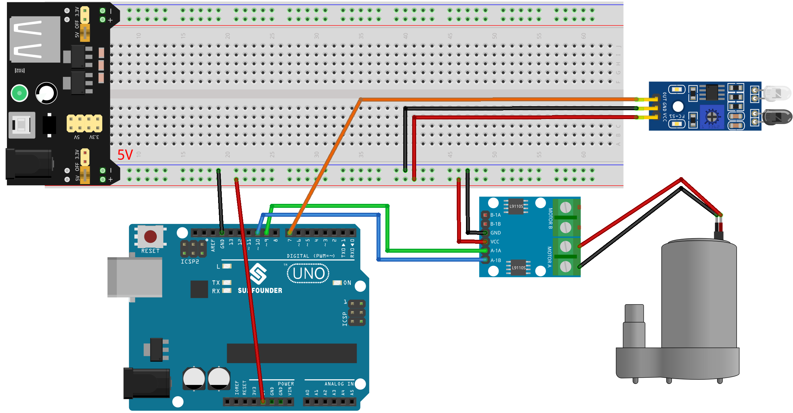

.. note:: 

    ¡Hola, bienvenido a la comunidad de entusiastas de SunFounder Raspberry Pi & Arduino & ESP32 en Facebook! Profundiza en Raspberry Pi, Arduino y ESP32 con otros aficionados.

    **Why Join?**

    - **Expert Support**: Resuelve problemas posventa y desafíos técnicos con la ayuda de nuestra comunidad y equipo.
    - **Learn & Share**: Intercambia consejos y tutoriales para mejorar tus habilidades.
    - **Exclusive Previews**: Obtén acceso anticipado a anuncios de nuevos productos y avances exclusivos.
    - **Special Discounts**: Disfruta de descuentos exclusivos en nuestros productos más recientes.
    - **Festive Promotions and Giveaways**: Participa en sorteos y promociones festivas.

    👉 ¿Listo para explorar y crear con nosotros? Haz clic en [|link_sf_facebook|] y únete hoy mismo!

.. _uno_lesson39_soap_dispenser:

Lección 39: Dispensador automático de jabón
================================================

El proyecto del Dispensador Automático de Jabón utiliza una placa Arduino Uno junto con un sensor infrarrojo de evitación de obstáculos y una bomba de agua. El sensor detecta la presencia de un objeto, como una mano, lo que activa la bomba de agua para dispensar jabón.

Componentes Necesarios
--------------------------

Para este proyecto, necesitaremos los siguientes componentes.

Es definitivamente conveniente comprar un kit completo, aquí está el enlace:

.. list-table::
    :widths: 20 20 20
    :header-rows: 1

    *   - Nombre	
        - ELEMENTOS EN ESTE KIT
        - ENLACE
    *   - Kit Universal de Sensores para Creadores
        - 94
        - |link_umsk|

También puedes comprarlos por separado en los siguientes enlaces.

.. list-table::
    :widths: 30 20
    :header-rows: 1

    *   - Introducción del Componente
        - Enlace de Compra

    *   - Arduino UNO R3 o R4
        - |link_Uno_R3_buy|
    *   - :ref:`cpn_ir_obstacle`
        - |link_obstacle_avoidance_module_buy|
    *   - :ref:`cpn_pump`
        - \-
    *   - :ref:`cpn_l9110`
        - \-
    *   - :ref:`cpn_power_module`
        - \-
    *   - :ref:`cpn_breadboard`
        - |link_breadboard_buy|
        

Cableado
---------------------------

Código
---------------------------

.. raw:: html

    <iframe src=https://create.arduino.cc/editor/sunfounder01/47ef3a59-afe1-40a8-9b36-1ff5db59af15/preview?embed style="height:510px;width:100%;margin:10px 0" frameborder=0></iframe>

Análisis del Código
---------------------------

La idea principal detrás de este proyecto es crear un sistema de dispensación de jabón sin contacto. El sensor infrarrojo de evitación de obstáculos detecta cuando un objeto (como una mano) está cerca. Al detectar un objeto, el sensor envía una señal al Arduino, que a su vez activa la bomba de agua para dispensar jabón. La bomba permanece activa durante un breve período, dispensando jabón, luego se apaga.

#. **Definición de los pines para el sensor y la bomba**

   En este fragmento de código, definimos los pines de Arduino que se conectan al sensor y a la bomba. Definimos el pin 7 como el pin del sensor y usaremos la variable ``sensorValue`` para almacenar los datos leídos de este sensor. Para la bomba de agua, usamos dos pines, el 9 y el 10.
   
   .. code-block:: arduino
   
      const int sensorPin = 7;
      int sensorValue;
      const int pump1A = 9;
      const int pump1B = 10;

#. **Configuración del sensor y la bomba**

   En la función ``setup()``, definimos los modos para los pines que estamos usando. El pin del sensor se establece como ``INPUT`` ya que se utilizará para recibir datos del sensor. Los pines de la bomba se configuran como ``OUTPUT`` ya que enviarán comandos a la bomba. Aseguramos que el pin ``pump1B`` comience en estado ``LOW`` (apagado), y comenzamos la comunicación serial con una tasa de baudios de 9600.

   .. code-block:: arduino
   
      void setup() {
        pinMode(sensorPin, INPUT);
        pinMode(pump1A, OUTPUT);    
        pinMode(pump1B, OUTPUT);    
        digitalWrite(pump1B, LOW);  
        Serial.begin(9600);
      }

#. **Verificación continua del sensor y control de la bomba**

   En la función ``loop()``, el Arduino lee constantemente el valor del sensor utilizando ``digitalRead()`` y lo asigna a ``sensorValue()``. Luego imprime este valor en el monitor serial para propósitos de depuración. Si el sensor detecta un objeto, ``sensorValue()`` será 0. Cuando esto sucede, ``pump1A`` se establece en ``HIGH``, activando la bomba, y un retraso de 700 milisegundos permite que la bomba dispense jabón. La bomba se desactiva luego estableciendo ``pump1A`` en ``LOW``, y un retraso de 1 segundo da tiempo al usuario para mover la mano antes de que el ciclo se repita.

   .. note:: 
   
      Si el sensor no funciona correctamente, ajusta el transmisor y receptor IR para que estén paralelos. Además, puedes ajustar el rango de detección usando el potenciómetro incorporado.

   .. code-block:: arduino
   
      void loop() {
        sensorValue = digitalRead(sensorPin);
        Serial.println(sensorValue);
        if (sensorValue == 0) {  
          digitalWrite(pump1A, HIGH);
          delay(700);
          digitalWrite(pump1A, LOW);
          delay(1000);
        }
      }
