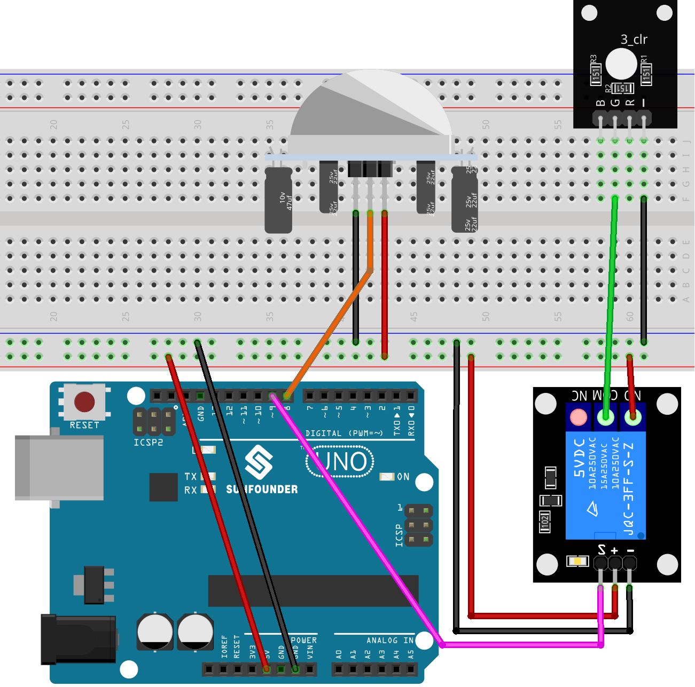

.. note::

    Bonjour, bienvenue dans la communauté des passionnés de SunFounder Raspberry Pi & Arduino & ESP32 sur Facebook ! Explorez plus en profondeur les univers du Raspberry Pi, Arduino et ESP32 avec d'autres passionnés.

    **Pourquoi rejoindre ?**

    - **Support d'experts** : Résolvez les problèmes post-vente et les défis techniques avec l'aide de notre communauté et de notre équipe.
    - **Apprendre & Partager** : Échangez des conseils et des tutoriels pour améliorer vos compétences.
    - **Aperçus exclusifs** : Bénéficiez d'un accès anticipé aux annonces de nouveaux produits et aux avant-premières.
    - **Réductions spéciales** : Profitez de réductions exclusives sur nos nouveaux produits.
    - **Promotions festives et cadeaux** : Participez à des tirages au sort et à des promotions de fêtes.

    👉 Prêt à explorer et à créer avec nous ? Cliquez sur [|link_sf_facebook|] et rejoignez-nous aujourd'hui !

.. _uno_lesson40_motion_triggered_relay:

Leçon 40 : Relais activé par mouvement
=========================================

Ce projet Arduino vise à contrôler une lumière actionnée par un relais à l'aide d'un capteur infrarouge passif (PIR). Lorsque le capteur PIR détecte un mouvement, le relais est activé, allumant la lumière. La lumière reste allumée pendant 5 secondes après le dernier mouvement détecté.

.. warning::
    En tant que démonstration, nous utilisons un relais pour contrôler un module LED RGB. Cependant, dans des scénarios réels, cette approche peut ne pas être la plus pratique.
    
    **Bien que vous puissiez connecter le relais à d'autres appareils dans des applications réelles, une extrême prudence est requise lors de la manipulation de haute tension AC. Une utilisation inappropriée ou incorrecte peut entraîner des blessures graves voire mortelles. Par conséquent, il est destiné aux personnes qui sont familières et informées sur la haute tension AC. La sécurité doit toujours être prioritaire.**

Composants requis
--------------------------

Pour ce projet, nous avons besoin des composants suivants.

Il est définitivement pratique d'acheter un kit complet, voici le lien :

.. list-table::
    :widths: 20 20 20
    :header-rows: 1

    *   - Nom	
        - ARTICLES DANS CE KIT
        - LIEN
    *   - Kit de capteurs universel pour créateurs
        - 94
        - |link_umsk|

Vous pouvez également les acheter séparément via les liens ci-dessous.

.. list-table::
    :widths: 30 20
    :header-rows: 1

    *   - Introduction du composant
        - Lien d'achat

    *   - Arduino UNO R3 ou R4
        - |link_Uno_R3_buy|
    *   - :ref:`cpn_pir_motion`
        - \-
    *   - :ref:`cpn_relay`
        - \-
    *   - :ref:`cpn_rgb`
        - \-
    *   - :ref:`cpn_breadboard`
        - |link_breadboard_buy|
        

Câblage
---------------------------

Code
---------------------------

.. raw:: html

    <iframe src=https://create.arduino.cc/editor/sunfounder01/1678870f-2731-4a6c-826d-2433214c4be4/preview?embed style="height:510px;width:100%;margin:10px 0" frameborder=0></iframe>

Analyse du code
---------------------------

Le projet s'articule autour de la capacité du capteur de mouvement PIR à détecter un mouvement. Lorsqu'un mouvement est détecté, un signal est envoyé à l'Arduino, déclenchant le module de relais, qui à son tour active une lumière. La lumière reste allumée pendant une durée spécifiée (dans ce cas, 5 secondes) après le dernier mouvement détecté, garantissant que la zone reste éclairée pendant une courte période même si le mouvement cesse.

1. **Configuration initiale et déclarations de variables**

   Ce segment définit les constantes et variables qui seront utilisées tout au long du code. Nous configurons les broches du relais et du PIR et une constante de délai pour le mouvement. Nous avons également une variable pour suivre le dernier moment de détection de mouvement et un indicateur pour surveiller si un mouvement est détecté.

   .. code-block:: arduino
   
      // Définir le numéro de broche pour le relais
      const int relayPin = 9;
   
      // Définir le numéro de broche pour le capteur PIR
      const int pirPin = 8;
   
      // Seuil de délai de mouvement en millisecondes
      const unsigned long MOTION_DELAY = 5000;
   
      unsigned long lastMotionTime = 0;  // Horodatage de la dernière détection de mouvement
      bool motionDetected = false;       // Indicateur pour suivre si un mouvement est détecté
   

2. **Configuration des broches dans la fonction setup()**

   Dans la fonction ``setup()``, nous configurons les modes de broche pour le relais et le capteur PIR. Nous initialisons également le relais pour qu'il soit éteint au début.

   .. code-block:: arduino
   
      void setup() {
        pinMode(relayPin, OUTPUT);    // Configurer relayPin comme broche de sortie
        pinMode(pirPin, INPUT);       // Configurer la broche PIR comme entrée
        digitalWrite(relayPin, LOW);  // Éteindre le relais initialement
      }

3. **Logique principale dans la fonction loop()**

   La fonction ``loop()`` contient la logique principale. Lorsque le capteur PIR détecte un mouvement, il envoie un signal ``HIGH``, activant le relais et mettant à jour le ``lastMotionTime``. Si aucun mouvement n'est détecté pendant le délai spécifié (5 secondes dans ce cas), le relais est éteint.
   
   Cette approche garantit que même si le mouvement est sporadique ou bref, la lumière reste allumée pendant au moins 5 secondes après le dernier mouvement détecté, offrant une durée d'éclairage constante.

   .. code-block:: arduino
   
      void loop() {
        if (digitalRead(pirPin) == HIGH) {
          lastMotionTime = millis();     // Mettre à jour le dernier moment de détection de mouvement
          digitalWrite(relayPin, HIGH);  // Allumer le relais (et donc la lumière)
          motionDetected = true;
        }
   
        // Si un mouvement a été détecté plus tôt et que 5 secondes se sont écoulées, éteindre le relais
        if (motionDetected && (millis() - lastMotionTime >= MOTION_DELAY)) {
          digitalWrite(relayPin, LOW);  // Éteindre le relais
          motionDetected = false;
        }
      }
   
   
