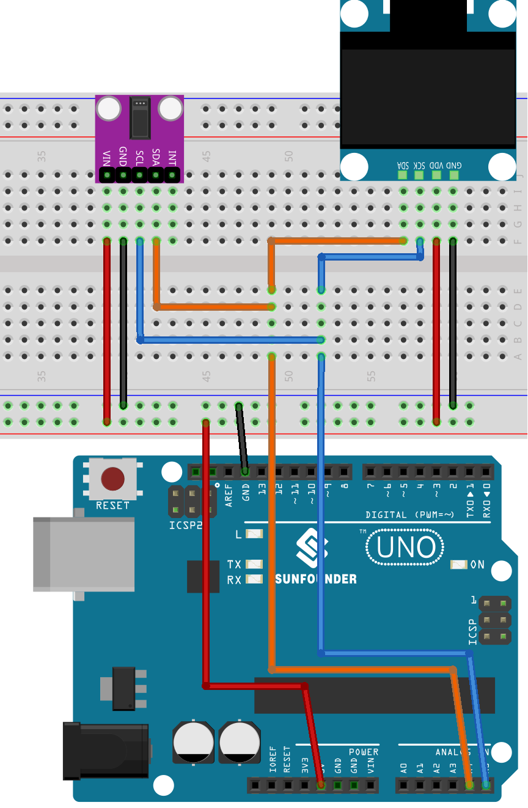

.. note::

    Ciao, benvenuto nella Community SunFounder dedicata agli appassionati di Raspberry Pi, Arduino ed ESP32 su Facebook! Approfondisci il mondo di Raspberry Pi, Arduino ed ESP32 insieme ad altri entusiasti.

    **Perché unirti?**

    - **Supporto Esperto**: Risolvi problemi post-vendita e sfide tecniche con l’aiuto della nostra community e del nostro team.
    - **Impara e Condividi**: Scambia consigli e tutorial per migliorare le tue competenze.
    - **Anteprime Esclusive**: Ottieni accesso anticipato agli annunci dei nuovi prodotti e anteprime esclusive.
    - **Sconti Speciali**: Approfitta di sconti riservati sui nostri prodotti più recenti.
    - **Promozioni Festive e Giveaway**: Partecipa a promozioni speciali e omaggi durante le festività.

    👉 Pronto a esplorare e creare con noi? Clicca su [|link_sf_facebook|] e unisciti oggi stesso!

.. _uno_lesson41_heartrate_monitor:

Lezione 41: Monitor del battito cardiaco
============================================

Questo progetto Arduino mira a realizzare un semplice monitor del battito cardiaco utilizzando un sensore pulsossimetro MAX30102 e un display OLED SSD1306. Il codice misura il battito calcolando il tempo tra un battito e l’altro. Dopo quattro misurazioni, viene calcolata la media, che viene poi visualizzata sul display OLED. Se il sensore non rileva un dito, viene mostrato un messaggio per invitare l’utente a posizionarlo correttamente.

Componenti Necessari
--------------------------

Per questo progetto servono i seguenti componenti.

È sicuramente comodo acquistare il kit completo, ecco il link:

.. list-table::
    :widths: 20 20 20
    :header-rows: 1

    *   - Nome
        - COMPONENTI NEL KIT
        - LINK
    *   - Universal Maker Sensor Kit
        - 94
        - |link_umsk|

Puoi anche acquistare separatamente i singoli componenti:

.. list-table::
    :widths: 30 20
    :header-rows: 1

    *   - Introduzione al Componente
        - Link Acquisto

    *   - Arduino UNO R3 o R4
        - |link_Uno_R3_buy|
    *   - :ref:`cpn_max30102`
        - |link_max30102_module_buy|
    *   - :ref:`cpn_oled`
        - \-
    *   - :ref:`cpn_breadboard`
        - |link_breadboard_buy|

Cablaggio
---------------------------

Codice
---------------------------

.. note::
   Per installare le librerie, apri il Library Manager di Arduino, cerca **"SparkFun MAX3010x"**, **"Adafruit SSD1306"** e **"Adafruit GFX"**, quindi installale.

.. raw:: html

    <iframe src=https://create.arduino.cc/editor/sunfounder01/0f574652-4575-46b9-88b7-2d30573bcb71/preview?embed style="height:510px;width:100%;margin:10px 0" frameborder=0></iframe>

Analisi del Codice
---------------------------

Il principio alla base di questo progetto è la rilevazione delle pulsazioni del flusso sanguigno tramite il dito, utilizzando il sensore MAX30102. Quando il sangue scorre, il volume nei vasi del polpastrello varia leggermente. Il sensore rileva queste variazioni misurando la luce assorbita o riflessa attraverso il dito. L’intervallo tra le pulsazioni viene poi usato per calcolare il battito cardiaco in BPM (battiti per minuto), che viene mediato su quattro misurazioni e visualizzato sullo schermo OLED.

1. **Inclusione delle librerie e dichiarazioni iniziali**:

   Il codice inizia includendo le librerie necessarie per il display OLED, il sensore MAX30102 e l’algoritmo di calcolo del battito cardiaco. Viene poi configurato il display e inizializzate le variabili per il calcolo.

   .. note::
      Per installare le librerie, apri il Library Manager di Arduino, cerca **"SparkFun MAX3010x"**, **"Adafruit SSD1306"** e **"Adafruit GFX"**, quindi installale.

   .. code-block:: arduino

      #include <Adafruit_GFX.h>  // Librerie per OLED
      #include <Adafruit_SSD1306.h>
      #include <Wire.h>
      #include "MAX30105.h"   // Libreria per MAX3010x
      #include "heartRate.h"  // Algoritmo per il calcolo del battito cardiaco

      // ... Variabili e configurazione OLED

   In questo progetto, abbiamo anche definito alcune immagini bitmap. La parola chiave ``PROGMEM`` indica che l’array è memorizzato nella memoria programma del microcontrollore Arduino, utile per risparmiare spazio in RAM.

   .. code-block:: arduino

      static const unsigned char PROGMEM beat1_bmp[] = {...}

      static const unsigned char PROGMEM beat2_bmp[] = {...}

2. **Funzione di setup**:

   Inizializza la comunicazione I2C, la comunicazione seriale, il display OLED e il sensore MAX30102.

   .. code-block:: arduino

      void setup() {
          Wire.setClock(400000);
          Serial.begin(9600);
          display.begin(SSD1306_SWITCHCAPVCC, SCREEN_ADDRESS);
          // ... Codice di setup restante

3. **Funzione loop principale**:

   Qui risiede la logica principale. Viene letto il valore IR dal sensore. Se viene rilevato un dito (valore IR > 50000), si controlla la presenza di un battito. Se il battito viene rilevato, viene aggiornato lo schermo OLED e calcolato il BPM. In caso contrario, viene richiesto all’utente di posizionare il dito correttamente.

   Sono inoltre stati creati due bitmap animati per visualizzare un effetto battito cardiaco dinamico sul display.

   .. code-block:: arduino

      void loop() {
        // Ottiene il valore IR dal sensore
        long irValue = particleSensor.getIR();  
      
        // Se viene rilevato un dito
        if (irValue > 50000) {
      
          // Verifica se è stato rilevato un battito
          if (checkForBeat(irValue) == true) {

            // Aggiorna lo schermo OLED
            // Calcola il BPM
      
            // Calcola la media del BPM
            // Stampa IR, BPM attuale e BPM medio sul serial monitor

            // Aggiorna il display OLED
            
          }
        }
        else {
          // ... Messaggio per posizionare il dito sul sensore
        }
      }
      

