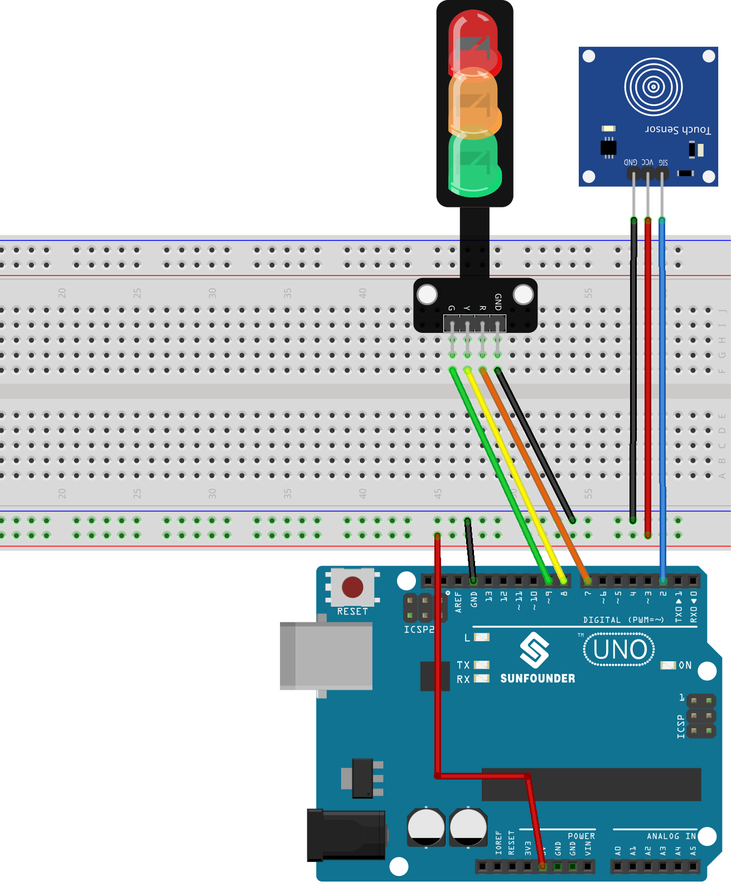

.. note::

    Bonjour, bienvenue dans la communauté des passionnés de SunFounder Raspberry Pi & Arduino & ESP32 sur Facebook ! Plongez plus profondément dans l'univers du Raspberry Pi, Arduino et ESP32 avec d'autres passionnés.

    **Pourquoi rejoindre ?**

    - **Support d'experts** : Résolvez les problèmes post-vente et les défis techniques avec l'aide de notre communauté et de notre équipe.
    - **Apprendre & Partager** : Échangez des astuces et des tutoriels pour améliorer vos compétences.
    - **Aperçus exclusifs** : Obtenez un accès anticipé aux annonces de nouveaux produits et aux avant-premières.
    - **Réductions spéciales** : Profitez de réductions exclusives sur nos nouveaux produits.
    - **Promotions festives et cadeaux** : Participez à des tirages au sort et à des promotions de fêtes.

    👉 Prêt à explorer et à créer avec nous ? Cliquez sur [|link_sf_facebook|] et rejoignez-nous aujourd'hui !

.. _uno_lesson42_touch_toggle_light:

Leçon 42 : Contrôle tactile d'un feu de signalisation
========================================================

Ce projet est une mise en œuvre simple d'un système de contrôle de feu de signalisation utilisant un capteur tactile et un module de feu de signalisation LED. 
L'activation du capteur tactile déclenche une séquence où les LED s'illuminent dans l'ordre suivant : Rouge -> Jaune -> Vert.

Composants requis
--------------------------

Pour ce projet, nous avons besoin des composants suivants.

Il est définitivement pratique d'acheter un kit complet, voici le lien :

.. list-table::
    :widths: 20 20 20
    :header-rows: 1

    *   - Nom	
        - ARTICLES DANS CE KIT
        - LIEN
    *   - Kit de capteurs universel pour créateurs
        - 94
        - |link_umsk|

Vous pouvez également les acheter séparément via les liens ci-dessous.

.. list-table::
    :widths: 30 20
    :header-rows: 1

    *   - Introduction du composant
        - Lien d'achat

    *   - Arduino UNO R3 ou R4
        - |link_Uno_R3_buy|
    *   - :ref:`cpn_touch`
        - \-
    *   - :ref:`cpn_traffic`
        - \-
    *   - :ref:`cpn_breadboard`
        - |link_breadboard_buy|
        

Câblage
---------------------------

Code
---------------------------

.. raw:: html

  <iframe src=https://create.arduino.cc/editor/sunfounder01/f53d6cf6-ed27-49d3-b4d3-12f29b417a89/preview?embed style="height:510px;width:100%;margin:10px 0" frameborder=0></iframe>

Analyse du code
---------------------------

Le fonctionnement de ce projet est simple : une détection de toucher sur le capteur déclenche l'illumination de la LED suivante dans la séquence (Rouge -> Jaune -> Vert), contrôlée par la variable ``currentLED``.

1. Définir les broches et les valeurs initiales

   .. code-block:: arduino
   
      const int touchSensorPin = 2;  // Broche du capteur tactile
      const int rledPin = 7;         // Broche LED rouge
      const int yledPin = 8;         // Broche LED jaune
      const int gledPin = 9;         // Broche LED verte
      int lastTouchState;            // État précédent du capteur tactile
      int currentTouchState;         // État actuel du capteur tactile
      int currentLED = 0;            // LED actuelle : 0->Rouge, 1->Jaune, 2->Vert
   
   Ces lignes établissent les connexions des broches pour les composants de la carte Arduino et initialisent l'état du capteur tactile et des LED.

2. Fonction setup()

   .. code-block:: arduino
   
       void setup() {
         Serial.begin(9600);              // Initialiser la communication série
         pinMode(touchSensorPin, INPUT);  // Configurer la broche du capteur tactile comme entrée
         // Configurer les broches LED comme sorties
         pinMode(rledPin, OUTPUT);
         pinMode(yledPin, OUTPUT);
         pinMode(gledPin, OUTPUT);
         currentTouchState = digitalRead(touchSensorPin); // Lire l'état initial du toucher
       }
   
   Cette fonction configure l'initialisation initiale pour l'Arduino, définissant les modes d'entrée et de sortie et démarrant la communication série pour le débogage.

3. Fonction loop()

   .. code-block:: arduino
   
       void loop() {
         lastTouchState = currentTouchState;                        // Enregistrer le dernier état
         currentTouchState = digitalRead(touchSensorPin);           // Lire le nouvel état de toucher
         if (lastTouchState == LOW && currentTouchState == HIGH) {  // Détecter le toucher
           Serial.println("Sensor touched");
           turnAllLEDsOff();  // Éteindre toutes les LED
           // Activer la LED suivante dans la séquence
           switch (currentLED) {
             case 0:
               digitalWrite(rledPin, HIGH);
               currentLED = 1;
               break;
             case 1:
               digitalWrite(yledPin, HIGH);
               currentLED = 2;
               break;
             case 2:
               digitalWrite(gledPin, HIGH);
               currentLED = 0;
               break;
           }
         }
       }

   La boucle surveille continuellement le capteur tactile, faisant défiler les LED lorsqu'un toucher est détecté, en s'assurant qu'une seule LED est allumée à un moment donné.

4. Fonction d'extinction des LED

   .. code-block:: arduino
      
       void turnAllLEDsOff() {
         // Mettre toutes les broches LED en LOW, les éteignant
         digitalWrite(rledPin, LOW);
         digitalWrite(yledPin, LOW);
         digitalWrite(gledPin, LOW);
       }

   Cette fonction auxiliaire éteint toutes les LED, aidant dans le processus de cyclage.
