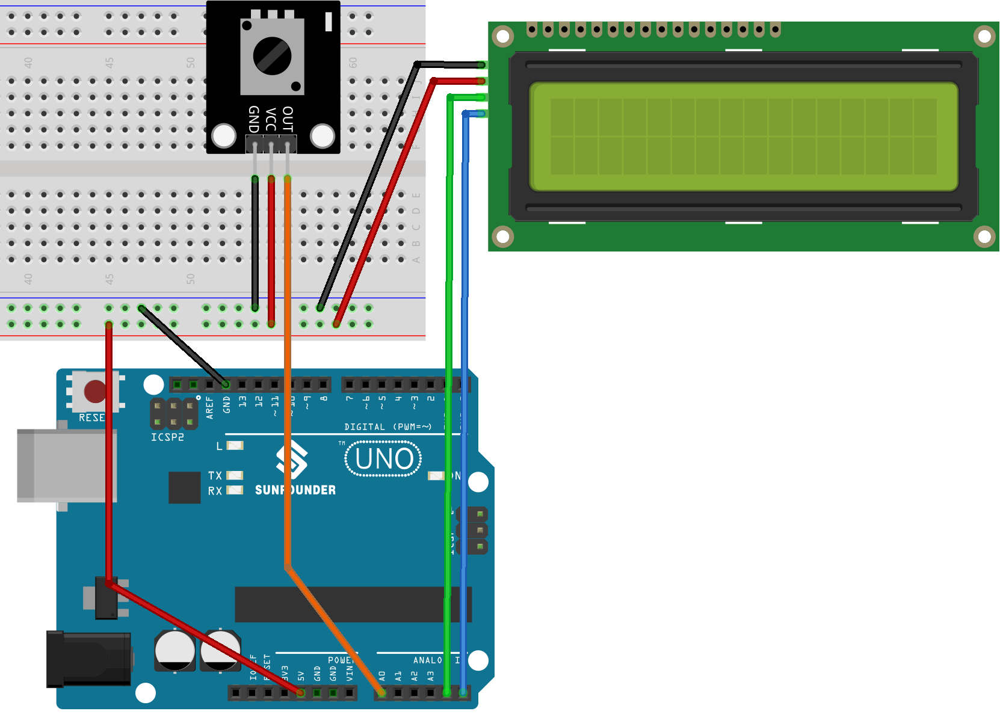

.. note::

    Ciao, benvenuto nella Community SunFounder dedicata agli appassionati di Raspberry Pi, Arduino ed ESP32 su Facebook! Approfondisci il mondo di Raspberry Pi, Arduino ed ESP32 insieme ad altri appassionati.

    **Perché unirti?**

    - **Supporto Esperto**: Risolvi problemi post-vendita e difficoltà tecniche grazie al supporto della nostra community e del nostro team.
    - **Impara e Condividi**: Scambia suggerimenti e tutorial per migliorare le tue competenze.
    - **Anteprime Esclusive**: Accedi in anteprima agli annunci dei nuovi prodotti e alle anticipazioni.
    - **Sconti Speciali**: Approfitta di sconti esclusivi sui nostri prodotti più recenti.
    - **Promozioni Festive e Giveaway**: Partecipa a concorsi e promozioni durante le festività.

    👉 Pronto a esplorare e creare con noi? Clicca su [|link_sf_facebook|] e unisciti subito!

.. _uno_lesson43_potentiometer_scale_value:

Lezione 43: Valore del potenziometro in scala
=============================================================

Questo progetto è focalizzato sulla lettura del valore di un potenziometro e sulla sua visualizzazione su un display LCD 1602 dotato di interfaccia I2C. 
Inoltre, il valore viene trasmesso al monitor seriale per un monitoraggio in tempo reale. 
Una particolarità del progetto è la rappresentazione grafica del valore sul display LCD, 
mostrato come una barra a lunghezza variabile proporzionale alla lettura del potenziometro.

Componenti Necessari
--------------------------

Per questo progetto servono i seguenti componenti.

È sicuramente comodo acquistare il kit completo, ecco il link:

.. list-table::
    :widths: 20 20 20
    :header-rows: 1

    *   - Nome
        - COMPONENTI INCLUSI
        - LINK
    *   - Universal Maker Sensor Kit
        - 94
        - |link_umsk|

Puoi anche acquistare i componenti singolarmente dai link qui sotto.

.. list-table::
    :widths: 30 20
    :header-rows: 1

    *   - Introduzione al Componente
        - Link Acquisto

    *   - Arduino UNO R3 o R4
        - |link_Uno_R3_buy|
    *   - :ref:`cpn_potentiometer`
        - \-
    *   - :ref:`cpn_i2c_lcd1602`
        - \-
    *   - :ref:`cpn_breadboard`
        - |link_breadboard_buy|

Collegamenti
---------------------------

Codice
---------------------------

.. raw:: html

   <iframe src=https://create.arduino.cc/editor/sunfounder01/b51d7dac-b89b-4785-8620-907914fe983c/preview?embed style="height:510px;width:100%;margin:10px 0" frameborder=0></iframe>

Analisi del Codice
---------------------------

La funzionalità principale di questo progetto è quella di leggere costantemente il valore del potenziometro, scalarlo in un intervallo da 0 a 16, e visualizzarne il risultato sia numericamente che graficamente sul display LCD. Per mantenere una visualizzazione fluida, l’aggiornamento dello schermo avviene solo quando viene rilevata una variazione significativa del valore.

1. **Inclusione delle librerie e inizializzazione**:

   .. code-block:: arduino

      #include <Wire.h>
      #include <LiquidCrystal_I2C.h>
      LiquidCrystal_I2C lcd(0x27, 16, 2);

   Questa sezione include le librerie necessarie per la comunicazione I2C e il controllo del display LCD, e inizializza un’istanza del display con indirizzo ``0x27``, specificando 16 colonne e 2 righe.

2. **Dichiarazione delle variabili**:

   .. code-block:: arduino

      int lastRead = 0;     // Memorizza l'ultima lettura del potenziometro
      int currentRead = 0;  // Memorizza la lettura attuale

   Le variabili ``lastRead`` e ``currentRead`` tengono traccia delle letture del potenziometro nel tempo.

3. **Funzione setup()**:

   .. code-block:: arduino

      void setup() {
        lcd.init();          // Inizializza il display LCD
        lcd.backlight();     // Attiva la retroilluminazione
        Serial.begin(9600);  // Avvia la comunicazione seriale a 9600 baud
      }

   Questa funzione prepara l’ambiente di esecuzione inizializzando il display LCD e la comunicazione seriale.

4. **Ciclo principale**:

   .. code-block:: arduino

      void loop() {
        currentRead = analogRead(A0);
        int barLength = map(currentRead, 0, 1023, 0, 16);
        if (abs(lastRead - currentRead) > 2) {
          lcd.clear();
          lcd.setCursor(0, 0);
          lcd.print("Value:");
          lcd.setCursor(7, 0);
          lcd.print(currentRead);
          Serial.println(currentRead);
          for (int i = 0; i < barLength; i++) {
            lcd.setCursor(i, 1);
            lcd.print(char(255));
          }
        }
        lastRead = currentRead;
        delay(200);
      }

   * Legge il valore del potenziometro e lo converte in un valore adatto alla rappresentazione grafica.
   * Aggiorna il display solo in caso di variazioni significative, mostrando sia il valore numerico che la barra grafica.
   * Invia il valore anche al monitor seriale per l’osservazione esterna.
   * Introduce un breve ritardo tra le iterazioni per garantire stabilità e reattività.

