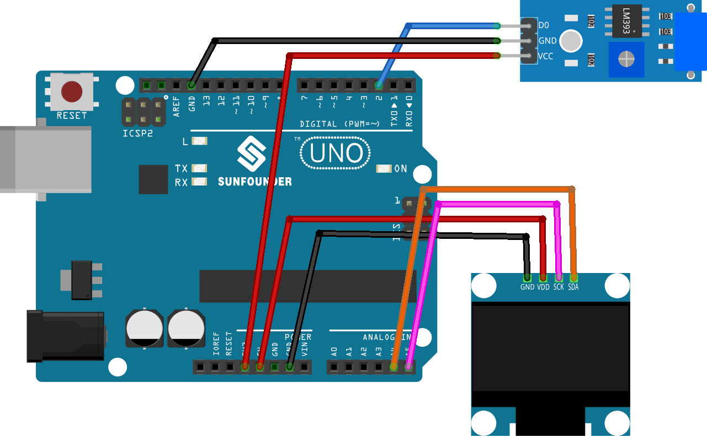

.. note:: 

    ¡Hola, bienvenido a la comunidad de entusiastas de SunFounder Raspberry Pi & Arduino & ESP32 en Facebook! Sumérgete más en Raspberry Pi, Arduino y ESP32 con otros aficionados.

    **Why Join?**

    - **Expert Support**: Resuelve problemas posventa y desafíos técnicos con la ayuda de nuestra comunidad y equipo.
    - **Learn & Share**: Intercambia consejos y tutoriales para mejorar tus habilidades.
    - **Exclusive Previews**: Obtén acceso anticipado a anuncios de nuevos productos y avances exclusivos.
    - **Special Discounts**: Disfruta de descuentos exclusivos en nuestros productos más recientes.
    - **Festive Promotions and Giveaways**: Participa en sorteos y promociones festivas.

    👉 ¿Listo para explorar y crear con nosotros? Haz clic en [|link_sf_facebook|] y únete hoy mismo!

.. _uno_lesson44_digital_dice:

Lección 44: Dados digitales
=============================================================

Este programa simula un lanzamiento de dados utilizando una pantalla OLED.
La simulación se activa agitando el interruptor de vibración, lo que provoca que la pantalla muestre números del 1 al 6,
similar a lanzar un dado.
La pantalla se detiene después de un corto período, revelando un número seleccionado al azar que representa el resultado del lanzamiento del dado.

Componentes Necesarios
--------------------------

Para este proyecto, necesitaremos los siguientes componentes.

Es definitivamente conveniente comprar un kit completo, aquí está el enlace:

.. list-table::
    :widths: 20 20 20
    :header-rows: 1

    *   - Nombre	
        - ELEMENTOS EN ESTE KIT
        - ENLACE
    *   - Kit Universal de Sensores para Creadores
        - 94
        - |link_umsk|

También puedes comprarlos por separado en los siguientes enlaces.

.. list-table::
    :widths: 30 20
    :header-rows: 1

    *   - Introducción del Componente
        - Enlace de Compra

    *   - Arduino UNO R3 o R4
        - |link_Uno_R3_buy|
    *   - :ref:`cpn_vibration`
        - |link_sw420_vibration_module_buy|
    *   - :ref:`cpn_oled`
        - \-
    *   - :ref:`cpn_breadboard`
        - |link_breadboard_buy|
        

Cableado
---------------------------

Código
---------------------------

.. note:: 
   Para instalar la biblioteca, utiliza el Administrador de Bibliotecas de Arduino y busca **"Adafruit SSD1306"** y **"Adafruit GFX"** e instálala.

.. raw:: html

    <iframe src=https://create.arduino.cc/editor/sunfounder01/70e73ef9-2968-4845-befd-23185286fd93/preview?embed style="height:510px;width:100%;margin:10px 0" frameborder=0></iframe>

Análisis del Código
---------------------------

Un desglose completo del código:

1. Inicialización de variables:

   ``vibPin``: Pin digital conectado al sensor de vibración.

2. Variables volátiles:

   ``rolling``: Una bandera volátil que indica el estado de rodaje de los dados. Es volátil ya que se accede tanto dentro de la rutina de servicio de interrupción como en el programa principal.

3. ``setup()``:

   Configura el modo de entrada del sensor de vibración.
   Asigna una interrupción al sensor para activar la función rollDice al cambiar de estado.
   Inicializa la pantalla OLED.

4. ``loop()``:

   Verifica continuamente si ``rolling`` es verdadero, mostrando un número aleatorio entre 1 y 6 durante este estado. El rodaje cesa si el sensor ha sido agitado durante más de 500 milisegundos.

5. ``rollDice()``:

   La rutina de servicio de interrupción para el sensor de vibración. Inicia el lanzamiento del dado cuando el sensor es agitado registrando la hora actual.

6. ``displayNumber()``:

   Muestra un número seleccionado en la pantalla OLED.