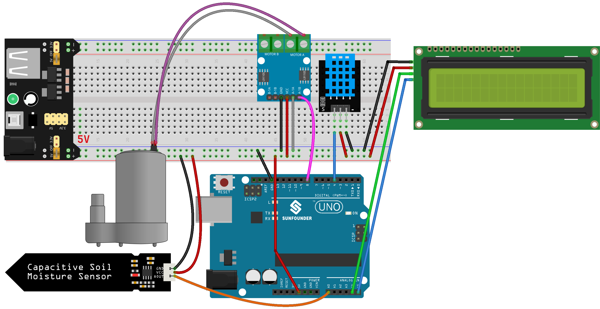
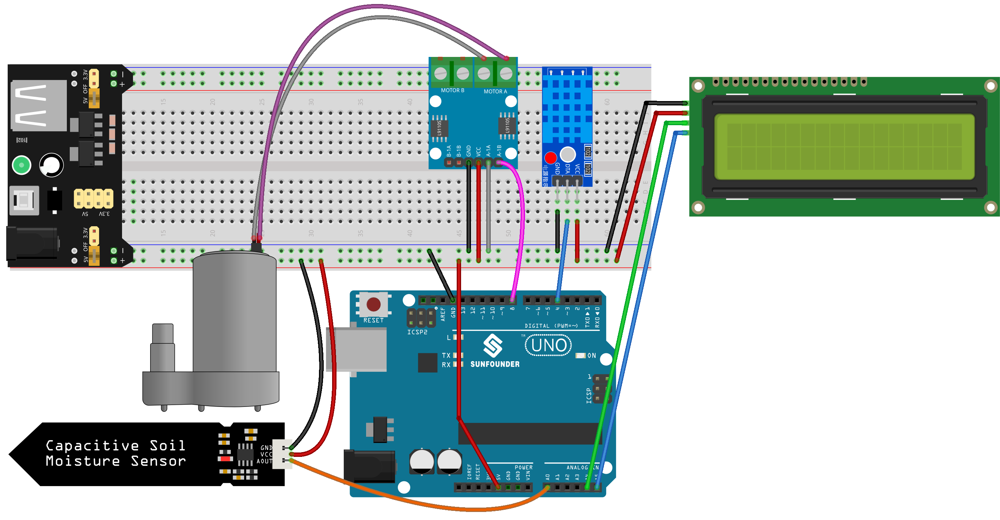

.. note::

    Ciao, benvenuto nella Community SunFounder dedicata agli appassionati di Raspberry Pi, Arduino ed ESP32 su Facebook! Approfondisci le tue conoscenze su Raspberry Pi, Arduino ed ESP32 insieme ad altri appassionati.

    **Perché unirsi?**

    - **Supporto Esperto**: Risolvi problemi post-vendita e difficoltà tecniche con il supporto del nostro team e della community.
    - **Impara e Condividi**: Scambia suggerimenti e tutorial per migliorare le tue competenze.
    - **Anteprime Esclusive**: Ottieni l'accesso anticipato agli annunci dei nuovi prodotti e alle anteprime.
    - **Sconti Speciali**: Goditi sconti esclusivi sui nostri prodotti più recenti.
    - **Promozioni Festive e Giveaway**: Partecipa a estrazioni e promozioni speciali durante le festività.

    👉 Pronto a esplorare e creare con noi? Clicca su [|link_sf_facebook|] e unisciti oggi stesso!

.. _uno_lesson45_plant_monitor:

Lezione 45: Monitor per Piante
=============================================================

Questo progetto automatizza in modo intelligente l’irrigazione delle piante attivando una pompa dell’acqua quando il livello di umidità del terreno scende al di sotto di una soglia predefinita.  
Include anche un display LCD che mostra temperatura, umidità e livello di umidità del suolo, offrendo all’utente informazioni utili sulle condizioni ambientali della pianta.

Componenti Necessari
--------------------------

Per questo progetto sono necessari i seguenti componenti.

È sicuramente comodo acquistare l’intero kit. Ecco il link:

.. list-table::
    :widths: 20 20 20
    :header-rows: 1

    *   - Nome
        - COMPONENTI NEL KIT
        - LINK
    *   - Universal Maker Sensor Kit
        - 94
        - |link_umsk|

In alternativa, puoi acquistare i componenti singolarmente dai link riportati qui sotto.

.. list-table::
    :widths: 30 20
    :header-rows: 1

    *   - Introduzione al Componente
        - Link Acquisto

    *   - Arduino UNO R3 o R4
        - |link_Uno_R3_buy|
    *   - :ref:`cpn_breadboard`
        - |link_breadboard_buy|
    *   - :ref:`cpn_power_module`
        - \-
    *   - :ref:`cpn_i2c_lcd1602`
        - |link_i2clcd1602_buy|
    *   - :ref:`cpn_pump`
        - \-
    *   - :ref:`cpn_l9110`
        - \-
    *   - :ref:`cpn_soil`
        - |link_soil_moisture_buy|
    *   - :ref:`cpn_dht11`
        - \-

Collegamenti
---------------------------

.. note::
   Il kit potrebbe includere versioni differenti del modulo DHT11. Verifica il metodo di collegamento in base al modulo in tuo possesso.

Codice
---------------------------

.. raw:: html

    <iframe src=https://create.arduino.cc/editor/sunfounder01/700a51fb-6bb3-46c0-b0eb-5b03a6eb681e/preview?embed style="height:510px;width:100%;margin:10px 0" frameborder=0></iframe>

Analisi del Codice
---------------------------

Il codice è strutturato per gestire automaticamente l'irrigazione delle piante monitorando i parametri ambientali:

1. Inclusione delle Librerie e Definizione di Costanti/Variabili:

   Include le librerie ``Wire.h``, ``LiquidCrystal_I2C.h`` e ``DHT.h``.  
   Imposta i pin e le configurazioni per il sensore DHT11, il sensore di umidità del suolo e la pompa dell'acqua.

2. ``setup()``:

   Configura i pin per il sensore del terreno e la pompa.  
   Disattiva inizialmente la pompa.  
   Inizializza e accende la retroilluminazione del display LCD.  
   Attiva il sensore DHT.

3. ``loop()``:

   Misura umidità e temperatura tramite il sensore DHT.  
   Rileva l’umidità del suolo con il sensore dedicato.  
   Mostra temperatura e umidità sul display LCD, seguite dal livello di umidità del terreno.  
   Se l’umidità rilevata è inferiore a 500 (soglia regolabile), attiva la pompa per 1 secondo.
   

