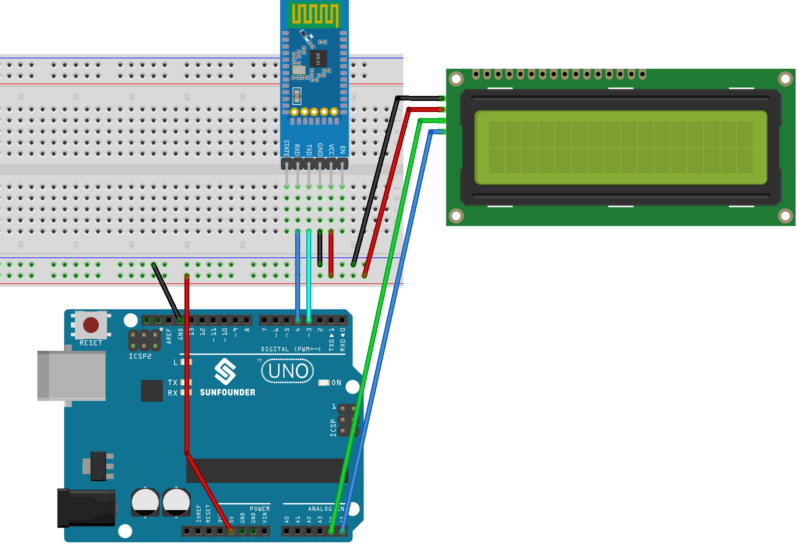

.. note:: 

    ¡Hola, bienvenido a la comunidad de entusiastas de SunFounder Raspberry Pi & Arduino & ESP32 en Facebook! Sumérgete más en Raspberry Pi, Arduino y ESP32 con otros aficionados.

    **Why Join?**

    - **Expert Support**: Resuelve problemas posventa y desafíos técnicos con la ayuda de nuestra comunidad y equipo.
    - **Learn & Share**: Intercambia consejos y tutoriales para mejorar tus habilidades.
    - **Exclusive Previews**: Obtén acceso anticipado a anuncios de nuevos productos y avances exclusivos.
    - **Special Discounts**: Disfruta de descuentos exclusivos en nuestros productos más recientes.
    - **Festive Promotions and Giveaways**: Participa en sorteos y promociones festivas.

    👉 ¿Listo para explorar y crear con nosotros? Haz clic en [|link_sf_facebook|] y únete hoy mismo!

.. _uno_lesson46_bluetooth_lcd:

Lección 46: LCD Bluetooth
=============================================================

Este proyecto permite recibir mensajes a través de un módulo Bluetooth conectado a una placa Arduino UNO y mostrar estos mensajes en una pantalla LCD.

Componentes Necesarios
--------------------------

Para este proyecto, necesitaremos los siguientes componentes.

Es definitivamente conveniente comprar un kit completo, aquí está el enlace:

.. list-table::
    :widths: 20 20 20
    :header-rows: 1

    *   - Nombre	
        - ELEMENTOS EN ESTE KIT
        - ENLACE
    *   - Kit Universal de Sensores para Creadores
        - 94
        - |link_umsk|

También puedes comprarlos por separado en los siguientes enlaces.

.. list-table::
    :widths: 30 20
    :header-rows: 1

    *   - Introducción del Componente
        - Enlace de Compra

    *   - Arduino UNO R3 o R4
        - |link_Uno_R3_buy|
    *   - :ref:`cpn_breadboard`
        - |link_breadboard_buy|
    *   - :ref:`cpn_i2c_lcd1602`
        - |link_i2clcd1602_buy|
    *   - :ref:`cpn_jdy31`
        - \-

Cableado
---------------------------

Código
---------------------------

.. note:: 
   Para instalar la biblioteca, usa el Administrador de Bibliotecas de Arduino y busca **"LiquidCrystal I2C"** e instálala.

.. raw:: html

   <iframe src=https://create.arduino.cc/editor/sunfounder01/ae00239d-f273-4686-b01d-f20487892640/preview?embed style="height:510px;width:100%;margin:10px 0" frameborder=0></iframe>

Conexión de la App y el módulo Bluetooth
-----------------------------------------------
Podemos usar una aplicación llamada "Serial Bluetooth Terminal" para enviar mensajes desde el módulo Bluetooth al Arduino.

a. **Instalar Serial Bluetooth Terminal**

   Ve a Google Play para descargar e instalar |link_serial_bluetooth_terminal|.

b. **Conectar Bluetooth**

   Inicialmente, activa el **Bluetooth** en tu smartphone.
   
      .. image:: img/09-app_1_shadow.png
         :width: 60%
         :align: center
   
   Navega a la configuración de **Bluetooth** en tu smartphone y busca nombres como **JDY-31-SPP**.
   
      .. image:: img/09-app_2_shadow.png
         :width: 60%
         :align: center
   
   Después de hacer clic en él, acepta la solicitud de **Emparejamiento** en la ventana emergente. Si se solicita un código de emparejamiento, introduce "1234".
   
      .. image:: img/09-app_3_shadow.png
         :width: 60%
         :align: center
   

c. **Comunicarse con el módulo Bluetooth**

   Abre el Serial Bluetooth Terminal. Conéctate a "JDY-31-SPP".

   .. image:: img/00-bluetooth_serial_4_shadow.png 

d. **Enviar comando**

   Usa la aplicación Serial Bluetooth Terminal para enviar mensajes al Arduino vía Bluetooth. El mensaje enviado a Bluetooth se mostrará en el LCD.

   .. image:: img/15-lcd_shadow.png
      :width: 100%
      :align: center

Análisis del Código
---------------------------

.. note:: 
      Para instalar la biblioteca, utiliza el Administrador de Bibliotecas de Arduino y busca **"LiquidCrystal I2C"** e instala la biblioteca.  

#. Configuración del LCD

   .. code-block:: arduino

      #include <LiquidCrystal_I2C.h>
      LiquidCrystal_I2C lcd(0x27, 16, 2);

   Este segmento de código incluye la biblioteca LiquidCrystal_I2C e inicializa el módulo LCD con la dirección I2C ``0x27``, especificando que el LCD tiene ``16`` columnas y ``2`` filas.

#. Configuración de la comunicación Bluetooth

   .. code-block:: arduino

      #include <SoftwareSerial.h>
      const int bluetoothTx = 3;
      const int bluetoothRx = 4;
      SoftwareSerial bleSerial(bluetoothTx, bluetoothRx);

   Aquí, se incluye la biblioteca SoftwareSerial para permitir que el módulo Bluetooth JDY-31 se comunique con el Arduino usando los pines 3 (TX) y 4 (RX).

#. Inicialización

   .. code-block:: arduino

      void setup() {
         lcd.init();
         lcd.clear();
         lcd.backlight();

         Serial.begin(9600);
         bleSerial.begin(9600);
      }

   La función ``setup()`` inicializa el LCD y borra cualquier contenido existente. También enciende la luz de fondo del LCD. Comienza la comunicación con el monitor serie y el módulo Bluetooth, ambos a una velocidad de transmisión de ``9600``.

#. Bucle Principal

   .. code-block:: arduino

      void loop() {
         String data;

         if (bleSerial.available()) {
            data += bleSerial.readString();
            data = data.substring(0, data.length() - 2);
            Serial.print(data);

            lcd.clear();
            lcd.setCursor(0, 0);
            lcd.print(data);
         }

         if (Serial.available()) {
            bleSerial.write(Serial.read());
         }
      }

   Este es el bucle operativo principal del programa Arduino. Continuamente verifica si hay datos entrantes tanto del módulo Bluetooth como del monitor serie. Cuando se reciben datos del dispositivo Bluetooth, se procesan, se muestran en el monitor serie y se muestran en el LCD. Si se ingresan datos en el monitor serie, estos datos se envían al módulo Bluetooth.
