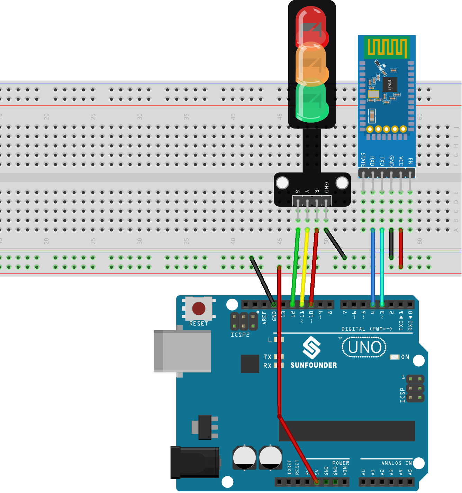

.. note:: 

    ¡Hola, bienvenido a la comunidad de entusiastas de SunFounder Raspberry Pi & Arduino & ESP32 en Facebook! Profundiza en Raspberry Pi, Arduino y ESP32 junto a otros aficionados.

    **Why Join?**

    - **Expert Support**: Resuelve problemas posventa y desafíos técnicos con ayuda de nuestra comunidad y equipo.
    - **Learn & Share**: Intercambia consejos y tutoriales para mejorar tus habilidades.
    - **Exclusive Previews**: Accede de forma anticipada a anuncios de nuevos productos y avances exclusivos.
    - **Special Discounts**: Disfruta de descuentos exclusivos en nuestros productos más recientes.
    - **Festive Promotions and Giveaways**: Participa en sorteos y promociones festivas.

    👉 ¿Listo para explorar y crear con nosotros? Haz clic en [|link_sf_facebook|] y únete hoy mismo.

.. _uno_lesson47_bluetooth_traffic_light:

Lección 47: Semáforo Bluetooth
=============================================================

Este proyecto está diseñado para controlar un semáforo (LEDs rojo, amarillo, verde) mediante comunicación Bluetooth. El usuario puede enviar un carácter ('R', 'Y' o 'G') desde un dispositivo Bluetooth. Cuando el Arduino recibe uno de estos caracteres, enciende el LED correspondiente, asegurando que los otros dos LEDs estén apagados.

Componentes Necesarios
--------------------------

Para este proyecto, necesitaremos los siguientes componentes.

Es definitivamente conveniente comprar un kit completo, aquí está el enlace:

.. list-table::
    :widths: 20 20 20
    :header-rows: 1

    *   - Nombre	
        - ELEMENTOS EN ESTE KIT
        - ENLACE
    *   - Kit Universal de Sensores para Creadores
        - 94
        - |link_umsk|

También puedes comprarlos por separado en los siguientes enlaces.

.. list-table::
    :widths: 30 20
    :header-rows: 1

    *   - Introducción del Componente
        - Enlace de Compra

    *   - Arduino UNO R3 o R4
        - |link_Uno_R3_buy|
    *   - :ref:`cpn_breadboard`
        - |link_breadboard_buy|
    *   - :ref:`cpn_traffic`
        - \-
    *   - :ref:`cpn_jdy31`
        - \-

Cableado
---------------------------

Código
---------------------------

.. raw:: html

   <iframe src=https://create.arduino.cc/editor/sunfounder01/5b9bd574-c807-4370-8e09-61f5f5a60b42/preview?embed style="height:510px;width:100%;margin:10px 0" frameborder=0></iframe>

Conexión de la App y el módulo Bluetooth
-----------------------------------------------
Podemos usar una aplicación llamada "Serial Bluetooth Terminal" para enviar mensajes desde el módulo Bluetooth al Arduino.

a. **Instalar Serial Bluetooth Terminal**

   Ve a Google Play para descargar e instalar |link_serial_bluetooth_terminal|.

b. **Conectar Bluetooth**

   Inicialmente, activa el **Bluetooth** en tu smartphone.
   
      .. image:: img/09-app_1_shadow.png
         :width: 60%
         :align: center
   
   Navega a la configuración de **Bluetooth** en tu smartphone y busca nombres como **JDY-31-SPP**.
   
      .. image:: img/09-app_2_shadow.png
         :width: 60%
         :align: center
   
   Después de hacer clic en él, acepta la solicitud de **Emparejamiento** en la ventana emergente. Si se solicita un código de emparejamiento, introduce "1234".
   
      .. image:: img/09-app_3_shadow.png
         :width: 60%
         :align: center
   

c. **Comunicarse con el módulo Bluetooth**

   Abre el Serial Bluetooth Terminal. Conéctate a "JDY-31-SPP".

   .. image:: img/00-bluetooth_serial_4_shadow.png 

d. **Enviar comando**

   Usa la aplicación Serial Bluetooth Terminal para enviar comandos al Arduino vía Bluetooth. Envía 'R' para encender la luz roja, 'Y' para la amarilla y 'G' para la verde.

   .. image:: img/16-R_shadow.png 
      :width: 85%
      :align: center

   .. image:: img/16-Y_shadow.png 
      :width: 85%
      :align: center

   .. image:: img/16-G_shadow.png 
      :width: 85%
      :align: center

Análisis del Código
---------------------------

#. Inicialización y configuración de Bluetooth

   .. code-block:: arduino

      // Configuración de la comunicación del módulo Bluetooth
      #include <SoftwareSerial.h>
      const int bluetoothTx = 3;
      const int bluetoothRx = 4;
      SoftwareSerial bleSerial(bluetoothTx, bluetoothRx);
   
   Comenzamos incluyendo la biblioteca SoftwareSerial para ayudarnos con la comunicación Bluetooth. Los pines TX y RX del módulo Bluetooth luego se definen y se asocian con los pines 3 y 4 en el Arduino. Finalmente, inicializamos el objeto ``bleSerial`` para la comunicación Bluetooth.

#. Definiciones de pines LED

   .. code-block:: arduino

      // Números de pin para cada LED
      const int rledPin = 10;  //rojo
      const int yledPin = 11;  //amarillo
      const int gledPin = 12;  //verde

   Aquí, estamos definiendo a qué pines del Arduino están conectados nuestros LEDs. El LED rojo está en el pin 10, el amarillo en el 11 y el verde en el 12.

#. Función setup()

   .. code-block:: arduino

      void setup() {
         pinMode(rledPin, OUTPUT);
         pinMode(yledPin, OUTPUT);
         pinMode(gledPin, OUTPUT);

         Serial.begin(9600);
         bleSerial.begin(9600);
      }

   En la función ``setup()``, configuramos los pines de los LEDs como ``OUTPUT``. También comenzamos la comunicación serie para tanto el módulo Bluetooth como el serie predeterminado (conectado al ordenador) a una velocidad de baudios de 9600.

#. Bucle principal loop() para la comunicación Bluetooth

   .. code-block:: arduino

      void loop() {
         while (bleSerial.available() > 0) {
            character = bleSerial.read();
            Serial.println(character);

            if (character == 'R') {
               toggleLights(rledPin);
            } else if (character == 'Y') {
               toggleLights(yledPin);
            } else if (character == 'G') {
               toggleLights(gledPin);
            }
         }
      }

   Dentro de nuestro principal ``loop()``, continuamente verificamos si hay datos disponibles desde el módulo Bluetooth. Si recibimos datos, leemos el carácter y lo mostramos en el monitor serie. Dependiendo del carácter recibido (R, Y o G), cambiamos el LED respectivo usando la función ``toggleLights()``.

#. Función Toggle Lights

   .. code-block:: arduino

      void toggleLights(int targetLight) {
         digitalWrite(rledPin, LOW);
         digitalWrite(yledPin, LOW);
         digitalWrite(gledPin, LOW);

         digitalWrite(targetLight, HIGH);
      }

   Esta función, ``toggleLights()``, primero apaga todos los LEDs. Después de asegurarse de que están todos apagados, enciende el LED objetivo especificado. Esto garantiza que solo un LED esté encendido en un momento dado.