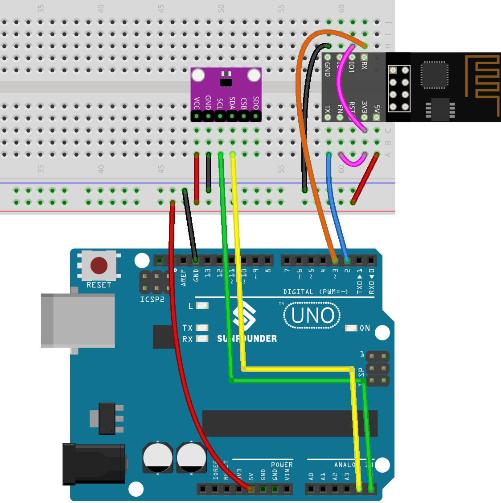
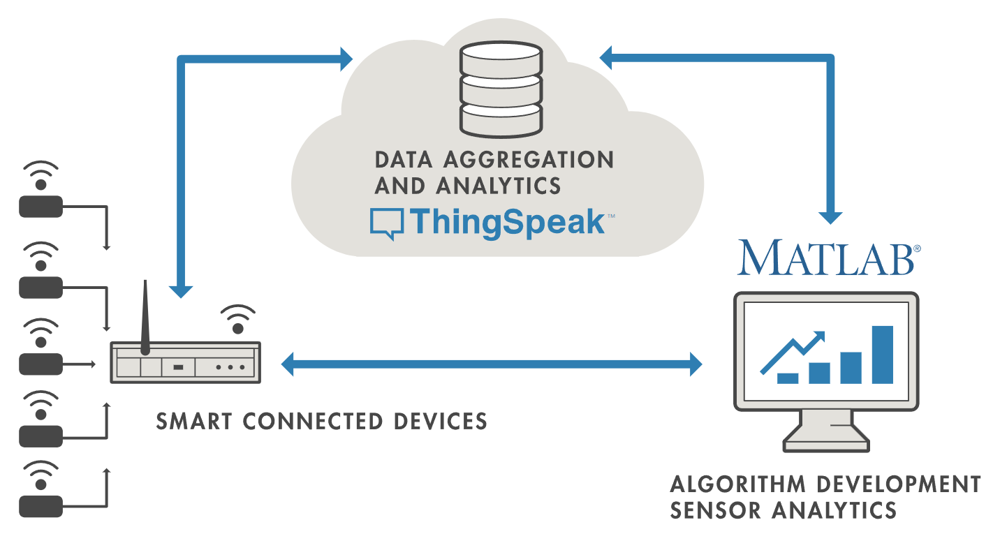
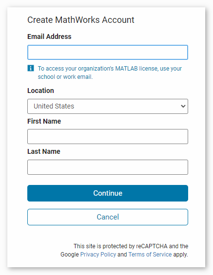
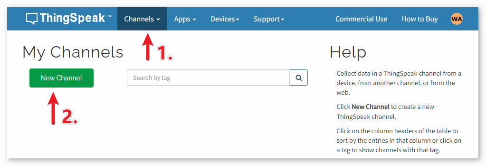
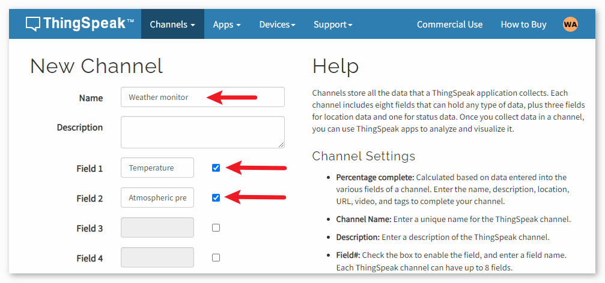

.. note:: 

    ¡Hola, bienvenido a la comunidad de entusiastas de SunFounder Raspberry Pi & Arduino & ESP32 en Facebook! Profundiza en Raspberry Pi, Arduino y ESP32 junto a otros aficionados.

    **Why Join?**

    - **Expert Support**: Resuelve problemas posventa y desafíos técnicos con ayuda de nuestra comunidad y equipo.
    - **Learn & Share**: Intercambia consejos y tutoriales para mejorar tus habilidades.
    - **Exclusive Previews**: Accede de forma anticipada a anuncios de nuevos productos y avances exclusivos.
    - **Special Discounts**: Disfruta de descuentos exclusivos en nuestros productos más recientes.
    - **Festive Promotions and Giveaways**: Participa en sorteos y promociones festivas.

    👉 ¿Listo para explorar y crear con nosotros? Haz clic en [|link_sf_facebook|] y únete hoy mismo.

.. _uno_iot_weather_monito:

Lección 48: Monitor de Clima con ThingSpeak
=============================================================

Este proyecto recoge datos de temperatura y presión usando un Sensor de Presión Atmosférica. Los datos recogidos se transmiten a la plataforma en la nube de ThingSpeak mediante un módulo ESP8266 y una red Wi-Fi en intervalos regulares de tiempo.

Componentes Necesarios
--------------------------

Para este proyecto, necesitamos los siguientes componentes.

Es definitivamente conveniente comprar un kit completo, aquí está el enlace:

.. list-table::
    :widths: 20 20 20
    :header-rows: 1

    *   - Nombre	
        - ELEMENTOS EN ESTE KIT
        - ENLACE
    *   - Kit Universal de Sensores para Creadores
        - 94
        - |link_umsk|

También puedes comprarlos por separado en los siguientes enlaces.

.. list-table::
    :widths: 30 20
    :header-rows: 1

    *   - Introducción del Componente
        - Enlace de Compra

    *   - Arduino UNO R3 o R4
        - |link_Uno_R3_buy|
    *   - :ref:`cpn_breadboard`
        - |link_breadboard_buy|
    *   - :ref:`cpn_esp8266`
        - \-
    *   - :ref:`cpn_bmp280`
        - \-

Cableado
---------------------------

Configurar ThingSpeak
-----------------------------

|link_thingspeak| ™ es un servicio de plataforma de análisis IoT que te permite agregar, visualizar y analizar flujos de datos en vivo en la nube. ThingSpeak proporciona visualizaciones instantáneas de los datos publicados por tus dispositivos a ThingSpeak. Con la capacidad de ejecutar código MATLAB® en ThingSpeak, puedes realizar análisis y procesamiento en línea de los datos a medida que llegan. ThingSpeak se utiliza a menudo para prototipos y sistemas IoT de prueba de concepto que requieren análisis.

.. raw:: html
    
       

**1) Crear una cuenta en ThingSpeak**
^^^^^^^^^^^^^^^^^^^^^^^^^^^^^^^^^^^^^^^^

Lo primero que debes hacer es crear una cuenta en ThingSpeak. Desde la colaboración con MATLAB, puedes usar tus credenciales de MathWorks para iniciar sesión en |link_thingspeak|.

Si no tienes una, necesitas crear una cuenta con MathWorks e iniciar sesión en la aplicación ThingSpeak.

**2) Crear el canal**
^^^^^^^^^^^^^^^^^^^^^^^^^^^^^^^^^^^^^^^^

Después de iniciar sesión, crea un nuevo canal para almacenar los datos yendo a "Canales" > "Mis Canales" y haciendo clic en "Nuevo Canal".

Para este proyecto, necesitamos crear un canal llamado "**Monitor del Clima**" con dos campos: **Field 1** para "**Temperatura**" y **Field 2** para "**Atmospheric Pressure**".

.. raw:: html
    
       

Código
---------------------------

#. Abre el archivo ``Lesson_48_Iot_Weather_Monitor.ino`` bajo la ruta de ``universal-maker-sensor-kit\arduino_uno\Lesson_48_Iot_Weather_Monitor``, o copia este código en **Arduino IDE**.

   .. note:: 
      Para instalar la biblioteca, usa el Administrador de Bibliotecas de Arduino y busca **"Adafruit BMP280"** e instálala.

   .. raw:: html
      
      <iframe src=https://create.arduino.cc/editor/sunfounder01/59eeae43-5dcc-46d7-833f-65fd2bdb3603/preview?embed style="height:510px;width:100%;margin:10px 0" frameborder=0></iframe

#. Necesitas ingresar el ``mySSID`` y ``myPWD`` de la WiFi que estás utilizando.

   .. code-block:: arduino

    String mySSID = "your_ssid";     // SSID de WiFi
    String myPWD = "your_password";  // Contraseña de WiFi

#. También necesitas modificar el ``myAPI`` con tu clave API del canal de ThingSpeak.

   .. code-block:: arduino
    
      String myAPI = "xxxxxxxxxxxx";  // Clave API

   .. image:: img/05-thingspeak_api_shadow.png
       :width: 80%
       :align: center
   
   
   Aquí puedes encontrar **tu clave API única que debes mantener privada**. 

#. Después de seleccionar la placa y el puerto correctos, haz clic en el botón **Subir**.

#. Abre el monitor serie (establece la tasa de baudios en **9600**) y espera una indicación como una conexión exitosa.

   .. image:: img/05-ready_1_shadow.png
          :width: 95%

   .. image:: img/05-ready_2_shadow.png
          :width: 95%

Análisis del Código
---------------------------

1. Inicialización y configuración del Bluetooth

   .. code-block:: arduino

      // Configuración de la comunicación del módulo Bluetooth
      #include <SoftwareSerial.h>
      const int bluetoothTx = 3;
      const int bluetoothRx = 4;
      SoftwareSerial bleSerial(bluetoothTx, bluetoothRx);
   
   Comenzamos incluyendo la biblioteca SoftwareSerial para ayudarnos con la comunicación Bluetooth. Los pines TX y RX del módulo Bluetooth se definen y se asocian con los pines 3 y 4 del Arduino. Finalmente, inicializamos el objeto ``bleSerial`` para la comunicación Bluetooth.

2. Definición de los pines de los LED

   .. code-block:: arduino

      // Números de pines para cada LED
      const int rledPin = 10;  //rojo
      const int yledPin = 11;  //amarillo
      const int gledPin = 12;  //verde

   Aquí, definimos a qué pines del Arduino están conectados nuestros LEDs. El LED rojo está en el pin 10, el amarillo en el 11 y el verde en el 12.

3. Función setup()

   .. code-block:: arduino

      void setup() {
         pinMode(rledPin, OUTPUT);
         pinMode(yledPin, OUTPUT);
         pinMode(gledPin, OUTPUT);

         Serial.begin(9600);
         bleSerial.begin(9600);
      }

   En la función ``setup()``, configuramos los pines de los LED como ``OUTPUT``. También iniciamos la comunicación serial tanto para el módulo Bluetooth como para el serial predeterminado (conectado al ordenador) con una tasa de baudios de 9600.

4. Bucle principal para la comunicación Bluetooth

   .. code-block:: arduino

      void loop() {
         while (bleSerial.available() > 0) {
            character = bleSerial.read();
            Serial.println(character);

            if (character == 'R') {
               toggleLights(rledPin);
            } else if (character == 'Y') {
               toggleLights(yledPin);
            } else if (character == 'G') {
               toggleLights(gledPin);
            }
         }
      }

   Dentro de nuestro bucle principal ``loop()``, verificamos continuamente si hay datos disponibles desde el módulo Bluetooth. Si recibimos datos, leemos el carácter y lo mostramos en el monitor serial. Dependiendo del carácter recibido (R, Y o G), alternamos el LED correspondiente usando la función ``toggleLights()``.

5. Función para alternar luces

   .. code-block:: arduino

      void toggleLights(int targetLight) {
         digitalWrite(rledPin, LOW);
         digitalWrite(yledPin, LOW);
         digitalWrite(gledPin, LOW);

         digitalWrite(targetLight, HIGH);
      }

   Esta función, ``toggleLights()``, primero apaga todos los LEDs. Después de asegurarse de que todos están apagados, enciende el LED objetivo especificado. Esto garantiza que solo un LED esté encendido a la vez.