.. note:: 

   Ciao, benvenuti nella Comunità degli Appassionati di SunFounder Raspberry Pi & Arduino & ESP32 su Facebook! Approfondisci la tua conoscenza di Raspberry Pi, Arduino e ESP32 insieme ad altri appassionati.

   **Perché unirsi?**

   - **Supporto Esperto**: Risolvi problemi post-vendita e sfide tecniche con l'aiuto della nostra comunità e del nostro team.
   - **Impara & Condividi**: Scambia consigli e tutorial per migliorare le tue competenze.
   - **Anteprime Esclusive**: Ottieni accesso anticipato agli annunci di nuovi prodotti e anteprime esclusive.
   - **Sconti Speciali**: Goditi sconti esclusivi sui nostri prodotti più recenti.
   - **Promozioni Festive e Regali**: Partecipa a regali e promozioni festive.

   👉 Pronto a esplorare e creare con noi? Clicca [|link_sf_facebook|] e unisciti oggi!

.. _uno_iot_vib_alert_system:

Lezione 49: Sistema di Allerta Vibrazioni con IFTTT
========================================================

Questo progetto implementa un sistema di rilevamento vibrazioni usando una scheda Arduino (Uno R4 o R3) con un modulo ESP8266 e un sensore di vibrazione (SW-420). Quando viene rilevata una vibrazione, il sistema invia una richiesta HTTP a un server IFTTT, potenzialmente innescando varie azioni come l'invio di una notifica o di un'email.

Per evitare allarmi eccessivi in un breve lasso di tempo, il sistema è stato programmato per inviare queste richieste HTTP con un intervallo minimo di 2 minuti (120000 millisecondi). Questo intervallo può essere regolato in base alle esigenze dell'utente.

Componenti Necessari
--------------------------

Per questo progetto, abbiamo bisogno dei seguenti componenti.

È decisamente conveniente acquistare un kit completo, ecco il link:

.. list-table::
    :widths: 20 20 20
    :header-rows: 1

    *   - Nome	
        - ELEMENTI IN QUESTO KIT
        - LINK
    *   - Universal Maker Sensor Kit
        - 94
        - |link_umsk|

Puoi anche acquistarli separatamente dai link sottostanti.

.. list-table::
    :widths: 30 20
    :header-rows: 1

    *   - Introduzione ai Componenti
        - Link di Acquisto

    *   - Arduino UNO R3 o R4
        - |link_Uno_R3_buy|
    *   - :ref:`cpn_breadboard`
        - |link_breadboard_buy|
    *   - :ref:`cpn_esp8266`
        - \-
    *   - :ref:`cpn_vibration`
        - \-

Cablaggio
---------------------------

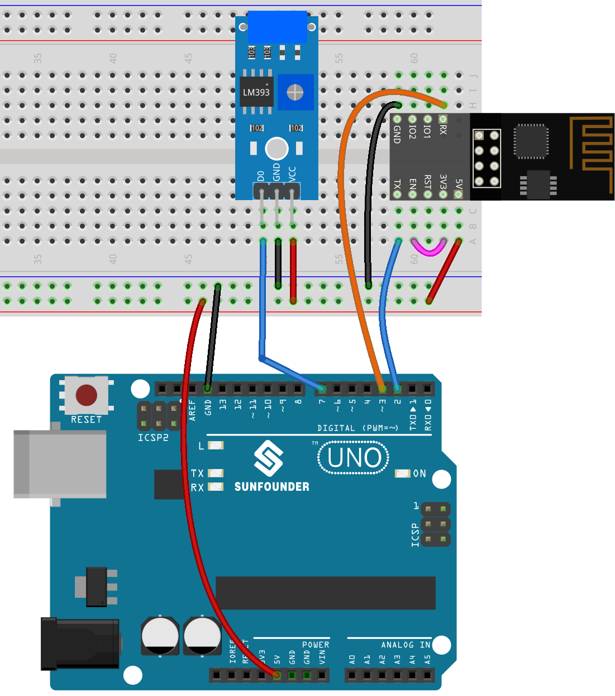

Configurazione IFTTT
-----------------------------

|link_ifttt| è un'azienda commerciale privata fondata nel 2011 che gestisce piattaforme digitali di automazione online che offre come servizio. Le loro piattaforme forniscono un'interfaccia visuale per realizzare if statement inter-platform ai suoi utenti, che, nel 2020, ammontavano a 18 milioni di persone.

IFTTT sta per "If This Then That" (Se questo allora quello). Fondamentalmente, se determinate condizioni sono soddisfatte, allora qualcos'altro accadrà. La parte "if this" è chiamata trigger, e la parte "then that" è chiamata azione. Collega dispositivi smart per la casa, social media, app di consegna e altro ancora per eseguire compiti automatizzati.

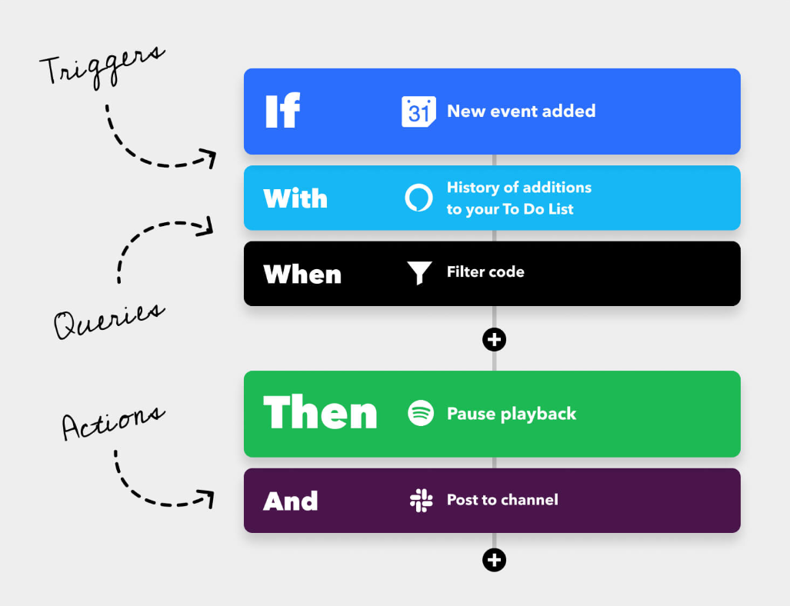

**1) Registrati su IFTTT**
^^^^^^^^^^^^^^^^^^^^^^^^^^^^^

Digita "https://ifttt.com" nel tuo browser e clicca sul pulsante "Get started" situato al centro della pagina. Compila il modulo con le tue informazioni per creare un account.

Clicca "Indietro" per uscire dalla guida rapida, torna alla homepage di IFTTT, aggiorna la pagina e accedi di nuovo.

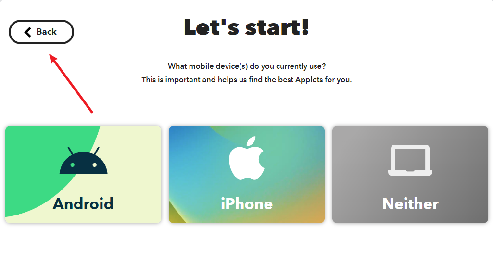

**2) Creazione dell'Applet**
^^^^^^^^^^^^^^^^^^^^^^^^^^^^^

Clicca "Crea" per iniziare a creare l'Applet.

.. raw:: html
    
       

**Se questo trigger**

Clicca "Aggiungi" accanto a "Se questo" per aggiungere un trigger.

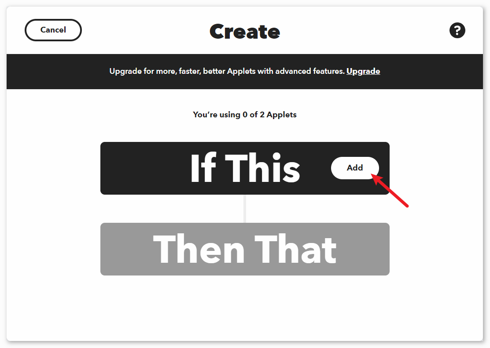

Cerca "webhook" e clicca su "Webhooks".

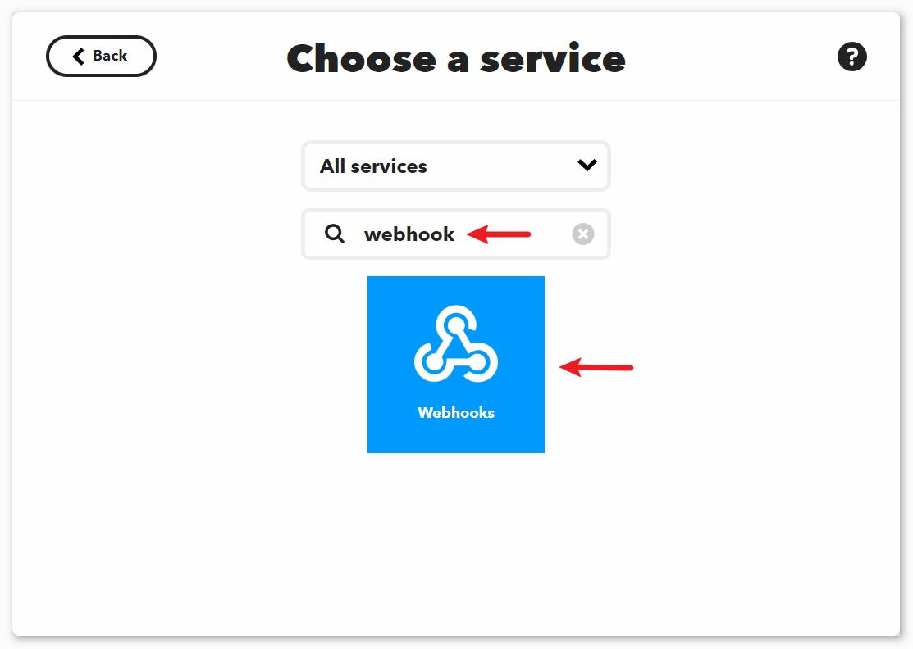

Clicca su "Ricevi una richiesta web" nella pagina mostrata nell'immagine seguente.

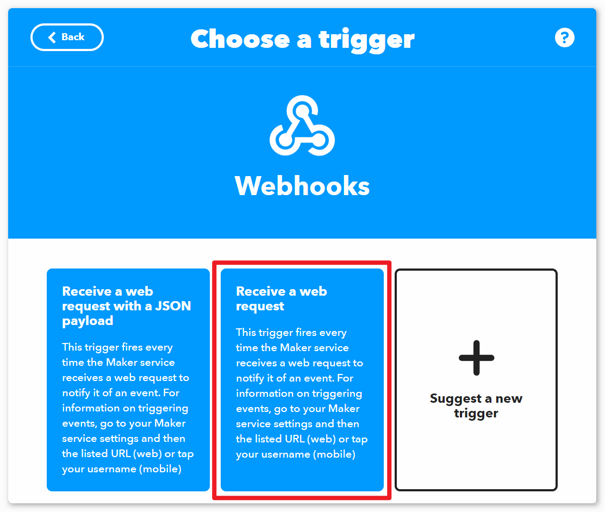

Imposta il "Nome dell'Evento" su "vibration_detected".

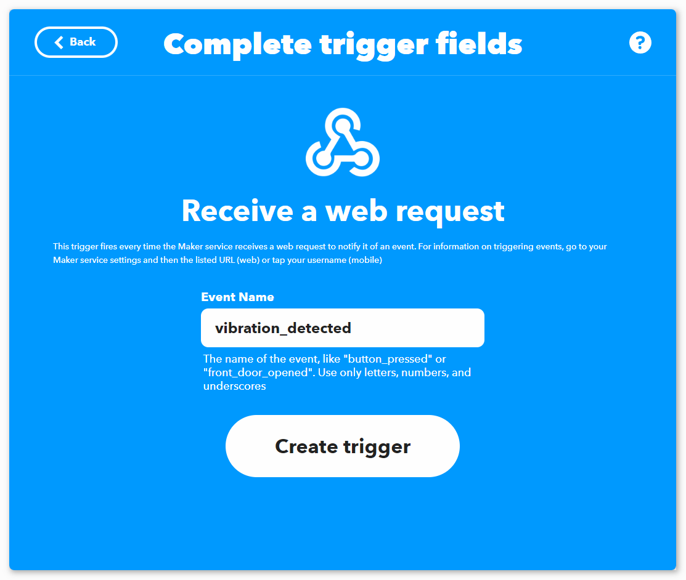

.. raw:: html
    
       

**Quindi quell'azione**

Clicca su "Aggiungi" accanto a "Quindi quello" per aggiungere un'azione.

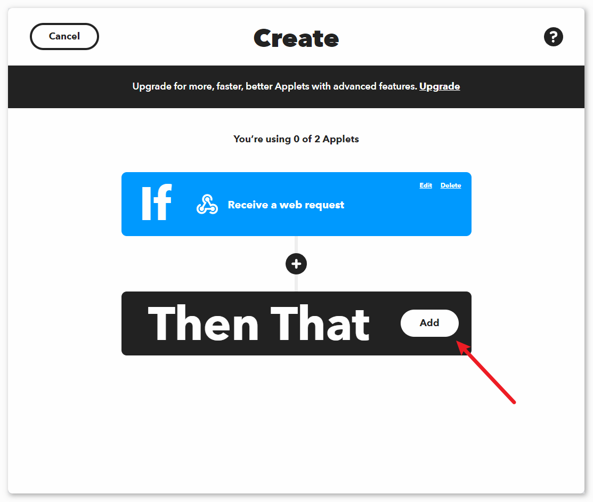

Cerca "email" e clicca su "Email".

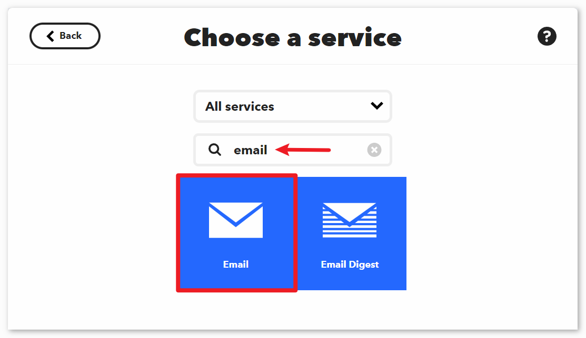

Clicca su "Inviami una email" nella pagina mostrata nell'immagine seguente.

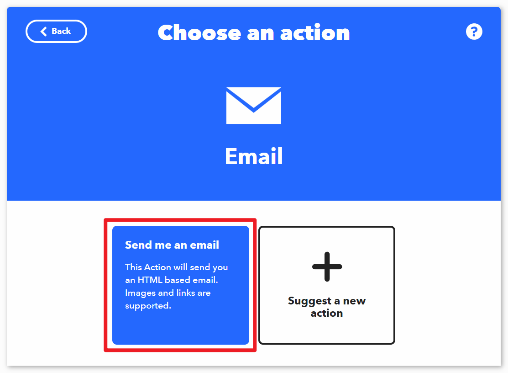

Imposta il soggetto e il contenuto dell'email da inviare quando viene rilevata una vibrazione.

Come riferimento, il soggetto è impostato su "[ESP-01] Rilevata vibrazione!!!", e il contenuto è impostato su "Rilevata vibrazione, si prega di confermare la situazione prontamente! {{OccurredAt}}". Quando si invia un'email, ``{{OccurredAt}}`` verrà automaticamente sostituito con l'orario in cui si è verificato l'evento.

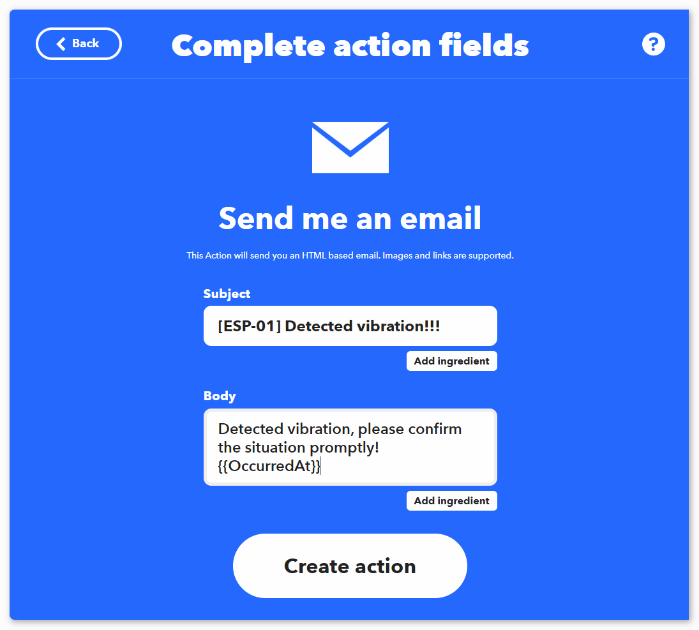

Seguendo i passaggi successivi, completa la creazione dell'Applet.

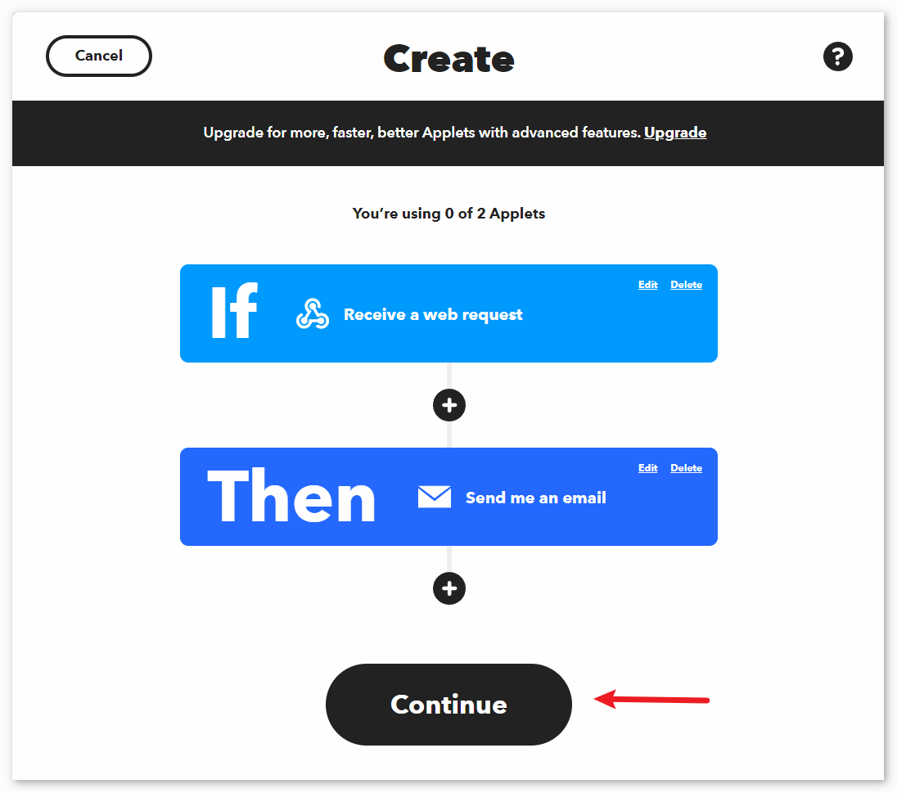

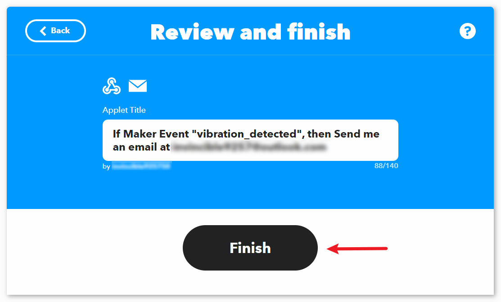

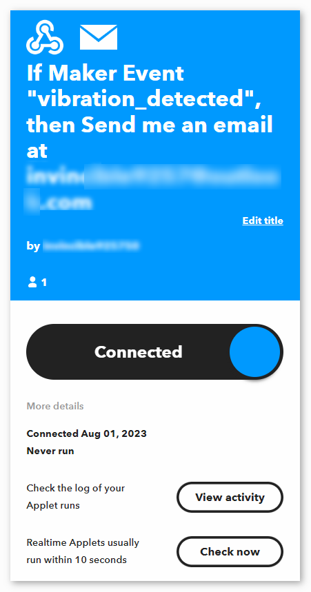

.. raw:: html
    
       

Codice
-----------------------

#. Apri il file ``Lesson_49_Vibration_alert_system.ino`` nel percorso ``universal-maker-sensor-kit\arduino_uno\Lesson_49_Vibration_alert_system``, o copia questo codice nell'**Arduino IDE**.

   .. raw:: html
       
        <iframe src=https://create.arduino.cc/editor/sunfounder01/35a75e1c-6b2a-407d-9724-f83ad50a4a41/preview?embed style="height:510px;width:100%;margin:10px 0" frameborder=0></iframe>

#. Devi inserire il ``mySSID`` e il ``myPWD`` del WiFi che stai utilizzando. 

   .. code-block:: arduino

    String mySSID = "your_ssid";     // SSID WiFi
    String myPWD = "your_password";  // Password WiFi

#. Devi anche modificare il ``URL`` con il nome dell'evento che hai impostato e la tua chiave API.

   .. code-block:: arduino
    
      String URL = "/trigger/vibration_detected/with/key/xxxxxxxxxxxxxxxxxx";

   .. image:: img/04-ifttt_apikey_1_shadow.png
       :width: 80%
       :align: center
   
   .. image:: img/04-ifttt_apikey_2_shadow.png
       :width: 80%
       :align: center

   Qui puoi trovare **la tua unica CHIAVE API che devi mantenere privata**. Digita il nome dell'evento come ``vibration_detected``. Il tuo URL finale apparirà in fondo alla pagina web. Copia questo URL.

   .. image:: img/04-ifttt_apikey_3_shadow.png
       :width: 80%
       :align: center

   .. image:: img/04-ifttt_apikey_4_shadow.png
       :width: 80%
       :align: center

#. Dopo aver selezionato la scheda corretta e la porta, clicca sul pulsante **Upload**.

#. Apri il monitor seriale (imposta il baudrate a **9600**) e attendi un prompt come una connessione riuscita che appaia.

   .. image:: img/04-ready_shadow.png
          :width: 95%

Analisi del Codice
---------------------------

Il modulo ESP8266 incluso nel kit è già pre-programmato con il firmware AT. Pertanto, il modulo ESP8266 può essere controllato attraverso comandi AT. In questo progetto, utilizziamo la serializzazione software per abilitare la comunicazione tra la scheda Arduino Uno e il modulo ESP8266. La scheda Arduino Uno invia comandi AT al modulo ESP8266 per la connessione di rete e l'invio di richieste. Puoi fare riferimento a |link_esp8266_at|.

La scheda Uno legge i valori dei sensori e invia comandi AT al modulo ESP8266. Il modulo ESP8266 si connette a una rete e invia richieste ai server IFTTT.

#. Includi la libreria SoftwareSerial per la comunicazione seriale tra Arduino e ESP8266

   .. code-block:: arduino
   
     #include <SoftwareSerial.h>      
     SoftwareSerial espSerial(2, 3);  

#. Configura le credenziali WiFi e i dettagli del server IFTTT

   .. code-block:: arduino
   
     String mySSID = "your_ssid";     
     String myPWD = "your_password";  
     String myHOST = "maker.ifttt.com";
     String myPORT = "80";
     String URL = "/trigger/xxx/with/key/xxxx";  

#. Definisci le variabili per il sensore di vibrazione e il controllo della frequenza di allerta

   .. code-block:: arduino
   
     unsigned long lastAlertTime = 0;                
     const unsigned long postingInterval = 120000L;
     const int sensorPin = 7;

#. In ``setup()``, inizializza la comunicazione seriale, il modulo ESP8266 e connettiti al WiFi

   .. code-block:: arduino
   
      void setup() {
        Serial.begin(9600);
        espSerial.begin(115200);
      
        // Inizializza il modulo ESP8266
        sendATCommand("AT+RST", 1000, DEBUG);   //Resetta il modulo ESP8266
        sendATCommand("AT+CWMODE=1", 1000, DEBUG);  //Imposta la modalità ESP come modalità stazione
        sendATCommand("AT+CWJAP=\"" + mySSID + "\",\"" + myPWD + "\"", 3000, DEBUG);  //Connettiti alla rete WiFi
      
        while (!espSerial.find("OK")) {
          //Aspetta la connessione
        }
      }

#. In ``loop()``, rileva la vibrazione e invia l'allerta se è passato l'intervallo di tempo

   .. code-block:: arduino
   
      void loop() {
      
        if (digitalRead(sensorPin)) {
          if (lastAlertTime == 0 || millis() - lastAlertTime > postingInterval) {
            Serial.println("Detected vibration!!!");
            sendAlert();  //Invia una richiesta HTTP al server IFTTT
          } else {
            Serial.print("Detected vibration!!! ");
            Serial.println("Poiché è stata inviata di recente un'email, questa volta non verrà inviata un'email di avviso per evitare di intasare la tua casella di posta.");
          }
        } else {
          if (DEBUG) {
            Serial.println("Detecting...");
          }
        }
        delay(500);
      }

#. sendAlert() costruisce la richiesta HTTP e la invia tramite ESP8266

   .. code-block:: arduino
   
     void sendAlert() {
   
       String sendData = "GET " + URL + " HTTP/1.1" + "\r\n";
       sendData += "Host: maker.ifttt.com\r\n";
       
       sendATCommand("AT+CIPMUX=0",1000,DEBUG);                           
       sendATCommand("AT+CIPSTART=...",3000,DEBUG);  
       sendATCommand("AT+CIPSEND=" + String(sendData.length()),1000,DEBUG);   
       espSerial.println(sendData);
      
     }  

#. Gestione dei comandi AT sendATCommand()

   Questa funzione invia comandi AT al modulo ESP8266 e raccoglie le risposte.
   
   .. code-block:: arduino
   
      void sendATCommand(String command, const int timeout, boolean debug) {
        // Stampa e invia il comando
        Serial.print("AT Command ==> ");
        Serial.print(command);
        Serial.println();
        espSerial.println(command);  // Invia il comando AT
      
        // Ottieni la risposta dal modulo ESP8266
        String response = "";
        long int time = millis();
        while ((time + timeout) > millis()) {  // Aspetta la risposta fino al timeout
          while (espSerial.available()) {
            char c = espSerial.read();
            response += c;
          }
        }
      
        // Stampa la risposta se la modalità debug è attiva
        if (debug) {
          Serial.println(response);
          Serial.println("--------------------------------------");
        }

**Riferimenti**

* |link_esp8266_at|
* |link_ifttt_welcome|
* |link_ifttt_webhook_faq|