.. note:: 

   Ciao, benvenuti nella Comunità degli Appassionati di SunFounder Raspberry Pi & Arduino & ESP32 su Facebook! Approfondisci la tua conoscenza di Raspberry Pi, Arduino e ESP32 insieme ad altri appassionati.

   **Perché unirsi?**

   - **Supporto Esperto**: Risolvi problemi post-vendita e sfide tecniche con l'aiuto della nostra comunità e del nostro team.
   - **Impara & Condividi**: Scambia consigli e tutorial per migliorare le tue competenze.
   - **Anteprime Esclusive**: Ottieni accesso anticipato agli annunci di nuovi prodotti e anteprime esclusive.
   - **Sconti Speciali**: Goditi sconti esclusivi sui nostri prodotti più recenti.
   - **Promozioni Festive e Regali**: Partecipa a regali e promozioni festive.

   👉 Pronto a esplorare e creare con noi? Clicca [|link_sf_facebook|] e unisciti oggi!

.. _uno_iot_flame:

Lezione 50: Sistema di Allerta Fiamma con Blynk
============================================================

In questo capitolo, ti guideremo attraverso il processo di creazione di una demo di sistema di allarme per fiamme domestico usando Blynk. Utilizzando un sensore di fiamma, puoi rilevare potenziali incendi nella tua abitazione. L'invio dei valori rilevati a Blynk permette il monitoraggio remoto della tua casa via internet. In caso di incendio, Blynk ti notificherà tempestivamente via email.

Componenti Necessari
--------------------------

Per questo progetto, abbiamo bisogno dei seguenti componenti.

È decisamente conveniente acquistare un kit completo, ecco il link:

.. list-table::
    :widths: 20 20 20
    :header-rows: 1

    *   - Nome	
        - ELEMENTI IN QUESTO KIT
        - LINK
    *   - Universal Maker Sensor Kit
        - 94
        - |link_umsk|

Puoi anche acquistarli separatamente dai link sottostanti.

.. list-table::
    :widths: 30 20
    :header-rows: 1

    *   - Introduzione ai Componenti
        - Link di Acquisto

    *   - Arduino UNO R3 o R4
        - |link_Uno_R3_buy|
    *   - :ref:`cpn_breadboard`
        - |link_breadboard_buy|
    *   - :ref:`cpn_esp8266`
        - \-
    *   - :ref:`cpn_flame`
        - \-

Cablaggio
---------------------------

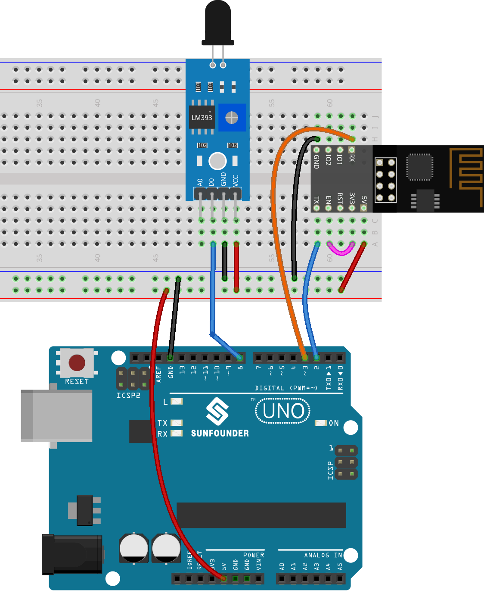

Configurazione di Blynk
-----------------------------

**1 Crea un template**
^^^^^^^^^^^^^^^^^^^^^^^^^^^^^

Prima di tutto, dobbiamo stabilire un template su Blynk. Segui i passaggi sottostanti per creare un template **"Sistema di Allerta Fiamma"**.

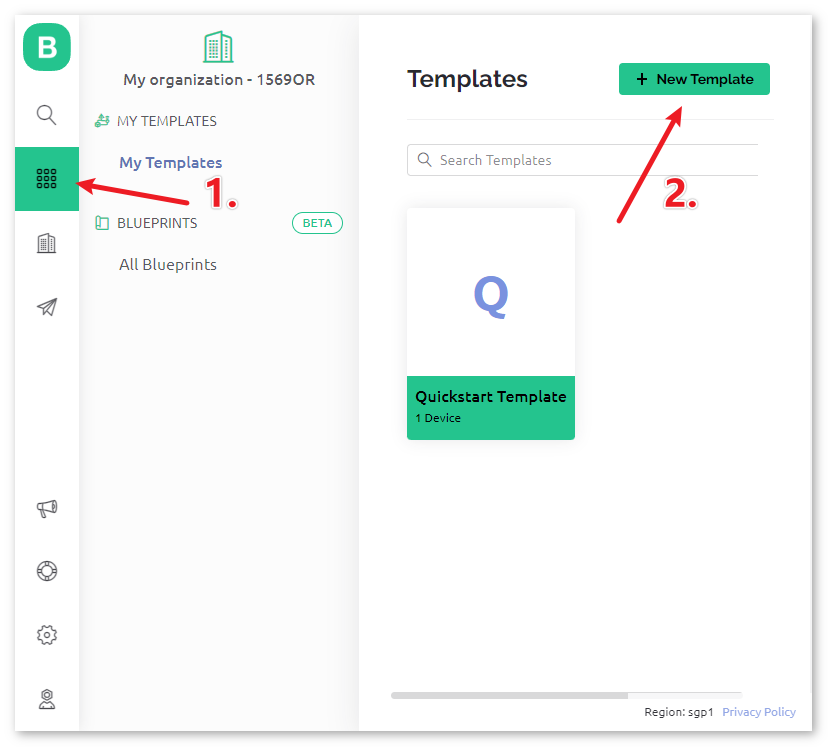

Assicurati che il **HARDWARE** sia configurato come **ESP8266** e il **TIPO DI CONNESSIONE** sia impostato su **WiFi**.

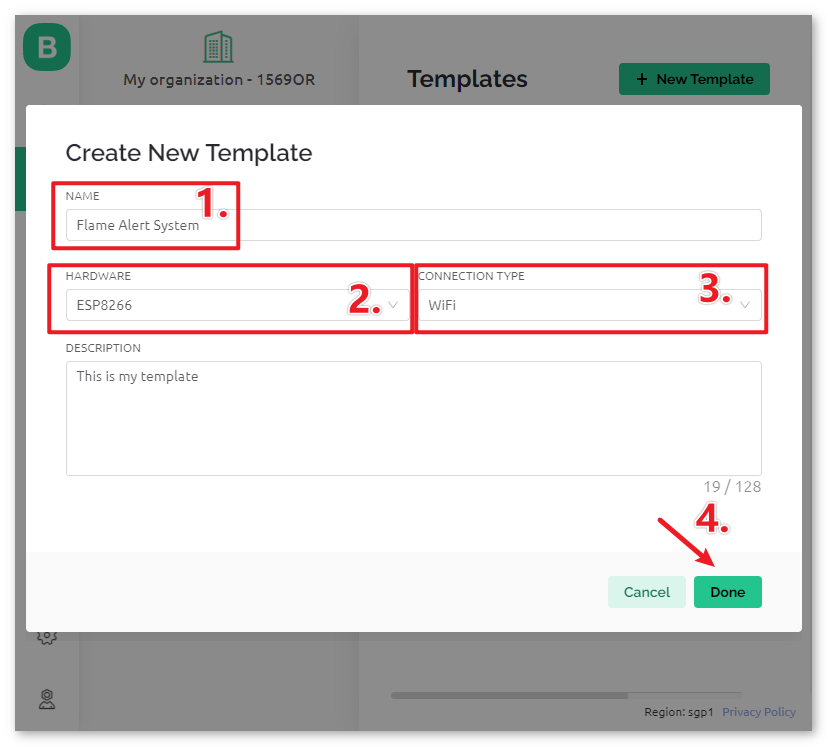

.. raw:: html
    
       

**2 Datastream**
^^^^^^^^^^^^^^^^^^^^^^^^^^^^^

Crea un **Datastream** di tipo **Pin Virtuale** nella pagina **Datastream** per ottenere il valore del modulo sensore di fiamma.

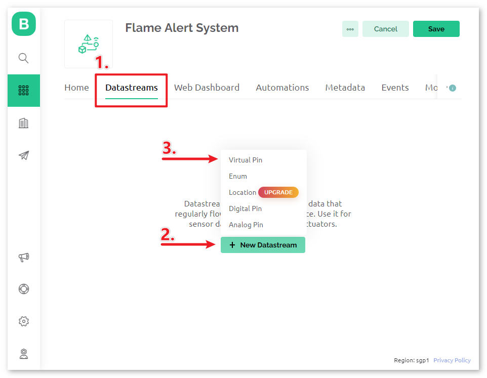

Imposta il nome del **Pin Virtuale** su ``flame_sensor_value``. Imposta il **TIPO DI DATO** su **Integer** e i valori MIN e MAX su **0** e **1**.

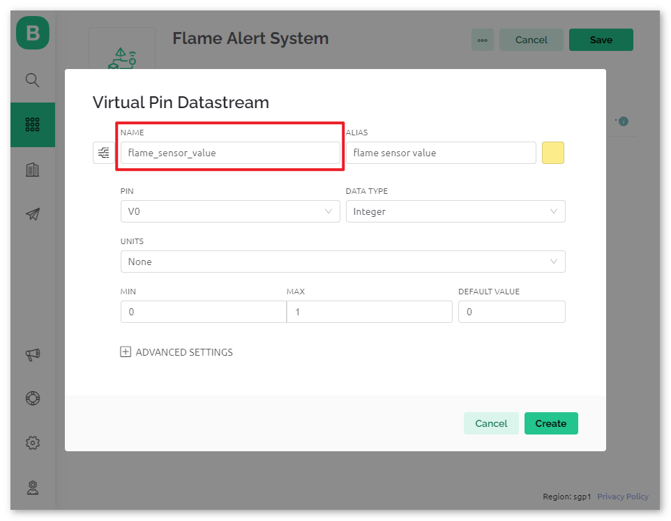

.. raw:: html
    
      

**3 Evento**
^^^^^^^^^^^^^^^^^^^^^^^^^^^^^

Successivamente, creeremo un **evento** che registra il rilevamento delle fiamme e invia una notifica via email.

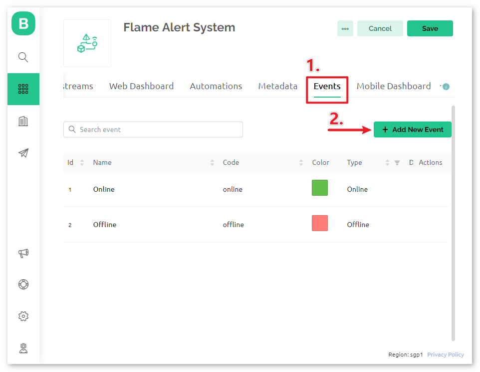

.. note::
    Si raccomanda di mantenere le impostazioni coerenti con le mie, altrimenti potrebbe essere necessario modificare il codice per eseguire il progetto.

Imposta **NOME EVENTO** su ``flame_detection_alert``. Allo stesso tempo, puoi personalizzare il contenuto dell'email inviata impostando **DESCRIZIONE** per l'attivazione dell'evento. Puoi anche impostare limiti di frequenza per l'attivazione dell'evento qui sotto.

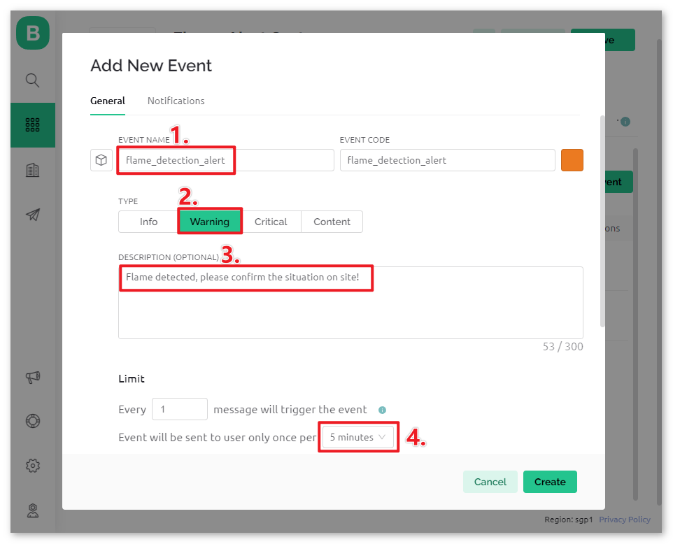

Vai alla pagina **Notifiche** e configura le impostazioni email.

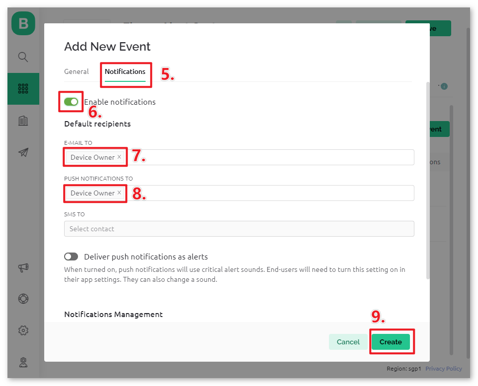

.. raw:: html
    
      

**4 Web Dashboard**
^^^^^^^^^^^^^^^^^^^^^^^^^^^^^

Dobbiamo anche impostare il **Web Dashboard** per visualizzare i dati del sensore inviati dalla scheda Uno.

Trascina e rilascia un **Widget Etichetta** nella pagina **Web Dashboard**.

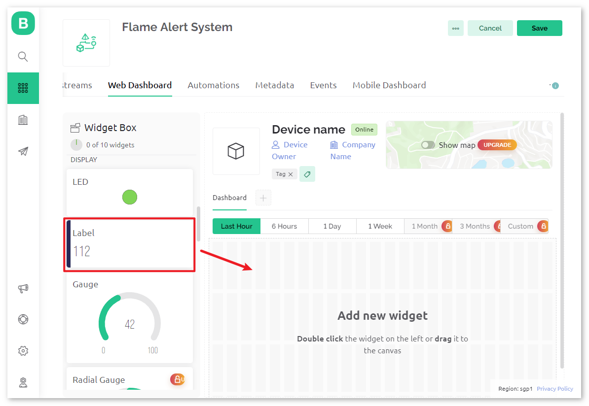

Nella pagina delle impostazioni del **Widget Etichetta**, seleziona **Datastream** come **flame_sensor_value(V0)**. Imposta poi il colore di **SFONDO WIDGET** per cambiare con il valore dei dati. Quando il valore visualizzato è 1, sarà mostrato in verde. Quando il valore è 0, sarà mostrato in rosso.

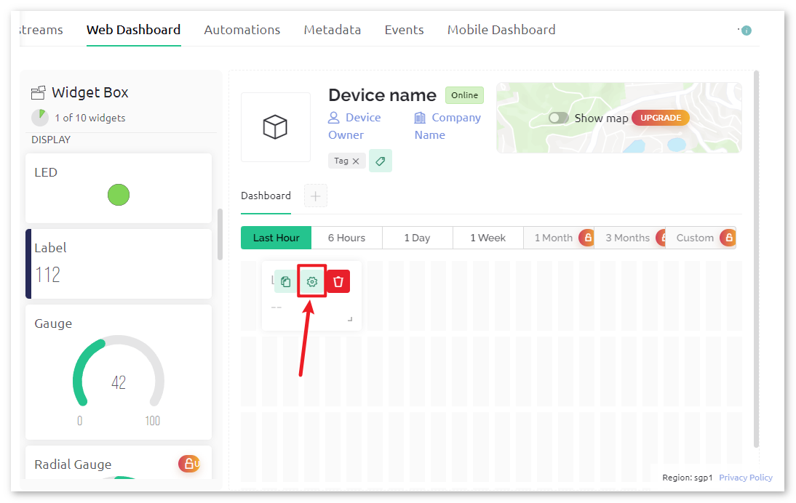

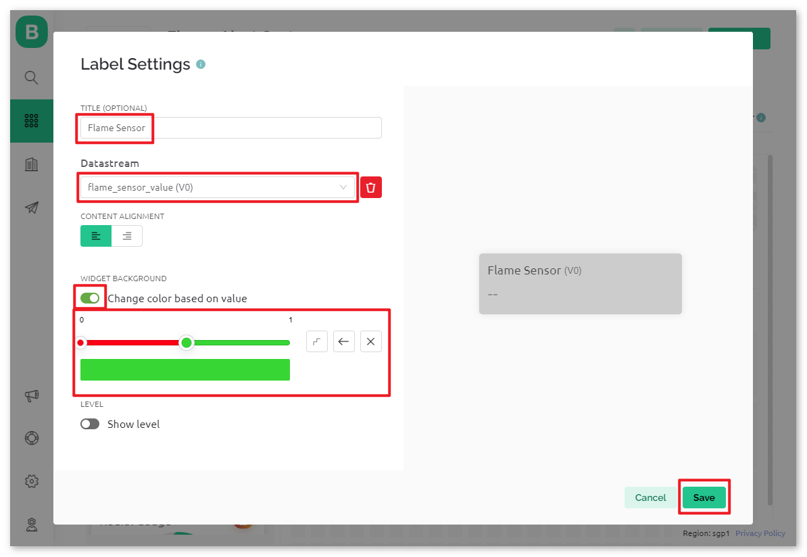

.. raw:: html
    
      

**5 Salva il template**
^^^^^^^^^^^^^^^^^^^^^^^^^^^^^

Infine, ricordati di salvare il template.

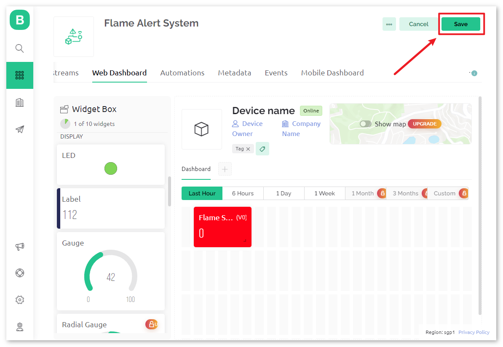

Nel caso in cui tu debba modificare il template, puoi cliccare sul pulsante di modifica nell'angolo in alto a destra.

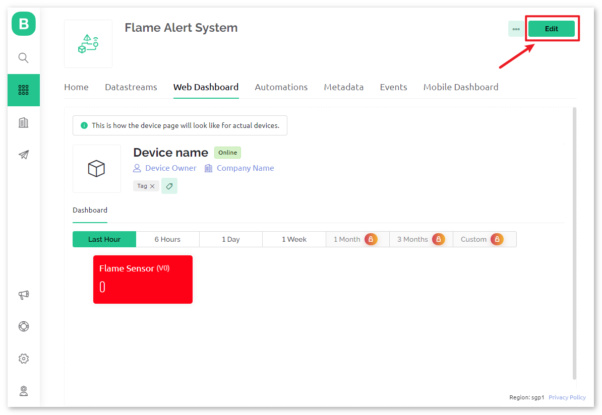

.. raw:: html
    
      

Codice
-----------------------

#. Apri il file ``Lesson_50_Flame_alert_system.ino`` nel percorso ``universal-maker-sensor-kit\arduino_uno\Lesson_50_Flame_alert_system``, o copia questo codice nell'**Arduino IDE**.

   .. raw:: html
       
       <iframe src=https://create.arduino.cc/editor/sunfounder01/ef829dd7-337d-475d-908b-d118c6a93eef/preview?embed style="height:510px;width:100%;margin:10px 0" frameborder=0></iframe>

#. Crea un dispositivo Blynk usando il template di Rilevamento Fiamma. Poi, sostituisci ``BLYNK_TEMPLATE_ID``, ``BLYNK_TEMPLATE_NAME``, e ``BLYNK_AUTH_TOKEN`` con i tuoi. 

   .. code-block:: arduino
    
      #define BLYNK_TEMPLATE_ID "TMPxxxxxxx"
      #define BLYNK_TEMPLATE_NAME "Flame Alert System"
      #define BLYNK_AUTH_TOKEN "xxxxxxxxxxxxx"
   
   .. image:: img/01-create_device_1_shadow.png
    :width: 80%
    :align: center

   .. image:: img/01-create_device_2_shadow.png
    :width: 80%
    :align: center

   .. image:: img/01-create_device_3_shadow.png
    :width: 80%
    :align: center

   .. image:: img/01-create_device_4_shadow.png
    :width: 80%
    :align: center

#. Devi anche inserire il ``ssid`` e ``password`` del WiFi che stai utilizzando. 

   .. code-block:: arduino

    char ssid[] = "your_ssid";
    char pass[] = "your_password";

#. Dopo aver selezionato la scheda e la porta corretti, clicca sul pulsante **Upload**.

#. Apri il monitor seriale (imposta il baudrate a 115200) e attendi un prompt come una connessione riuscita che appaia.

   .. image:: img/01-ready_1_shadow.png
    :width: 80%
    :align: center

   .. note::

       Se appare il messaggio ``ESP is not responding`` quando ti connetti, segui questi passaggi.

       * Assicurati che la batteria da 9V sia collegata.
       * Resetta il modulo ESP8266 collegando il pin RST a GND per 1 secondo, poi scollegarlo.
       * Premi il pulsante di reset sulla scheda R4.

       A volte, potrebbe essere necessario ripetere l'operazione sopra 3-5 volte, per favore sii paziente.

#. Ora, Blynk mostrerà i dati letti dal sensore di fiamma. Nel widget etichetta, puoi vedere il valore letto dal sensore di fiamma. Quando il valore visualizzato è 1, lo sfondo dell'etichetta sarà mostrato in verde. Quando il valore è 0, lo sfondo dell'etichetta sarà mostrato in rosso e Blynk ti invierà un'email di allerta.
   
   .. image:: img/01-ready_2_shadow.png
    :width: 80%
    :align: center

#. Se vuoi usare Blynk sui dispositivi mobili, consulta :ref:`blynk_mobile`.

Analisi del Codice
---------------------------

1. **Inizializzazione delle Librerie**

   Prima di iniziare, è fondamentale impostare le librerie necessarie e le impostazioni per la comunicazione tra Arduino, il modulo WiFi ESP8266 e l'app Blynk. Questo codice imposta le librerie richieste e configura una connessione seriale software tra Arduino e il modulo ESP8266, con il baud rate appropriato per la trasmissione dei dati.
   
   .. code-block:: arduino
   
       //Imposta stampe di debug su Monitor Seriale
       #define BLYNK_PRINT Serial
   
       #include <ESP8266_Lib.h>               // Libreria per ESP8266
       #include <BlynkSimpleShieldEsp8266.h>  // Libreria per Blynk
   
       // Seriale Software su Uno
       #include <SoftwareSerial.h>
       SoftwareSerial EspSerial(2, 3);  // RX, TX
       #define ESP8266_BAUD 115200      // Imposta il baud rate di ESP8266
       ESP8266 wifi(&EspSerial);

2. **Configurazione Blynk e WiFi**

   Per comunicare con l'app Blynk, il progetto deve connettersi a una rete Wi-Fi. Le credenziali devono essere specificate qui.
   
   .. code-block:: arduino

      // ID Template, Nome Dispositivo e Auth Token sono forniti da Blynk Cloud
      // Vedi la scheda Informazioni Dispositivo, o impostazioni del Template
      #define BLYNK_TEMPLATE_ID "TMPxxxxxx"
      #define BLYNK_TEMPLATE_NAME "Sistema di Allerta Fiamma"
      #define BLYNK_AUTH_TOKEN "xxxxxxxxxxxxxxx" 
      
      // Credenziali WiFi.
      // Imposta la password su "" per reti aperte.
      char ssid[] = "your_ssid";
      char pass[] = "your_password";

3. **Dichiarazione del Pin del Sensore & Timer**

   Definisci il numero del pin per la fiamma.
   La libreria Blynk fornisce un timer integrato, e creiamo un oggetto timer. Maggiori informazioni su |link_blynk_timer_intro| 

   .. code-block:: arduino

       const int sensorPin = 8;
       BlynkTimer timer;

4. **Funzione setup()**

   Le configurazioni iniziali come l'impostazione della modalità del pin per sensorPin, l'inizio della comunicazione seriale, l'impostazione del BlynkTimer e la connessione all'app Blynk sono fatte in questa funzione.

   - Usiamo ``timer.setInterval(1000L, myTimerEvent)`` per impostare l'intervallo del timer in setup(), qui impostiamo per eseguire la funzione ``myTimerEvent()`` ogni **1000ms**. Puoi modificare il primo parametro di ``timer.setInterval(1000L, myTimerEvent)`` per cambiare l'intervallo tra le esecuzioni di ``myTimerEvent``.

   .. raw:: html
    
      

   .. code-block:: arduino

       void setup() {
         pinMode(sensorPin, INPUT);
         Serial.begin(115200);
         EspSerial.begin(ESP8266_BAUD);
         delay(1000);
         timer.setInterval(1000L, myTimerEvent);
         Blynk.config(wifi,BLYNK_AUTH_TOKEN);
         Blynk.connectWiFi(ssid, pass);
       }

5. **Funzione loop()**

   Il loop principale esegue continuamente i servizi Blynk e Timer.

   .. code-block:: arduino

       void loop() {
         Blynk.run();
         timer.run();
       }

6. **Funzioni myTimerEvent() & sendData()**

   

   .. code-block:: arduino
 
       void myTimerEvent() {
         // Si prega di non inviare più di 10 valori al secondo.
         sendData();  // Chiama funzione per inviare dati del sensore a Blynk
       }

   La funzione ``sendData()`` legge il valore dal sensore di fiamma e lo invia a Blynk. Se rileva una fiamma (valore 0), invia l'evento ``flame_detection_alert`` all'app Blynk.

   - Usa ``Blynk.virtualWrite(vPin, value)`` per inviare dati al pin virtuale V0 su Blynk. Maggiori informazioni su |link_blynk_virtualWrite|.

   - Usa ``Blynk.logEvent("event_code")`` per registrare eventi su Blynk. Maggiori informazioni su |link_blynk_logEvent|.

   .. raw:: html
    
      

   .. code-block:: arduino
       
      void sendData() {
        int data = digitalRead(sensorPin);
        Blynk.virtualWrite(V0, data);  // invia dati al pin virtuale V0 su Blynk
        Serial.print("flame:");
        Serial.println(data);  // Stampa lo stato della fiamma su Monitor Seriale
        if (data == 0) {
          Blynk.logEvent("flame_alert");  // registra evento di allerta fiamma se il sensore rileva fiamma
        }
      }

**Riferimenti**

- |link_blynk_doc|
- |link_blynk_quickstart| 
- |link_blynk_virtualWrite|
- |link_blynk_logEvent|
- |link_blynk_timer_intro|