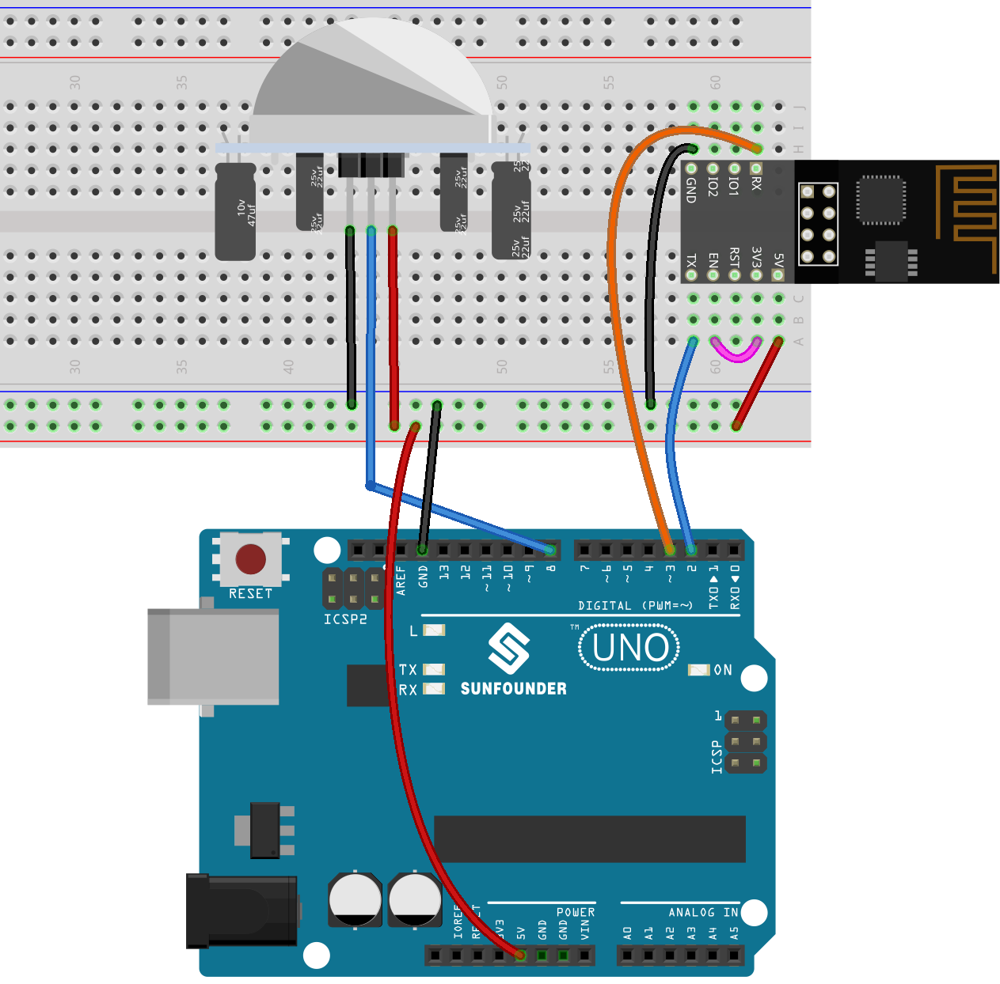
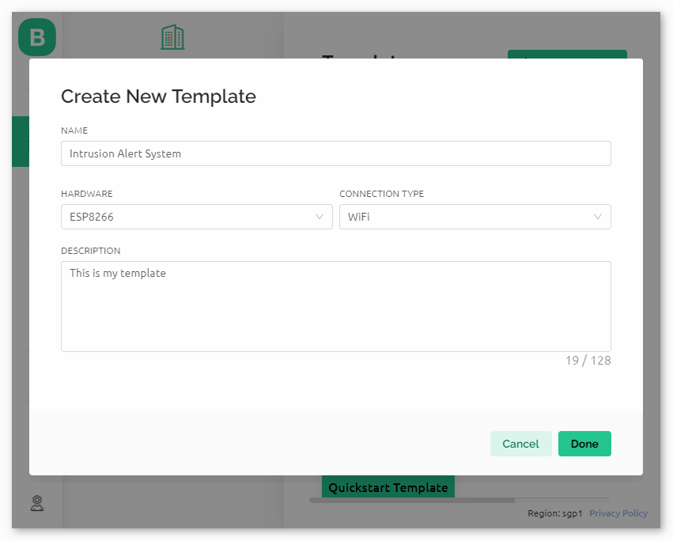
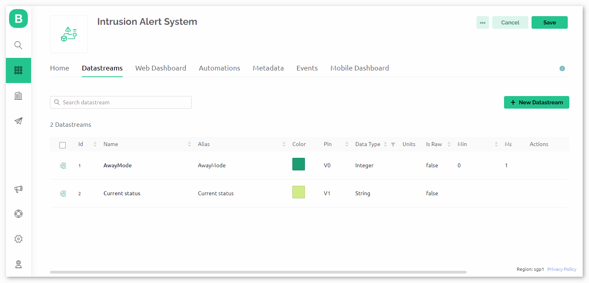
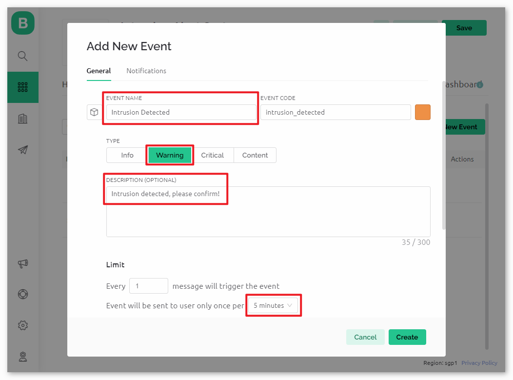
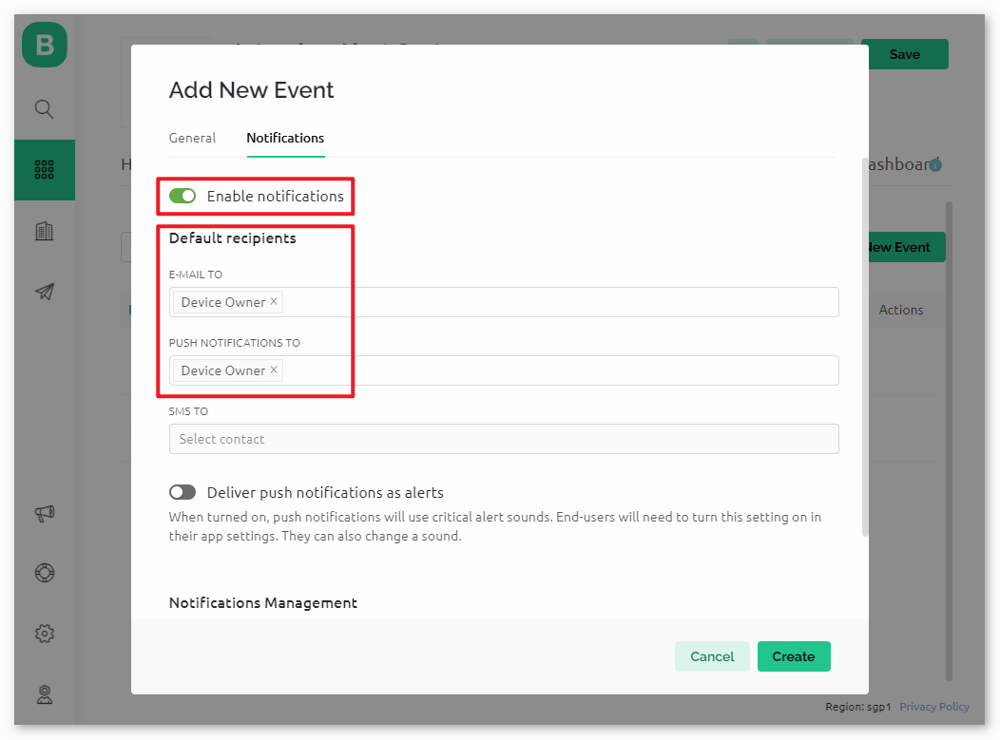
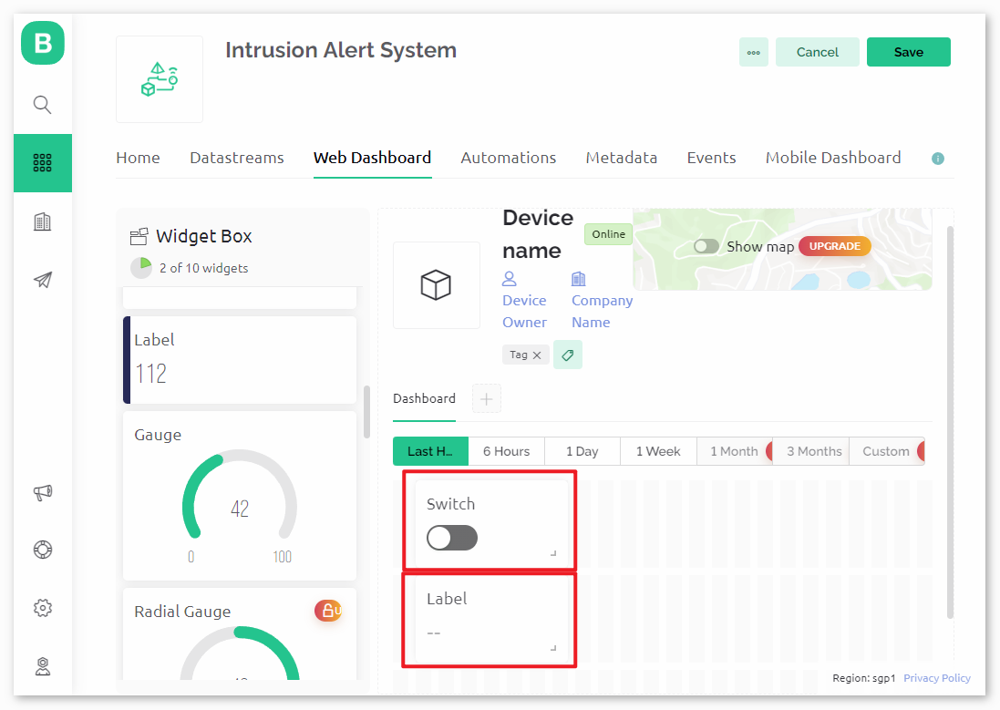
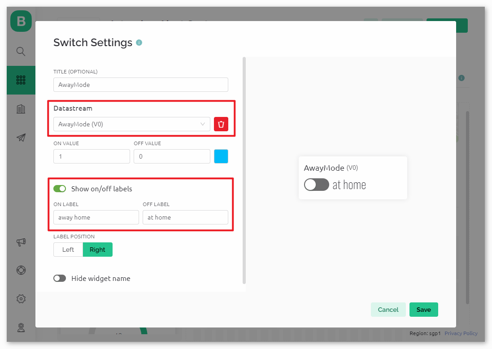
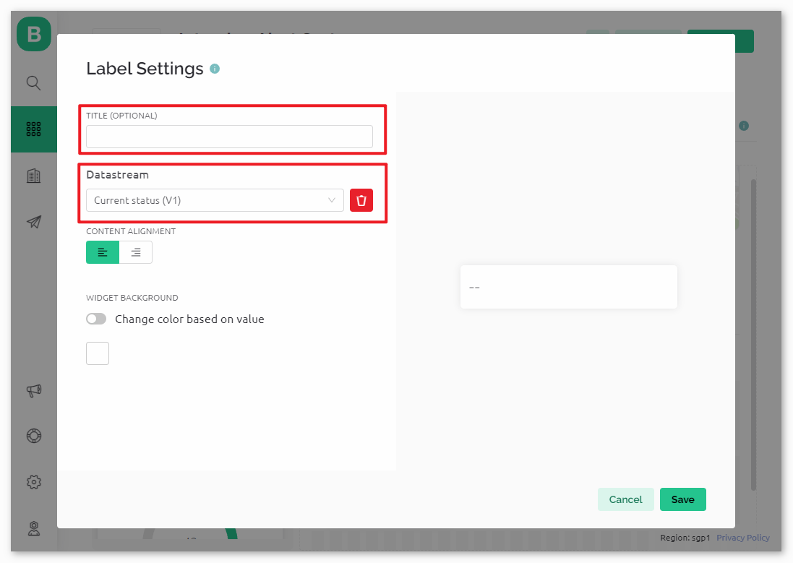
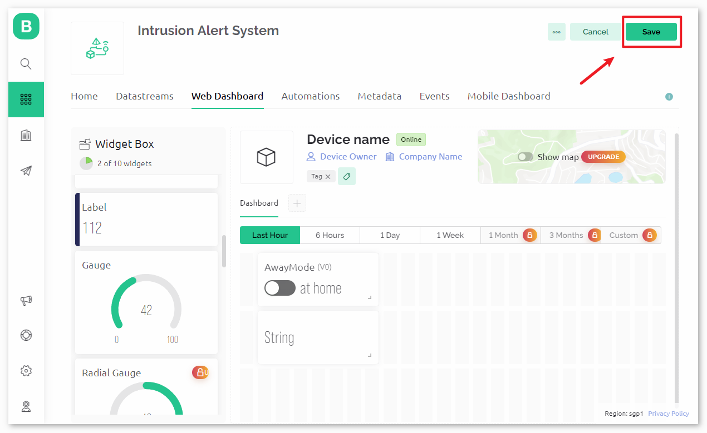

.. note::

    Bonjour, bienvenue dans la communauté des passionnés de SunFounder Raspberry Pi & Arduino & ESP32 sur Facebook ! Plongez plus profondément dans l'univers de Raspberry Pi, Arduino et ESP32 avec d'autres passionnés.

    **Pourquoi rejoindre ?**

    - **Support Expert** : Résolvez les problèmes post-vente et les défis techniques avec l'aide de notre communauté et de notre équipe.
    - **Apprendre & Partager** : Échangez des astuces et des tutoriels pour améliorer vos compétences.
    - **Aperçus Exclusifs** : Obtenez un accès anticipé aux nouvelles annonces de produits et aux aperçus.
    - **Réductions Spéciales** : Profitez de réductions exclusives sur nos nouveaux produits.
    - **Promotions Festives et Cadeaux** : Participez à des cadeaux et des promotions festives.

    👉 Prêts à explorer et créer avec nous ? Cliquez sur [|link_sf_facebook|] et rejoignez-nous aujourd'hui !

.. _uno_iot_intrusion_alert_system:

Leçon 51 : Système d'alerte d'intrusion avec Blynk
===================================================================

Ce projet présente un système simple de détection d'intrusion à domicile utilisant un capteur infrarouge passif (PIR) (HC-SR501).
Lorsque le système est réglé en mode 'Absent' via l'application Blynk, le capteur PIR surveille les mouvements.
Tout mouvement détecté déclenche une notification sur l'application Blynk, alertant l'utilisateur d'une intrusion potentielle.

Composants Nécessaires
--------------------------

Pour ce projet, nous avons besoin des composants suivants. 

Il est certainement pratique d'acheter un kit complet, voici le lien : 

.. list-table::
    :widths: 20 20 20
    :header-rows: 1

    *   - Nom	
        - ÉLÉMENTS DE CE KIT
        - LIEN
    *   - Kit de capteurs universel pour créateurs
        - 94
        - |link_umsk|

Vous pouvez également les acheter séparément via les liens ci-dessous.

.. list-table::
    :widths: 30 20
    :header-rows: 1

    *   - Introduction des composants
        - Lien d'achat

    *   - Arduino UNO R3 ou R4
        - |link_Uno_R3_buy|
    *   - :ref:`cpn_breadboard`
        - |link_breadboard_buy|
    *   - :ref:`cpn_esp8266`
        - \-
    *   - :ref:`cpn_pir_motion`
        - \-

Câblage
---------------------------

Configurer Blynk
-----------------------------

.. note::
    Si vous n'êtes pas familier avec Blynk, il est fortement recommandé de lire d'abord ces deux tutoriels. :ref:`iot_blynk_start` est un guide pour débutants sur Blynk, qui inclut comment configurer ESP8266 et s'enregistrer sur Blynk. Et :ref:`uno_iot_Flame` est un exemple simple, mais la description des étapes sera plus détaillée.

**1 Créer un modèle**
^^^^^^^^^^^^^^^^^^^^^^^^^^^^^

Tout d'abord, nous devons établir un modèle sur Blynk. Suivez les étapes ci-dessous pour créer un modèle **"Système d'alerte d'intrusion"**.

**2 Flux de données**
^^^^^^^^^^^^^^^^^^^^^^^^^^^^^

Créez des **Flux de données** de type **Pin Virtuel** dans la page **Flux de données** pour recevoir des données de esp8266 et du tableau uno r4.

* Créez le Pin Virtuel V0 selon le schéma suivant :

  Définissez le nom du **Pin Virtuel V0** à **Mode Absent**. Définissez le **TYPE DE DONNÉES** à **Entier** et MIN et MAX à **0** et **1**.

  .. image:: img/02-datastream_1_shadow.png
      :width: 90%

* Créez le Pin Virtuel V1 selon le schéma suivant :

  Définissez le nom du **Pin Virtuel V1** à **Statut Actuel**. Définissez le **TYPE DE DONNÉES** à **Chaîne**.

  .. image:: img/02-datastream_2_shadow.png
      :width: 90%

Assurez-vous d'avoir configuré deux Pins Virtuels selon les étapes ci-dessus.

.. raw:: html

       

**3 Événement** 
^^^^^^^^^^^^^^^^^^^^^^^^^^^^^

Ensuite, nous allons créer un **événement** qui enregistre la détection d'intrusion et envoie une notification par email.

.. note::
    Il est recommandé de rester cohérent avec mes paramètres, sinon vous devrez peut-être modifier le code pour exécuter le projet. Assurez-vous que le **CODE DE L'ÉVÉNEMENT** soit défini comme ``intrusion_detected``.

Accédez à la page **Notifications** et configurez les paramètres d'email.

.. raw:: html
    
      

**4 Tableau de bord Web**
^^^^^^^^^^^^^^^^^^^^^^^^^^^^^

Nous devons également configurer le **Tableau de bord Web** pour interagir avec le Système d'alerte d'intrusion.

Glissez-déposez un **Widget Interrupteur** et un **Widget Étiquette** sur la page du **Tableau de bord Web**.

Dans la page de paramètres du **Widget Interrupteur**, sélectionnez **Flux de données** comme **AwayMode(V0)**. Réglez **ONLABEL** et **OFFLABEL** pour afficher "absent" lorsque l'interrupteur est activé, et "présent" lorsque l'interrupteur est désactivé.

Dans la page de paramètres du **Widget Étiquette**, sélectionnez **Flux de données** comme **Statut actuel(V1)**.

**5 Sauvegarder le modèle**
^^^^^^^^^^^^^^^^^^^^^^^^^^^^^

Enfin, n'oubliez pas de sauvegarder le modèle.

.. raw:: html
    
       

Code
----------------------

#. Ouvrez le fichier ``Lesson_51_Intrusion_alert_system.ino`` sous le chemin ``universal-maker-sensor-kit\arduino_uno\Lesson_51_Intrusion_alert_system``, ou copiez ce code dans **Arduino IDE**.

   .. raw:: html
       
       <iframe src=https://create.arduino.cc/editor/sunfounder01/e94c0b5e-1fcd-46aa-bc95-0395efee1d32/preview?embed style="height:510px;width:100%;margin:10px 0" frameborder=0></iframe>

#. Créez un appareil Blynk en utilisant le modèle "Système d'alerte d'intrusion". Remplacez ensuite les ``BLYNK_TEMPLATE_ID``, ``BLYNK_TEMPLATE_NAME``, et ``BLYNK_AUTH_TOKEN`` par les vôtres.

   .. code-block:: arduino
    
      #define BLYNK_TEMPLATE_ID "TMPxxxxxxx"
      #define BLYNK_TEMPLATE_NAME "Système d'alerte d'intrusion"
      #define BLYNK_AUTH_TOKEN "xxxxxxxxxxxxx"

#. Vous devez également entrer le ``ssid`` et le ``mot de passe`` du WiFi que vous utilisez.

   .. code-block:: arduino

    char ssid[] = "votre_ssid";
    char pass[] = "votre_mot_de_passe";

#. Après avoir sélectionné la bonne carte et le bon port, cliquez sur le bouton **Téléverser**.

#. Ouvrez le moniteur série (réglez le baudrate sur 115200) et attendez une invite indiquant une connexion réussie.

   .. image:: img/02-ready_1_shadow.png
    :width: 80%
    :align: center

   .. note::

       Si le message ``ESP ne répond pas`` apparaît lorsque vous vous connectez, veuillez suivre ces étapes.

       * Assurez-vous que la batterie 9V est branchée.
       * Réinitialisez le module ESP8266 en connectant la broche RST à GND pendant 1 seconde, puis débranchez-la.
       * Appuyez sur le bouton de réinitialisation de la carte R4.

       Parfois, vous devrez peut-être répéter l'opération ci-dessus 3 à 5 fois, veuillez être patient.

Analyse du code
---------------------------

#. **Configuration et bibliothèques**

   Ici, les constantes et les identifiants pour Blynk sont définis. Les bibliothèques nécessaires pour le module WiFi ESP8266 et Blynk sont incluses.

   .. code-block:: arduino

      #define BLYNK_TEMPLATE_ID "TMPxxxx"
      #define BLYNK_TEMPLATE_NAME "Système d'alerte d'intrusion"
      #define BLYNK_AUTH_TOKEN "xxxxxx-"
      #define BLYNK_PRINT Serial

      #include <ESP8266_Lib.h>
      #include <BlynkSimpleShieldEsp8266.h>

#. **Configuration WiFi**

   Configurez les identifiants WiFi et mettez en place la communication série logicielle avec le module ESP01.

   .. code-block:: arduino

      char ssid[] = "votre_ssid";
      char pass[] = "votre_mot_de_passe";

      SoftwareSerial EspSerial(2, 3);
      #define ESP8266_BAUD 115200
      ESP8266 wifi(&EspSerial);

#. **Configuration du capteur PIR**

   Définissez la broche où le capteur PIR est connecté et initialisez les variables d'état.

   .. code-block:: arduino

      const int sensorPin = 8;
      int state = 0;
      int awayHomeMode = 0;
      BlynkTimer timer;

#. **Fonction setup()**

   Cette fonction initialise le capteur PIR en tant qu'entrée, configure la communication série, se connecte au WiFi, et configure Blynk.

   - Nous utilisons ``timer.setInterval(1000L, myTimerEvent)`` pour régler l'intervalle du minuteur dans setup(), ici nous configurons pour exécuter la fonction ``myTimerEvent()`` toutes les **1000ms**. Vous pouvez modifier le premier paramètre de ``timer.setInterval(1000L, myTimerEvent)`` pour changer l'intervalle entre les exécutions de ``myTimerEvent``.

   .. raw:: html
    
      

   .. code-block:: arduino

      void setup() {
         pinMode(sensorPin, INPUT);
         Serial.begin(115200);
         EspSerial.begin(ESP8266_BAUD);
         delay(10);
         Blynk.config(wifi, BLYNK_AUTH_TOKEN);
         Blynk.connectWiFi(ssid, pass);
         timer.setInterval(1000L, myTimerEvent);
      }

#. **Fonction loop()**

   La fonction boucle exécute continuellement les fonctions Blynk et le minuteur Blynk.

   .. code-block:: arduino

      void loop() {
         Blynk.run();
         timer.run();
      }

#. **Interaction avec l'application Blynk**

   Ces fonctions sont appelées lorsque l'appareil se connecte à Blynk et lorsqu'il y a un changement dans l'état de la broche virtuelle V0 sur l'application Blynk.

   - Chaque fois que l'appareil se connecte au serveur Blynk, ou se reconnecte en raison de conditions de réseau médiocres, la fonction ``BLYNK_CONNECTED()`` est appelée. La commande ``Blynk.syncVirtual()`` demande la valeur d'une seule broche virtuelle. La broche virtuelle spécifiée effectuera l'appel ``BLYNK_WRITE()``. Veuillez consulter |link_blynk_syncing| pour plus de détails.

   - Chaque fois que la valeur d'une broche virtuelle sur le serveur BLYNK change, cela déclenchera ``BLYNK_WRITE()``. Plus de détails à |link_blynk_write|.

   .. raw:: html
    
      

   .. code-block:: arduino
      
      // Cette fonction est appelée chaque fois que l'appareil est connecté à Blynk.Cloud
      BLYNK_CONNECTED() {
         Blynk.syncVirtual(V0);
      }
      
      // Cette fonction est appelée chaque fois que l'état de la broche virtuelle 0 change
      BLYNK_WRITE(V0) {
         awayHomeMode = param.asInt();
         // logique supplémentaire
      }

#. **Gestion des données**

   Chaque seconde, la fonction ``myTimerEvent()`` appelle ``sendData()``. Si le mode absent est activé sur Blynk, elle vérifie le capteur PIR et envoie une notification à Blynk si un mouvement est détecté.

   - Nous utilisons ``Blynk.virtualWrite(V1, "Quelqu'un dans votre maison ! Veuillez vérifier !");`` pour changer le texte d'une étiquette.

   - Utilisez ``Blynk.logEvent("intrusion_detected");`` pour enregistrer l'événement sur Blynk.

   .. raw:: html
    
      

   .. code-block:: arduino

      void myTimerEvent() {
         sendData();
      }

      void sendData() {
         if (awayHomeMode == 1) {
            state = digitalRead(sensorPin);  // Lire l'état du capteur PIR

            Serial.print("state:");
            Serial.println(state);
        
            // Si le capteur détecte un mouvement, envoyer une alerte à l'application Blynk
            if (state == HIGH) {
              Serial.println("Somebody here!");
              Blynk.virtualWrite(V1, "Somebody in your house! Please check!");
              Blynk.logEvent("intrusion_detected");
            }
         }
      }

**Références**

- |link_blynk_doc|
- |link_blynk_quickstart| 
- |link_blynk_virtualWrite|
- |link_blynk_logEvent|
- |link_blynk_timer_intro|
- |link_blynk_syncing| 
- |link_blynk_write|