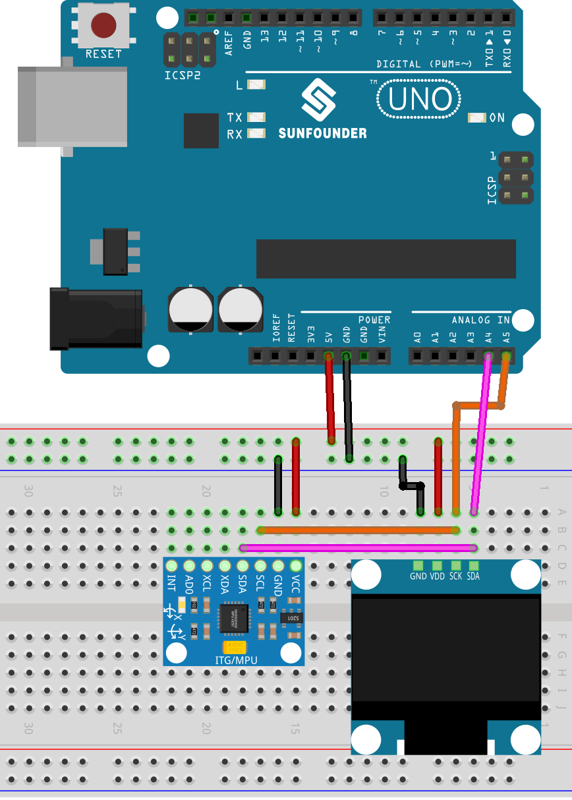

.. note:: 

    ¡Hola, bienvenido a la comunidad de entusiastas de SunFounder en Facebook sobre Raspberry Pi, Arduino y ESP32! Sumérgete más a fondo en Raspberry Pi, Arduino y ESP32 con otros aficionados.

    **¿Por qué unirse?**

    - **Soporte de Expertos**: Resuelve problemas posventa y desafíos técnicos con ayuda de nuestra comunidad y equipo.
    - **Aprender y Compartir**: Intercambia consejos y tutoriales para mejorar tus habilidades.
    - **Previsualizaciones Exclusivas**: Obtén acceso anticipado a anuncios de nuevos productos y avances exclusivos.
    - **Descuentos Especiales**: Disfruta de descuentos exclusivos en nuestros productos más nuevos.
    - **Promociones Festivas y Sorteos**: Participa en sorteos y promociones festivas.

    👉 ¿Listo para explorar y crear con nosotros? Haz clic en [|link_sf_facebook|] ¡y únete hoy!

.. _uno_lesson52_tilt_direction_indicator:

Lección 52: Indicador de Dirección de Inclinación
===================================================

Este proyecto de Arduino utiliza un acelerómetro y giroscopio MPU6050 junto con una pantalla OLED. El proyecto lee datos del sensor MPU6050 para detectar la dirección de inclinación y muestra flechas correspondientes (arriba, abajo, izquierda o derecha) o un círculo (si no hay una inclinación significativa) en la pantalla OLED basada en la dirección de inclinación.

Componentes Necesarios
---------------------------

En este proyecto, necesitamos los siguientes componentes. 

Es definitivamente conveniente comprar un kit completo, aquí está el enlace:

.. list-table::
    :widths: 20 20 20
    :header-rows: 1

    *   - Nombre	
        - ARTÍCULOS EN ESTE KIT
        - ENLACE
    *   - Kit Universal de Sensores para Creadores
        - 94
        - |link_umsk|

También puedes comprarlos por separado en los enlaces a continuación.

.. list-table::
    :widths: 30 20
    :header-rows: 1

    *   - Introducción al Componente
        - Enlace de Compra

    *   - Arduino UNO R3 o R4
        - |link_Uno_R3_buy|
    *   - :ref:`cpn_mpu6050`
        - |link_mpu6050_buy|
    *   - :ref:`cpn_oled`
        - \-
    *   - :ref:`cpn_breadboard`
        - |link_breadboard_buy|
        

Cableado
---------------------------

Código
---------------------------

.. note:: 
   Para instalar la biblioteca, utiliza el Administrador de Bibliotecas de Arduino y busca **"Adafruit SSD1306"** y **"Adafruit GFX"** e instálalas.

.. raw:: html

    <iframe src="https://app.arduino.cc/sketches/ea5345ae-b849-424d-9b61-9a192695aef8?view-mode=embed" style="height:510px;width:100%;margin:10px 0" frameborder=0 /></iframe>

Análisis del Código
---------------------------

#. Inclusión de bibliotecas y configuración de la pantalla OLED

   El proyecto comienza incluyendo las bibliotecas necesarias para interactuar con el sensor MPU6050 y la pantalla OLED. Se definen las dimensiones de la pantalla OLED y la dirección I2C, seguido de la creación del objeto de pantalla.

   .. code-block:: arduino

       #include <Adafruit_MPU6050.h>
       #include <Adafruit_Sensor.h>
       #include <Wire.h>
       #include <Adafruit_GFX.h>
       #include <Adafruit_SSD1306.h>

       #define SCREEN_WIDTH 128
       #define SCREEN_HEIGHT 64

       #define OLED_RESET -1
       #define SCREEN_ADDRESS 0x3C
       Adafruit_SSD1306 display(SCREEN_WIDTH, SCREEN_HEIGHT, &Wire, OLED_RESET);

       Adafruit_MPU6050 mpu;

#. Función de configuración

   En la función de configuración, se inicializa la comunicación serial, y el sensor MPU6050 se inicializa con configuraciones específicas para los rangos del acelerómetro y giroscopio. También se inicializa y limpia la pantalla OLED.

   .. code-block:: arduino

       void setup(void) {
         Serial.begin(115200);

         if (!mpu.begin()) {
           Serial.println("Failed to find MPU6050 chip");
           while (1) {
             delay(10);
           }
         }

         mpu.setAccelerometerRange(MPU6050_RANGE_8_G);
         mpu.setGyroRange(MPU6050_RANGE_500_DEG);
         mpu.setFilterBandwidth(MPU6050_BAND_21_HZ);

         if (!display.begin(SSD1306_SWITCHCAPVCC, SCREEN_ADDRESS)) {
           Serial.println(F("SSD1306 allocation failed"));
           for (;;)
             ;  // No continuar, bucle infinito
         }
         display.clearDisplay();

         delay(100);
       }

#. Función de bucle

   En la función de bucle, se lee continuamente el dato del sensor y se determina la dirección de la inclinación basada en los valores de aceleración. Dependiendo de la dirección de la inclinación, se dibujan diferentes flechas o un círculo en la pantalla OLED.

   El código lee datos del sensor MPU6050 para detectar la dirección de inclinación y muestra flechas correspondientes (arriba, abajo, izquierda o derecha) o un círculo (si no hay una inclinación significativa) en la pantalla OLED basada en la dirección de inclinación.

   .. code-block:: arduino

       void loop() {

         display.clearDisplay();

         sensors_event_t a, g, temp;
         mpu.getEvent(&a, &g, &temp);

         Serial.print("acceleration:");
         Serial.print(a.acceleration.x);
         Serial.print(",");
         Serial.print(a.acceleration.y);
         Serial.print(",");
         Serial.println(a.acceleration.z);

         if (a.acceleration.x >= 2) {
           drawUpArrow();
         } else if (a.acceleration.x <= -2) {
           drawDownArrow();
         } else if (a.acceleration.y >= 2) {
           drawLeftArrow();
         } else if (a.acceleration.y <= -2) {
           drawRightArrow();
         } else {
           drawCircle();
         }
         display.display();

         delay(200);
       }

#. Funciones de dibujo

   Se definen varias funciones auxiliares para dibujar diferentes formas en la pantalla OLED. Estas funciones utilizan la biblioteca ``Adafruit_GFX`` para dibujar flechas y círculos.

   .. code-block:: arduino

       void drawUpArrow() {
         display.fillTriangle(49, 30, 64, 15, 79, 30, WHITE);
         display.fillRect(59, 30, 10, 20, WHITE);
       }

       void drawDownArrow() {
         display.fillTriangle(49, 36, 64, 51, 79, 36, WHITE);
         display.fillRect(59, 16, 10, 20, WHITE);
       }

       void drawRightArrow() {
         display.fillTriangle(70, 15, 85, 30, 70, 45, WHITE);
         display.fillRect(50, 25, 20, 10, WHITE);
       }

       void drawLeftArrow() {
         display.fillTriangle(60, 15, 45, 30, 60, 45, WHITE);
         display.fillRect(60, 25, 20, 10, WHITE);
       }

       void drawCircle() {
         display.fillCircle(64, 32, 10, WHITE);
         display.fillCircle(64, 32, 8, BLACK);
       }

**Referencia**

- |link_adafruit_gfx_graphics_library|

