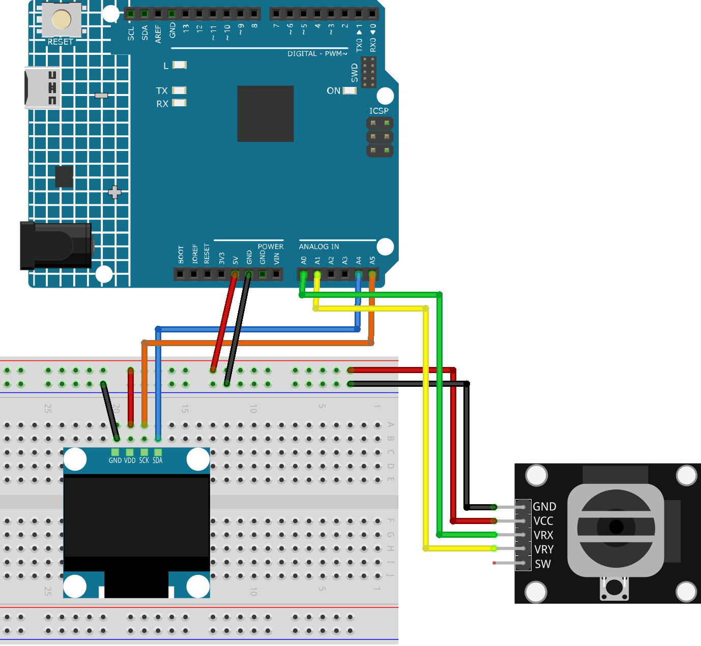

.. note:: 

   Ciao, benvenuti nella Comunità degli Appassionati di SunFounder Raspberry Pi & Arduino & ESP32 su Facebook! Esplorate più a fondo Raspberry Pi, Arduino e ESP32 insieme ad altri appassionati.

   **Perché unirsi?**

   - **Supporto Esperto**: Risolvi problemi post-vendita e sfide tecniche con l'aiuto della nostra comunità e del nostro team.
   - **Impara & Condividi**: Scambia consigli e tutorial per migliorare le tue competenze.
   - **Anteprime Esclusive**: Ottieni accesso anticipato agli annunci di nuovi prodotti e anteprime.
   - **Sconti Speciali**: Goditi sconti esclusivi sui nostri prodotti più recenti.
   - **Promozioni Festive e Regali**: Partecipa a regali e promozioni festive.

   👉 Pronto a esplorare e creare con noi? Clicca [|link_sf_facebook|] e unisciti oggi!

.. _uno_lesson53_direction_indicator:

Lezione 53: Indicatore di Direzione
===========================================

Questo progetto Arduino inizializza un display OLED e legge gli input da un joystick connesso ai pin analogici A0 e A1. Monitora continuamente la posizione del joystick per determinare la sua direzione di inclinazione e visualizza una freccia appropriata (su, giù, sinistra o destra) o un cerchio (se il joystick è centrato) sul display OLED.

Componenti Necessari
--------------------------

Per questo progetto, abbiamo bisogno dei seguenti componenti.

È decisamente conveniente acquistare un kit completo, ecco il link:

.. list-table::
    :widths: 20 20 20
    :header-rows: 1

    *   - Nome	
        - ELEMENTI IN QUESTO KIT
        - LINK
    *   - Universal Maker Sensor Kit
        - 94
        - |link_umsk|

Puoi anche acquistarli separatamente dai link sottostanti.

.. list-table::
    :widths: 30 20
    :header-rows: 1

    *   - Introduzione ai Componenti
        - Link di Acquisto

    *   - Arduino UNO R3 o R4
        - |link_Uno_R3_buy|
    *   - :ref:`cpn_joystick`
        - |link_joystick_buy|
    *   - :ref:`cpn_oled`
        - \-
    *   - :ref:`cpn_breadboard`
        - |link_breadboard_buy|
        

Cablaggio
---------------------------

Codice
---------------------------

.. note:: 
   Per installare la libreria, utilizza il Gestore Librerie Arduino e cerca **"Adafruit SSD1306"** e **"Adafruit GFX"** e installale. 

.. raw:: html

    <iframe src="https://app.arduino.cc/sketches/c926f784-c6ac-4d4d-864c-d55aee9595b4?view-mode=embed" style="height:510px;width:100%;margin:10px 0" frameborder=0></iframe>

Analisi del Codice
---------------------------

#. Inclusione delle librerie necessarie

   Il progetto utilizza tre librerie: ``Wire.h`` per la comunicazione I2C, ``Adafruit_GFX.h`` per le primitive grafiche e ``Adafruit_SSD1306.h`` per il controllo del display OLED.
 
   .. code-block:: arduino
 
      #include <Wire.h>
      #include <Adafruit_GFX.h>
      #include <Adafruit_SSD1306.h>

#. Definizione delle costanti e creazione di un oggetto display OLED

   Vengono definite le costanti per le dimensioni e l'indirizzo del display OLED. Viene creato l'oggetto display con questi parametri.
 
   .. code-block:: arduino
     
      #define SCREEN_WIDTH 128  // Larghezza del display OLED, in pixel
      #define SCREEN_HEIGHT 64  // Altezza del display OLED, in pixel
      #define OLED_RESET -1  // Pin di reset (o -1 se condivide il pin di reset di Arduino)
      #define SCREEN_ADDRESS 0x3C
      Adafruit_SSD1306 display(SCREEN_WIDTH, SCREEN_HEIGHT, &Wire, OLED_RESET);

#. Definizioni dei pin e soglia per il joystick

   I pin analogici A0 e A1 sono utilizzati per il joystick, e viene definita una soglia per determinare se il joystick è centrato.
 
   .. code-block:: arduino
 
      const int xPin = A0;  // VRX collegato a
      const int yPin = A1;  // VRY collegato a
      const int threshold = 50;  // soglia per considerare il joystick centrato
 
#. Funzione di setup: inizializzazione della comunicazione seriale e del display OLED

   Viene inizializzata la comunicazione seriale per il debug, e il display OLED viene inizializzato e pulito.
 
   .. code-block:: arduino
 
      void setup() {
        Serial.begin(9600);
        if (!display.begin(SSD1306_SWITCHCAPVCC, SCREEN_ADDRESS)) {
          Serial.println(F("SSD1306 allocation failed"));
          for (;;);
        }
        display.clearDisplay();
      }
 
#. Ciclo principale: lettura dei valori del joystick, determinazione della direzione e visualizzazione delle forme

   Il ciclo principale legge i valori del joystick, determina la direzione in base a questi valori e visualizza la forma corrispondente sul display OLED.

   .. image:: img/Lesson_53_Code_Analysis.png
    :width: 85%

   .. raw:: html
   
         
 
   .. code-block:: arduino
 
      void loop() {
        display.clearDisplay();
        int xValue = analogRead(xPin);
        int yValue = analogRead(yPin) * -1;
        Serial.print("X: ");
        Serial.print(xValue);
        Serial.print("|Y: ");
        Serial.println(-yValue);
  
        float yLine1 = line1(xValue);
        float yLine2 = line2(xValue);
  
        int relX = xValue - 512;
        int relY = -yValue - 512;
  
        if (abs(relX) < threshold && abs(relY) < threshold) {
          drawCircle();
        } else if (yValue > yLine1 && yValue > yLine2) {
          drawUpArrow();
        } else if (yValue < yLine1 && yValue < yLine2) {
          drawDownArrow();
        } else if (yValue < yLine1 && yValue > yLine2) {
          drawRightArrow();
        } else if (yValue > yLine1 && yValue < yLine2) {
          drawLeftArrow();
        }
  
        display.display();
        delay(80);
      }
 
#. Funzioni di aiuto: calcolo delle linee e disegno delle forme

   Queste funzioni aiutano nel calcolo delle linee utilizzate per la determinazione della direzione e nel disegno delle forme sul display OLED.
 
   .. code-block:: arduino
 
      float line1(float x) {
        return x - 1023;
      }
  
      float line2(float x) {
        return -x;
      }
  
      void drawUpArrow() {
        display.fillTriangle(49, 30, 64, 15, 79, 30, WHITE);
        display.fillRect(59, 30, 10, 20, WHITE);
      }
  
      void drawDownArrow() {
        display.fillTriangle(49, 36, 64, 51, 79, 36, WHITE);
        display.fillRect(59, 16, 10, 20, WHITE);
      }
  
      void drawRightArrow() {
        display.fillTriangle(70, 15, 85, 30, 70, 45, WHITE);
        display.fillRect(50, 25, 20, 10, WHITE);
      }
  
      void drawLeftArrow() {
        display.fillTriangle(60, 15, 45, 30, 60, 45, WHITE);
        display.fillRect(60, 25, 20, 10, WHITE);
      }
  
      void drawCircle() {
        display.fillCircle(64, 32, 10, WHITE);
        display.fillCircle(64, 32, 8, BLACK);
      }
  
**Riferimento**

- |link_adafruit_gfx_graphics_library|