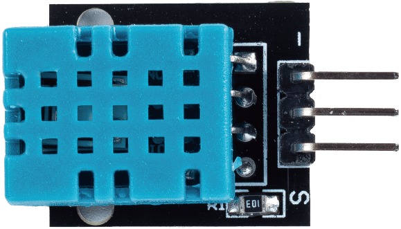
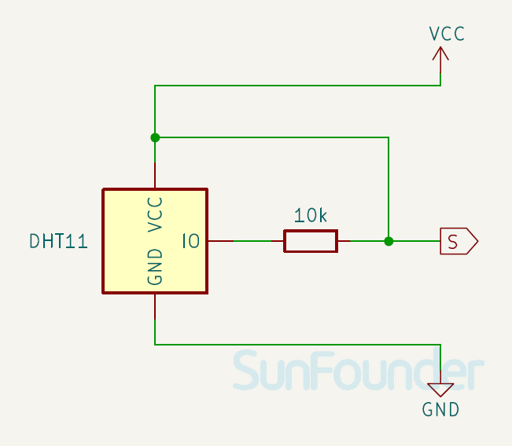
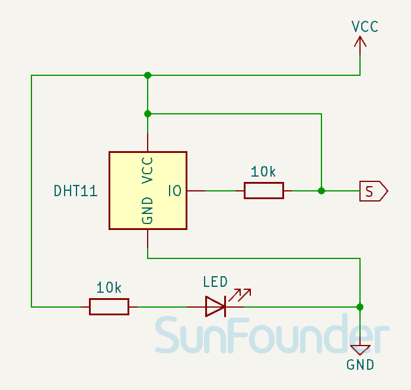

.. _cpn_dht11:

Temperature and Humidity Sensor Module (DHT11)
================================================

.. raw:: html

    

The digital temperature and humidity sensor DHT11 is a composite sensor that contains a calibrated digital signal output of temperature and humidity. The technology of a dedicated digital modules collection and the temperature and humidity sensing technology are applied to ensure that the product has high reliability and excellent long-term stability.

Specification
---------------------------
* Supply Voltage: 3.3V - 5V
* Output Signal Type: Digital output
* Temperature Measurement Range: 0-50℃ ± 2℃
* Humidity Measurement Range: 20-90%RH ± 5%RH
* Temperature Accuracy: ±2°C
* Humidity Accuracy: ±5% RH

Pinout
---------------------------
* **VCC**: This is the positive power supply input from the main control. 
* **GND**: Ground connection.
* **S**: This pin is used for transmitting temperature and humidity data to the microcontroller using a single-wire bi-directional protocol.

Principle
---------------------------
Only three pins are available for use: VCC, GND, and DATA. The communication process begins with the DATA line sending start signals to DHT11, and DHT11 receives the signals and returns an answer signal. Then the host receives the answer signal and begins to receive 40-bit humidity and temperature data (8-bit humidity integer + 8-bit humidity decimal + 8-bit temperature integer + 8-bit temperature decimal + 8-bit checksum).

.. image:: img/19_dht11_module_2.png
    :width: 300
    :align: center

.. raw:: html
    
     

Schematic diagram
---------------------------

.. csv-table:: 
   :widths: 30, 70

   |dht11_module|, |dht11_module_schematic|
   |dht11_module_withLED|, |dht11_module_withLED_schematic|

.. |dht11_module_withLED| image:: img/19_dht11_module_withLED.png
   :width: 150px

Example
---------------------------
* :ref:`uno_lesson19_dht11` (Arduino UNO)
* :ref:`esp32_lesson19_dht11` (ESP32)
* :ref:`pico_lesson19_dht11` (Raspberry Pi Pico)
* :ref:`pi_lesson19_dht11` (Raspberry Pi)

* :ref:`uno_lesson45_plant_monitor` (Arduino UNO)
* :ref:`esp32_plant_monitor` (ESP32)
* :ref:`esp32_adafruit_io` (ESP32)