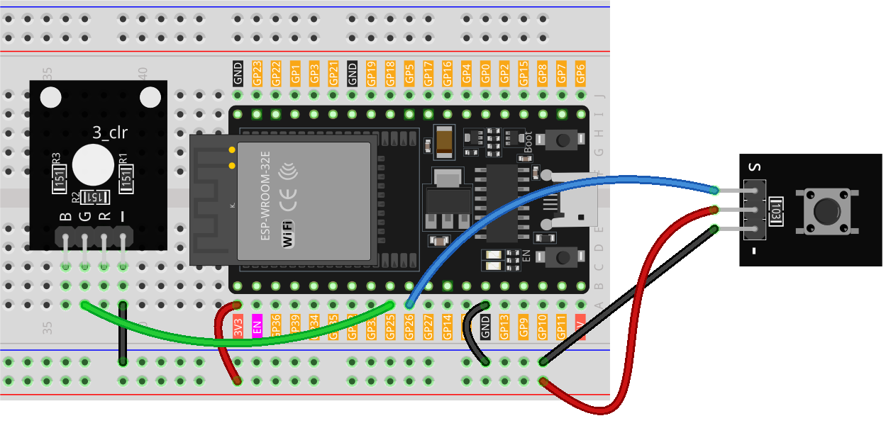

.. note::

    Bonjour, bienvenue dans la communauté des passionnés de SunFounder Raspberry Pi, Arduino et ESP32 sur Facebook ! Plongez plus profondément dans l'univers de Raspberry Pi, Arduino et ESP32 aux côtés d'autres passionnés.

    **Pourquoi rejoindre ?**

    - **Support d'experts** : Obtenez de l'aide pour résoudre les problèmes post-vente et les défis techniques grâce à notre communauté et notre équipe.
    - **Apprendre & Partager** : Échangez des astuces et des tutoriels pour enrichir vos compétences.
    - **Aperçus exclusifs** : Accédez en avant-première aux annonces de nouveaux produits et aux coulisses de leur développement.
    - **Réductions spéciales** : Profitez de promotions exclusives sur nos dernières nouveautés.
    - **Promotions festives et cadeaux** : Participez à des jeux concours et à des offres spéciales pour les fêtes.

    👉 Prêt à explorer et à créer avec nous ? Cliquez sur [|link_sf_facebook|] et rejoignez-nous dès aujourd'hui !

.. _eps32_lesson01_button:

Leçon 01 : Module Bouton
==================================

Dans cette leçon, vous apprendrez comment un bouton interagit avec une LED à l'aide d'une carte de développement ESP32. Nous verrons comment appuyer sur le bouton allume la LED et la relâcher l'éteint. Ce projet est idéal pour les débutants, car il offre une compréhension pratique des opérations d'entrée et de sortie sur la plateforme ESP32.

Composants requis
--------------------------

Pour ce projet, nous avons besoin des composants suivants.

Il est certainement pratique d'acheter un kit complet, voici le lien :

.. list-table::
    :widths: 20 20 20
    :header-rows: 1

    *   - Nom
        - ÉLÉMENTS DANS CE KIT
        - LIEN
    *   - Kit Capteurs Universel pour Makers
        - 94
        - |link_umsk|

Vous pouvez également les acheter séparément via les liens ci-dessous.

.. list-table::
    :widths: 30 20
    :header-rows: 1

    *   - Introduction des composants
        - Lien d'achat

    *   - ESP32 & Carte de développement (:ref:`cpn_esp32_wroom_32e`)
        - |link_esp32_camera_pro_kit_buy|
    *   - :ref:`cpn_button`
        - \-
    *   - :ref:`cpn_breadboard`
        - |link_breadboard_buy|

Câblage
---------------------------

Code
---------------------------

.. raw:: html

    <iframe src=https://create.arduino.cc/editor/sunfounder01/7286feaf-3b32-4ce8-959b-eccd6c99c4e1/preview?embed style="height:510px;width:100%;margin:10px 0" frameborder=0></iframe>

Analyse du code
---------------------------

#. Initialisation des broches

   Les broches du bouton et de la LED sont définies et initialisées. La variable ``buttonPin`` est configurée en entrée pour lire l'état du bouton, tandis que ``ledPin`` est configurée en sortie pour contrôler la LED.

   .. code-block:: arduino

      const int buttonPin = 26;  // Numéro de la broche pour le bouton
      const int ledPin = 25;     // Numéro de la broche pour la LED
      int buttonState = 0;  // Variable stockant l'état actuel du bouton

#. Fonction d'initialisation (setup)

   Cette fonction s'exécute une seule fois au démarrage et configure les modes des broches. ``pinMode(buttonPin, INPUT)`` configure la broche du bouton en entrée. ``pinMode(ledPin, OUTPUT)`` configure la broche de la LED en sortie.

   .. code-block:: arduino

      void setup() {
        pinMode(buttonPin, INPUT);  // Initialise buttonPin en tant qu'entrée
        pinMode(ledPin, OUTPUT);    // Initialise ledPin en tant que sortie
      }

#. Fonction principale (loop)

   Cette fonction constitue le cœur du programme. L'état du bouton est lu en continu et la LED est activée ou désactivée en conséquence. ``digitalRead(buttonPin)`` permet de récupérer l'état du bouton. Si le bouton est enfoncé (LOW), la LED s'allume avec ``digitalWrite(ledPin, HIGH)``. Sinon, elle s'éteint avec ``digitalWrite(ledPin, LOW)``.

   Le :ref:`button module<cpn_button>` utilisé dans ce projet intègre une résistance de pull-up interne (voir son :ref:`schematic diagram<cpn_button_sch>`), ce qui signifie que le bouton est à un niveau bas lorsqu'il est pressé et à un niveau haut lorsqu'il est relâché.

   .. code-block:: arduino

      void loop() {
        // Lire l'état actuel du bouton
        buttonState = digitalRead(buttonPin);

        // Vérifier si le bouton est pressé (LOW)
        if (buttonState == LOW) {
          digitalWrite(ledPin, HIGH);  // Allumer la LED
        } else {
          digitalWrite(ledPin, LOW);  // Éteindre la LED
        }
      }
