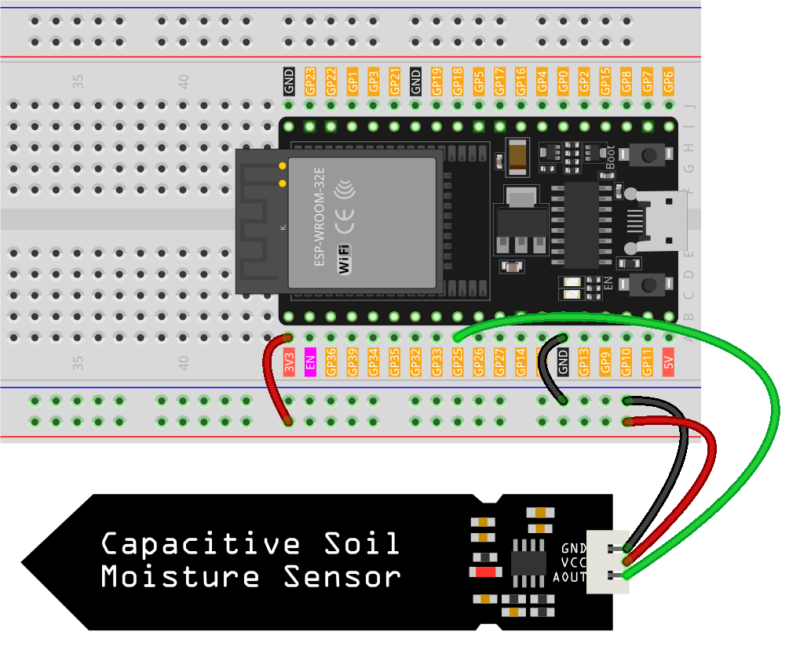

.. note:: 

    Ciao, benvenuto nella Community degli Appassionati di SunFounder Raspberry Pi & Arduino & ESP32 su Facebook! Approfondisci le tue conoscenze su Raspberry Pi, Arduino e ESP32 insieme ad altri appassionati.

    **Perché Unirsi?**

    - **Supporto degli Esperti**: Risolvi problemi post-vendita e sfide tecniche con l'aiuto della nostra comunità e del nostro team.
    - **Impara & Condividi**: Scambia consigli e tutorial per migliorare le tue competenze.
    - **Anteprime Esclusive**: Ottieni accesso anticipato alle nuove annunci di prodotti e anteprime esclusive.
    - **Sconti Speciali**: Goditi sconti esclusivi sui nostri prodotti più recenti.
    - **Promozioni Festive e Giveaway**: Partecipa ai giveaway e alle promozioni durante le festività.

    👉 Sei pronto a esplorare e creare con noi? Clicca [|link_sf_facebook|] e unisciti oggi!

.. _esp32_lesson02_soil_moisture:

Lezione 02: Modulo di Umidità del Suolo Capacitivo
=========================================================

In questa lezione, imparerai come utilizzare un sensore di umidità del suolo capacitivo con una scheda di sviluppo ESP32 per leggere il livello di umidità del suolo. Copriremo il collegamento del sensore al pin 25, la lettura del suo valore analogico e l'interpretazione di questi dati per determinare il livello di umidità del suolo. Questo progetto è ideale per i principianti poiché fornisce esperienza pratica nel lavorare con i sensori e nella comprensione dell'input analogico sulla piattaforma ESP32.

Componenti Necessari
--------------------------

Per questo progetto abbiamo bisogno dei seguenti componenti. 

È decisamente conveniente acquistare un kit completo, ecco il link: 

.. list-table::
    :widths: 20 20 20
    :header-rows: 1

    *   - Nome	
        - ARTICOLI IN QUESTO KIT
        - LINK
    *   - Kit Sensori Universali per Maker
        - 94
        - |link_umsk|

Puoi anche acquistarli separatamente dai link qui sotto.

.. list-table::
    :widths: 30 20
    :header-rows: 1

    *   - Introduzione al Componente
        - Link per l'Acquisto

    *   - ESP32 & Scheda di Sviluppo (:ref:`cpn_esp32_wroom_32e`)
        - |link_esp32_camera_pro_kit_buy|
    *   - :ref:`cpn_soil`
        - |link_soil_moisture_buy|
    *   - :ref:`cpn_breadboard`
        - |link_breadboard_buy|

Cablaggio
---------------------------

Codice
---------------------------

.. raw:: html

    <iframe src=https://create.arduino.cc/editor/sunfounder01/ab3dd759-5698-477c-b837-0c3719a09b8d/preview?embed style="height:510px;width:100%;margin:10px 0" frameborder=0></iframe>

Analisi del Codice
---------------------------

#. Definizione del pin del sensore:

   Questa linea di codice dichiara un intero costante ``sensorPin`` e gli assegna il valore ``25``, che è il pin al quale è collegato il sensore.

   .. code-block:: arduino

      const int sensorPin = 25;

#. Funzione di Setup:

   La funzione ``setup()`` viene eseguita una volta quando il programma inizia. Inizializza la comunicazione seriale a una velocità di 9600 baud. Questa configurazione è necessaria per inviare dati al monitor seriale.

   .. code-block:: arduino

      void setup() {
        Serial.begin(9600);
      }

#. Funzione Loop:

   La funzione ``loop()`` viene eseguita continuamente dopo il ``setup()``. Legge il valore del sensore dal pin A0 usando ``analogRead()`` e stampa questo valore sul monitor seriale. L'istruzione ``delay(500)`` interrompe il loop per 500 millisecondi prima della prossima lettura, controllando così la frequenza di acquisizione dei dati.

   .. code-block:: arduino

      void loop() {
        Serial.println(analogRead(sensorPin));
        delay(500);
      }

