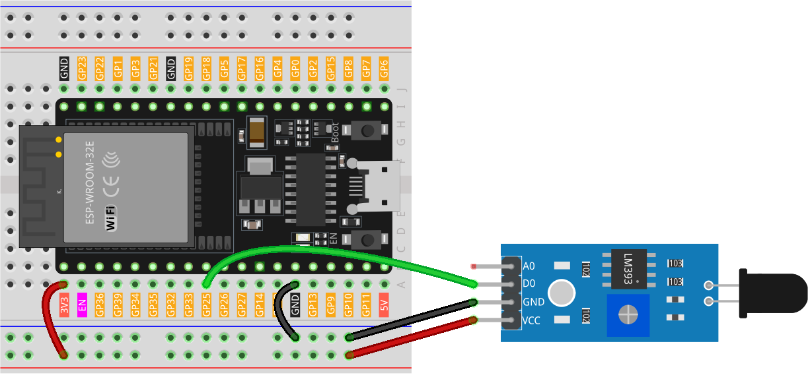

.. note:: 

    ¡Hola, bienvenido a la comunidad de entusiastas de SunFounder en Facebook sobre Raspberry Pi, Arduino y ESP32! Sumérgete más a fondo en Raspberry Pi, Arduino y ESP32 con otros aficionados.

    **¿Por qué unirse?**

    - **Soporte de Expertos**: Resuelve problemas posventa y desafíos técnicos con ayuda de nuestra comunidad y equipo.
    - **Aprender y Compartir**: Intercambia consejos y tutoriales para mejorar tus habilidades.
    - **Previsualizaciones Exclusivas**: Obtén acceso anticipado a anuncios de nuevos productos y avances exclusivos.
    - **Descuentos Especiales**: Disfruta de descuentos exclusivos en nuestros productos más nuevos.
    - **Promociones Festivas y Sorteos**: Participa en sorteos y promociones festivas.

    👉 ¿Listo para explorar y crear con nosotros? Haz clic en [|link_sf_facebook|] ¡y únete hoy!

.. _esp32_lesson03_flame:

Lección 03: Módulo Sensor de Llama
=====================================

En esta lección, aprenderás cómo conectar un sensor de llama a una Placa de Desarrollo ESP32 para la detección de incendios. Examinaremos la respuesta del sensor al fuego y cómo desencadena un mensaje de advertencia. Este proyecto es ideal para principiantes que trabajan con sensores y ESP32, proporcionando experiencia práctica en la monitorización de factores ambientales utilizando componentes electrónicos básicos.

Componentes Necesarios
--------------------------

En este proyecto, necesitamos los siguientes componentes.

Es definitivamente conveniente comprar un kit completo, aquí está el enlace:

.. list-table::
    :widths: 20 20 20
    :header-rows: 1

    *   - Nombre	
        - ARTÍCULOS EN ESTE KIT
        - ENLACE
    *   - Kit Universal de Sensores para Creadores
        - 94
        - |link_umsk|

También puedes comprarlos por separado en los enlaces a continuación.

.. list-table::
    :widths: 30 20
    :header-rows: 1

    *   - Introducción al Componente
        - Enlace de Compra

    *   - ESP32 & Placa de Desarrollo (:ref:`cpn_esp32_wroom_32e`)
        - |link_esp32_camera_pro_kit_buy|
    *   - :ref:`cpn_flame`
        - |link_flame_sensor_module_buy|
    *   - :ref:`cpn_breadboard`
        - |link_breadboard_buy|

Cableado
---------------------------

Código
---------------------------

.. raw:: html

    <iframe src=https://create.arduino.cc/editor/sunfounder01/82f965f6-4213-4c23-88db-4257cf12d920/preview?embed style="height:510px;width:100%;margin:10px 0" frameborder=0></iframe>

Análisis del Código
---------------------------

#. **Definición del Pin del Sensor**:

   Se define el pin al que está conectado el sensor de llama como una constante entera.
 
   .. code-block:: arduino

      const int sensorPin = 25;

#. **Función de Configuración**:

   Esta función se ejecuta una vez cuando el ESP32 se inicia. Inicializa el pin del sensor como una entrada y comienza la comunicación serial a una tasa de 9600 baudios para la salida.
 
   .. code-block:: arduino

      void setup() {
        pinMode(sensorPin, INPUT);
        Serial.begin(9600);
      }

#. **Función de Bucle**:

   El núcleo del programa, verifica continuamente el estado del sensor de llama. Si el sensor detecta una llama (devuelve 0), imprime un mensaje de alerta de incendio. De lo contrario, indica que no se detecta fuego. La verificación ocurre cada 100 milisegundos.
 
   .. code-block:: arduino

      void loop() {
        if (digitalRead(sensorPin) == 0) {
          Serial.println("** Fire detected!!! **");
        } else {
          Serial.println("No Fire detected");
        }
        delay(100);
      }
