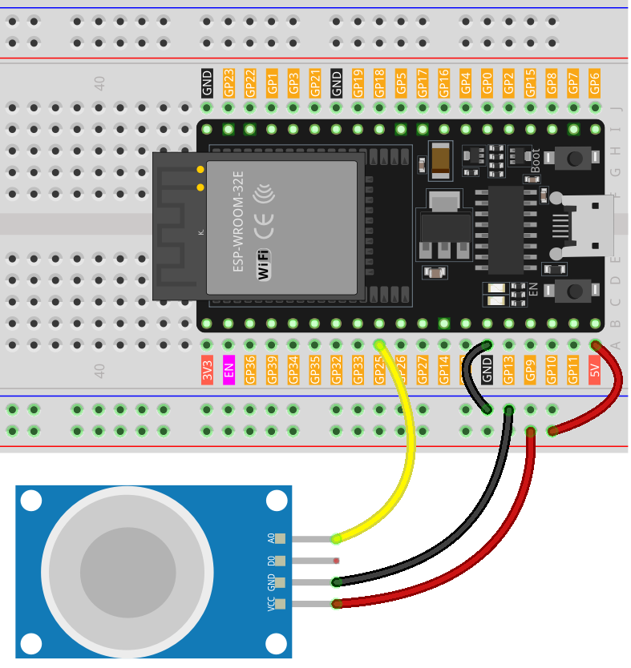

.. note::

    Ciao, benvenuto nella Comunità di Appassionati di Raspberry Pi, Arduino e ESP32 di SunFounder su Facebook! Approfondisci le tue conoscenze su Raspberry Pi, Arduino e ESP32 con altri appassionati.

    **Why Join?**

    - **Expert Support**: Risolvi problemi post-vendita e sfide tecniche con il supporto della nostra comunità e del nostro team.
    - **Learn & Share**: Scambia consigli e tutorial per migliorare le tue competenze.
    - **Exclusive Previews**: Ottieni accesso anticipato ad annunci di nuovi prodotti e anteprime esclusive.
    - **Special Discounts**: Godi di sconti esclusivi sui nostri prodotti più recenti.
    - **Festive Promotions and Giveaways**: Partecipa a giveaway e promozioni festive.

    👉 Pronto a esplorare e creare con noi? Clicca [|link_sf_facebook|] e unisciti oggi!

.. _esp32_lesson04_mq2:

Lezione 04: Modulo Sensore di Gas (MQ-2)
============================================

In questa lezione, imparerai come misurare le concentrazioni di gas utilizzando un sensore MQ-2 con una scheda di sviluppo ESP32. Tratteremo la lettura dell'output analogico del sensore di gas e la sua visualizzazione sul monitor seriale. Questo progetto è ideale per principianti nell'elettronica, offrendo esperienza pratica con sensori e microcontrollori mentre insegna il trattamento di segnali analogici e la comunicazione seriale.

Componenti Necessari
--------------------------

Per questo progetto, abbiamo bisogno dei seguenti componenti.

È decisamente conveniente acquistare un kit completo, ecco il link:

.. list-table::
    :widths: 20 20 20
    :header-rows: 1

    *   - Nome	
        - ELEMENTI IN QUESTO KIT
        - LINK
    *   - Kit Sensori Universale Maker
        - 94
        - |link_umsk|

Puoi anche acquistarli separatamente dai link qui sotto.

.. list-table::
    :widths: 30 10
    :header-rows: 1

    *   - Introduzione al Componente
        - Link d'acquisto

    *   - ESP32 & Scheda di Sviluppo (:ref:`cpn_esp32_wroom_32e`)
        - |link_esp32_camera_pro_kit_buy|
    *   - :ref:`cpn_gas`
        - |link_mq2_gas_sensor_module_buy|
    *   - :ref:`cpn_breadboard`
        - |link_breadboard_buy|

Cablaggio
---------------------------

Codice
---------------------------

.. raw:: html

    <iframe src=https://create.arduino.cc/editor/sunfounder01/79ef2209-7e92-4a53-81f2-1ba01214af31/preview?embed style="height:510px;width:100%;margin:10px 0" frameborder=0></iframe>

Analisi del Codice
---------------------------

1. La prima riga di codice è una dichiarazione di intero costante per il pin del sensore di gas. Utilizziamo il pin 25 per leggere l'uscita dal sensore di gas.

   .. code-block:: arduino

      const int sensorPin = 25;

2. La funzione ``setup()`` è dove iniziamo la nostra comunicazione seriale a una velocità di baud di 9600. Questo è necessario per stampare le letture dal sensore di gas sul monitor seriale.

   .. code-block:: arduino

      void setup() {
        Serial.begin(9600);  // Avvia la comunicazione seriale a 9600 baud
      }

3. La funzione ``loop()`` è dove continuiamo a leggere il valore analogico dal sensore di gas e lo stampiamo sul monitor seriale. Utilizziamo la funzione ``analogRead()`` per leggere il valore analogico dal sensore. Poi attendiamo 50 millisecondi prima della prossima lettura. Questo ritardo dà un po' di spazio per elaborare i dati al monitor seriale.

   .. note:: 

     MQ2 è un sensore alimentato da riscaldamento che generalmente richiede un periodo di pre-riscaldamento prima dell'uso. Durante il periodo di pre-riscaldamento, il sensore di solito legge valori elevati che diminuiscono gradualmente fino a stabilizzarsi.

   .. code-block:: arduino

      void loop() {
        Serial.print("Analog output: ");
        Serial.println(analogRead(sensorPin));  // Leggi il valore analogico del sensore di gas e stampalo sul monitor seriale
        delay(50);                             // Attendi 50 millisecondi
      }

