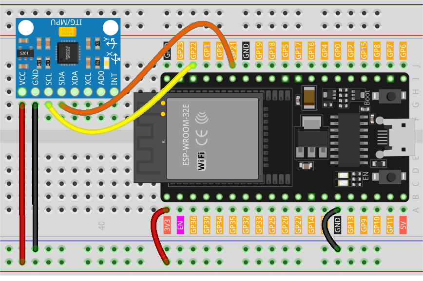

.. note::

    Bonjour, bienvenue dans la communauté des passionnés de SunFounder Raspberry Pi, Arduino et ESP32 sur Facebook ! Plongez plus profondément dans l'univers de Raspberry Pi, Arduino et ESP32 aux côtés d'autres passionnés.

    **Pourquoi rejoindre ?**

    - **Support d'experts** : Obtenez de l'aide pour résoudre les problèmes post-vente et les défis techniques grâce à notre communauté et notre équipe.
    - **Apprendre & Partager** : Échangez des astuces et des tutoriels pour enrichir vos compétences.
    - **Aperçus exclusifs** : Accédez en avant-première aux annonces de nouveaux produits et aux coulisses de leur développement.
    - **Réductions spéciales** : Profitez de promotions exclusives sur nos dernières nouveautés.
    - **Promotions festives et cadeaux** : Participez à des jeux concours et à des offres spéciales pour les fêtes.

    👉 Prêt à explorer et à créer avec nous ? Cliquez sur [|link_sf_facebook|] et rejoignez-nous dès aujourd'hui !

.. _esp32_lesson05_mpu6050:

Leçon 05 : Module Gyroscope & Accéléromètre (MPU6050)
==========================================================

Dans cette leçon, vous apprendrez à connecter le capteur accéléromètre et gyroscope MPU6050 à une carte de développement ESP32. Nous verrons comment configurer la bibliothèque Adafruit_MPU6050, initialiser le capteur et régler les plages de l’accéléromètre et du gyroscope. Vous découvrirez également comment lire les données d’accélération, de rotation et de température, puis les afficher sur le moniteur série. Ce projet est idéal pour ceux qui souhaitent explorer le suivi des mouvements et la détection d’orientation, offrant une expérience pratique avec des capteurs avancés sur la plateforme ESP32 compatible Arduino.

Composants requis
--------------------------

Pour ce projet, nous avons besoin des composants suivants.

Il est certainement pratique d'acheter un kit complet, voici le lien :

.. list-table::
    :widths: 20 20 20
    :header-rows: 1

    *   - Nom
        - ÉLÉMENTS DANS CE KIT
        - LIEN
    *   - Kit Capteurs Universel pour Makers
        - 94
        - |link_umsk|

Vous pouvez également les acheter séparément via les liens ci-dessous.

.. list-table::
    :widths: 30 10
    :header-rows: 1

    *   - Introduction des composants
        - Lien d'achat

    *   - ESP32 & Carte de développement (:ref:`cpn_esp32_wroom_32e`)
        - |link_esp32_camera_pro_kit_buy|
    *   - :ref:`cpn_mpu6050`
        - |link_mpu6050_buy|
    *   - :ref:`cpn_breadboard`
        - |link_breadboard_buy|

Câblage
---------------------------

Code
---------------------------

.. note:: 
    Pour installer la bibliothèque, utilisez le Gestionnaire de Bibliothèques Arduino et recherchez **"Adafruit MPU6050"**, puis installez-la. 

.. raw:: html

    <iframe src=https://create.arduino.cc/editor/sunfounder01/9464e05b-2cab-4185-bf6d-983e907dd279/preview?embed style="height:510px;width:100%;margin:10px 0" frameborder=0></iframe>

Analyse du code
---------------------------

1. Le code commence par inclure les bibliothèques nécessaires et par créer un objet pour le capteur MPU6050. Il utilise la bibliothèque ``Adafruit_MPU6050`` pour interagir avec le capteur et récupérer les données d’accélération, de rotation et de température. La bibliothèque ``Adafruit_Sensor`` fournit une interface commune pour différents types de capteurs. La bibliothèque ``Wire`` est utilisée pour la communication I2C, nécessaire à l’échange de données avec le MPU6050.

   .. note:: 
       Pour installer la bibliothèque, utilisez le Gestionnaire de Bibliothèques Arduino et recherchez **"Adafruit MPU6050"**, puis installez-la. 
   
   .. code-block:: arduino
   
      #include <Adafruit_MPU6050.h>
      #include <Adafruit_Sensor.h>
      #include <Wire.h>
      Adafruit_MPU6050 mpu;
   
2. La fonction ``setup()`` initialise la communication série et vérifie si le capteur est détecté. Si le capteur n'est pas trouvé, l’ESP32 entre dans une boucle infinie en affichant un message d’erreur. Si le capteur est détecté, les plages de l’accéléromètre et du gyroscope sont définies, ainsi que la bande passante du filtre, avec un délai pour la stabilisation.

   .. code-block:: arduino
   
      void setup(void) {
        // Initialisation de la communication série
        Serial.begin(9600);
   
        // Vérification de la présence du capteur MPU6050
        if (!mpu.begin()) {
          Serial.println("Failed to find MPU6050 chip");
          while (1) {
            delay(10);
          }
        }
        Serial.println("MPU6050 Found!");
   
        // Définir la plage de l’accéléromètre à ±8G
        mpu.setAccelerometerRange(MPU6050_RANGE_8_G);
   
        // Définir la plage du gyroscope à ±500 degrés/s
        mpu.setGyroRange(MPU6050_RANGE_500_DEG);
   
        // Définir la bande passante du filtre à 21 Hz
        mpu.setFilterBandwidth(MPU6050_BAND_21_HZ);
   
        // Ajouter un délai pour stabilisation
        delay(100);
      }

3. Dans la fonction ``loop()``, le programme crée des événements pour stocker les relevés du capteur, puis récupère ces données. Les valeurs d’accélération, de rotation et de température sont ensuite affichées sur le moniteur série.

   .. code-block:: arduino
   
      void loop() {
        // Obtenir les nouvelles mesures du capteur
        sensors_event_t a, g, temp;
        mpu.getEvent(&a, &g, &temp);
   
        // Afficher les valeurs d’accélération, de rotation et de température
        // ...

        // Ajouter un délai pour éviter de saturer le moniteur série
        delay(1000);
      }
