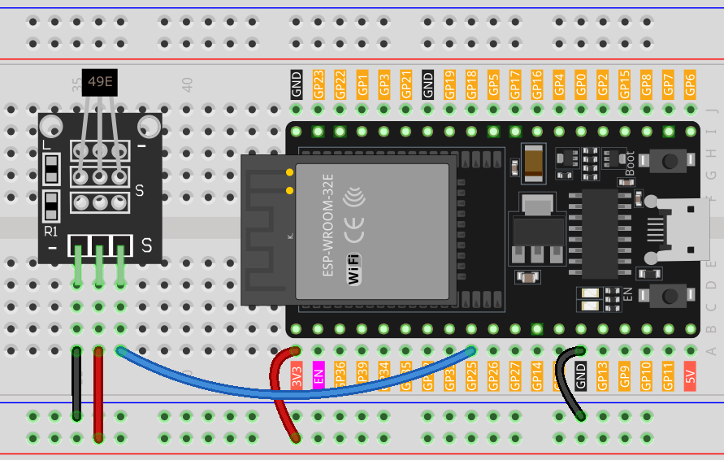

.. note::

    Ciao, benvenuto nella Comunità di Appassionati di Raspberry Pi, Arduino e ESP32 di SunFounder su Facebook! Approfondisci le tue conoscenze su Raspberry Pi, Arduino e ESP32 con altri appassionati.

    **Why Join?**

    - **Expert Support**: Risolvi problemi post-vendita e sfide tecniche con il supporto della nostra comunità e del nostro team.
    - **Learn & Share**: Scambia consigli e tutorial per migliorare le tue competenze.
    - **Exclusive Previews**: Ottieni accesso anticipato ad annunci di nuovi prodotti e anteprime esclusive.
    - **Special Discounts**: Godi di sconti esclusivi sui nostri prodotti più recenti.
    - **Festive Promotions and Giveaways**: Partecipa a giveaway e promozioni festive.

    👉 Pronto a esplorare e creare con noi? Clicca [|link_sf_facebook|] e unisciti oggi!

.. _esp32_lesson06_hall_sensor:

Lezione 06: Modulo Sensore Hall
==================================

In questa lezione, imparerai come utilizzare un sensore Hall con una scheda di sviluppo ESP32 per rilevare la polarità di un campo magnetico. Tratteremo la lettura dei segnali analogici dal sensore e l'interpretazione di questi per differenziare tra i poli nord e sud. Questo progetto è ideale per i principianti in elettronica, fornendo esperienza pratica con i sensori e l'elaborazione dei segnali sulla piattaforma ESP32.

Componenti Necessari
--------------------------

Per questo progetto, abbiamo bisogno dei seguenti componenti.

È decisamente conveniente acquistare un kit completo, ecco il link:

.. list-table::
    :widths: 20 20 20
    :header-rows: 1

    *   - Nome	
        - ELEMENTI IN QUESTO KIT
        - LINK
    *   - Kit Sensori Universale Maker
        - 94
        - |link_umsk|

Puoi anche acquistarli separatamente dai link qui sotto.

.. list-table::
    :widths: 30 20
    :header-rows: 1

    *   - Introduzione al Componente
        - Link d'acquisto

    *   - ESP32 & Scheda di Sviluppo (:ref:`cpn_esp32_wroom_32e`)
        - |link_esp32_camera_pro_kit_buy|
    *   - :ref:`cpn_hall`
        - \-
    *   - :ref:`cpn_breadboard`
        - |link_breadboard_buy|

Cablaggio
---------------------------

Codice
---------------------------

.. raw:: html

    <iframe src=https://create.arduino.cc/editor/sunfounder01/48094da0-b2f8-4af6-ad59-38504a201cbf/preview?embed style="height:510px;width:100%;margin:10px 0" frameborder=0></iframe>

Analisi del Codice
---------------------------

1. Configurazione del Sensore Hall

   .. code-block:: arduino

      const int hallSensorPin = 25;  // Pin collegato all'uscita del sensore Hall
      void setup() {
        Serial.begin(9600);             // Inizia la comunicazione seriale a 9600 bps
        pinMode(hallSensorPin, INPUT);  // Imposta il pin del sensore Hall come input
      }

   L'uscita del sensore Hall è collegata al pin 25 sulla scheda di sviluppo ESP32. La funzione ``setup()`` viene utilizzata per iniziare la comunicazione seriale a 9600 bit per secondo (bps) per visualizzare i dati sul monitor seriale. La funzione ``pinMode()`` è utilizzata per configurare il pin 25 come pin di ingresso.

2. Lettura dal Sensore Hall e Determinazione della Polarità

   Il modulo sensore Hall è dotato di un sensore Hall lineare 49E, che può misurare la polarità dei poli nord e sud del campo magnetico oltre alla forza relativa del campo magnetico. Se si avvicina il polo sud di un magnete al lato contrassegnato con 49E (il lato con il testo inciso), il valore letto dal codice aumenterà linearmente in proporzione alla forza del campo magnetico applicato. Al contrario, se si avvicina un polo nord a questo lato, il valore letto dal codice diminuirà linearmente in proporzione a quella forza del campo magnetico. Per maggiori dettagli, si prega di fare riferimento a :ref:`cpn_hall`.

   .. code-block:: arduino

      void loop() {
        int sensorValue = analogRead(hallSensorPin);  // Leggi il valore analogico dal sensore Hall
        Serial.print(sensorValue);                    // Stampa il valore del sensore grezzo sul Monitor Seriale
        delay(200);                                   // Ritardo di 200 millisecondi

        // Determina il polo magnetico in base al valore del sensore
        if (sensorValue >= 2600) {
          Serial.print(" - South pole detected");  // Polo sud rilevato se il valore è >= 2600
        } else if (sensorValue <= 1200) {
          Serial.print(" - North pole detected");  // Polo nord rilevato se il valore è <= 1200
        }

        Serial.println();  // Nuova linea per il prossimo output
      }

