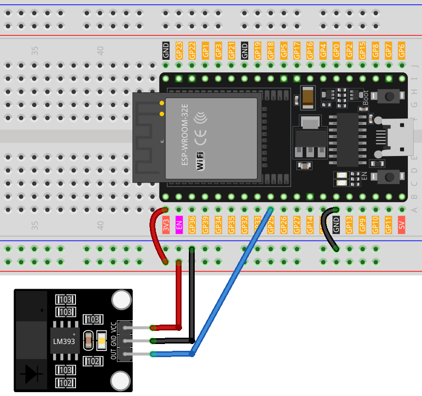

.. note::

    Ciao, benvenuto nella Comunità di Appassionati di Raspberry Pi, Arduino e ESP32 di SunFounder su Facebook! Approfondisci le tue conoscenze su Raspberry Pi, Arduino e ESP32 con altri appassionati.

    **Why Join?**

    - **Expert Support**: Risolvi problemi post-vendita e sfide tecniche con il supporto della nostra comunità e del nostro team.
    - **Learn & Share**: Scambia consigli e tutorial per migliorare le tue competenze.
    - **Exclusive Previews**: Ottieni accesso anticipato ad annunci di nuovi prodotti e anteprime esclusive.
    - **Special Discounts**: Godi di sconti esclusivi sui nostri prodotti più recenti.
    - **Festive Promotions and Giveaways**: Partecipa a giveaway e promozioni festive.

    👉 Pronto a esplorare e creare con noi? Clicca [|link_sf_facebook|] e unisciti oggi!

.. _esp32_lesson07_speed:

Lezione 07: Modulo Sensore di Velocità a Infrarossi
========================================================

In questa lezione, imparerai come utilizzare una Scheda di Sviluppo ESP32 con un Modulo Sensore di Velocità per rilevare ostruzioni. Vedremo come il sensore invia un segnale alto quando c'è un'ostacolo e un segnale basso quando il percorso è libero. Questo progetto è ideale per chi desidera comprendere l'integrazione dei sensori e le operazioni di input/output di base in un contesto pratico utilizzando la piattaforma ESP32.

Componenti Necessari
--------------------------

Per questo progetto, abbiamo bisogno dei seguenti componenti.

È decisamente conveniente acquistare un kit completo, ecco il link:

.. list-table::
    :widths: 20 20 20
    :header-rows: 1

    *   - Nome	
        - ELEMENTI IN QUESTO KIT
        - LINK
    *   - Kit Sensori Universale Maker
        - 94
        - |link_umsk|

Puoi anche acquistarli separatamente dai link qui sotto.

.. list-table::
    :widths: 30 20
    :header-rows: 1

    *   - Introduzione al Componente
        - Link d'acquisto

    *   - ESP32 & Scheda di Sviluppo (:ref:`cpn_esp32_wroom_32e`)
        - |link_esp32_camera_pro_kit_buy|
    *   - :ref:`cpn_breadboard`
        - |link_breadboard_buy|
    *   - :ref:`cpn_speed`
        - |link_speed_sensor_module_buy|

Cablaggio
---------------------------

Codice
---------------------------

.. raw:: html

    <iframe src=https://create.arduino.cc/editor/sunfounder01/bdf494c6-c0b1-4dbd-89bc-ce671db41bbb/preview?embed style="height:510px;width:100%;margin:10px 0" frameborder=0></iframe>

Analisi del Codice
---------------------------

#. Definire il pin del sensore

   Il pin del sensore è dichiarato come intero costante e assegnato al numero di pin 25 dell'ESP32.

   .. code-block:: arduino

      const int sensorPin = 25;

#. Funzione Setup

   Questa funzione inizializza la comunicazione seriale a una velocità di 9600 baud e imposta il sensorPin come input.

   .. code-block:: arduino
    
      void setup() {
        Serial.begin(9600);
        pinMode(sensorPin, INPUT);
      }

#. Funzione Loop

   La funzione loop controlla continuamente lo stato del pin del sensore.
   Se il pin del sensore legge HIGH, stampa "Ostruzione rilevata" sul Monitor Seriale.
   Se il pin del sensore è LOW, stampa "Libero".

   .. code-block:: arduino

      void loop() {
        if (digitalRead(sensorPin) == HIGH) {
          Serial.println("Obstruction detected");
        } else {
          Serial.println("Unobstructed");
        }
      }

#. Altro

   Se un encoder è montato sul motore, la velocità di rotazione del motore può essere calcolata contando il numero di volte che un'ostruzione passa il sensore in un determinato periodo.

   .. image:: img/Lesson_07_Encoder_Disk.png
      :align: center
      :width: 20%