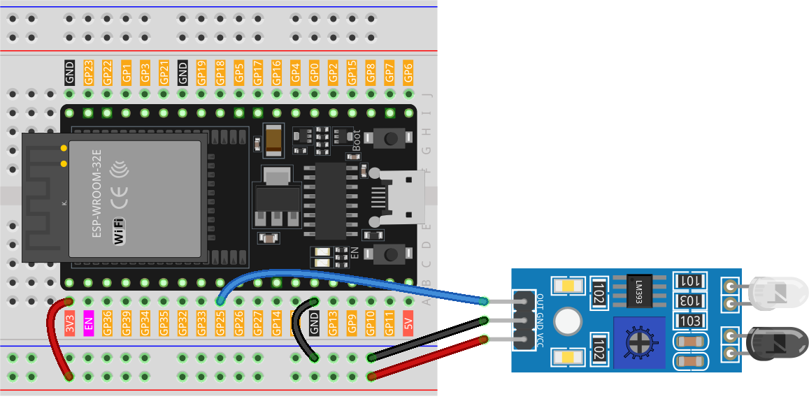

.. note::

    Ciao, benvenuto nella Comunità di Appassionati di Raspberry Pi, Arduino e ESP32 di SunFounder su Facebook! Approfondisci le tue conoscenze su Raspberry Pi, Arduino e ESP32 con altri appassionati.

    **Why Join?**

    - **Expert Support**: Risolvi problemi post-vendita e sfide tecniche con il supporto della nostra comunità e del nostro team.
    - **Learn & Share**: Scambia consigli e tutorial per migliorare le tue competenze.
    - **Exclusive Previews**: Ottieni accesso anticipato ad annunci di nuovi prodotti e anteprime esclusive.
    - **Special Discounts**: Godi di sconti esclusivi sui nostri prodotti più recenti.
    - **Festive Promotions and Giveaways**: Partecipa a giveaway e promozioni festive.

    👉 Pronto a esplorare e creare con noi? Clicca [|link_sf_facebook|] e unisciti oggi!

.. _esp32_lesson08_ir_obstacle_avoidance:

Lezione 08: Modulo Sensore di Evitamento Ostacoli IR
========================================================

In questa lezione, imparerai come utilizzare un sensore di evitamento ostacoli a infrarossi con una Scheda di Sviluppo ESP32. Esploreremo come il sensore rileva gli ostacoli e modifica il suo segnale di uscita. Imparerai anche come leggere questi segnali utilizzando l'ESP32 e visualizzarli sul monitor seriale. Questo progetto offre un'ottima opportunità per i principianti di acquisire esperienza pratica con i sensori e l'elaborazione di input digitali sulla piattaforma ESP32, rendendolo perfetto per chi è interessato a costruire progetti interattivi.

Componenti Necessari
--------------------------

Per questo progetto, abbiamo bisogno dei seguenti componenti.

È decisamente conveniente acquistare un kit completo, ecco il link:

.. list-table::
    :widths: 20 20 20
    :header-rows: 1

    *   - Nome	
        - ELEMENTI IN QUESTO KIT
        - LINK
    *   - Kit Sensori Universale Maker
        - 94
        - |link_umsk|

Puoi anche acquistarli separatamente dai link qui sotto.

.. list-table::
    :widths: 30 20
    :header-rows: 1

    *   - Introduzione al Componente
        - Link d'acquisto

    *   - ESP32 & Scheda di Sviluppo (:ref:`cpn_esp32_wroom_32e`)
        - |link_esp32_camera_pro_kit_buy|
    *   - :ref:`cpn_ir_obstacle`
        - |link_obstacle_avoidance_module_buy|
    *   - :ref:`cpn_breadboard`
        - |link_breadboard_buy|

Cablaggio
---------------------------

Codice
---------------------------

.. raw:: html

    <iframe src=https://create.arduino.cc/editor/sunfounder01/e04a4a04-e707-46a1-aee5-488add646356/preview?embed style="height:510px;width:100%;margin:10px 0" frameborder=0></iframe>

Analisi del Codice
---------------------------

1. Definire il numero del pin per la connessione del sensore:

   .. code-block:: arduino

     const int sensorPin = 25;

   Collega il pin di uscita del sensore al pin 25.

2. Impostare la comunicazione seriale e definire il pin del sensore come input:

   .. code-block:: arduino

     void setup() {
       pinMode(sensorPin, INPUT);  
       Serial.begin(9600);
     }

   Inizializza la comunicazione seriale a una velocità di 9600 baud per stampare sul monitor seriale.
   Imposta il pin del sensore come input per leggere il segnale di input.

3. Leggere il valore del sensore e stamparlo sul monitor seriale:

   .. code-block:: arduino

     void loop() {
       Serial.println(digitalRead(sensorPin));
       delay(50); 
     }
   
   Leggi continuamente il valore digitale dal pin del sensore usando ``digitalRead()`` e stampa il valore sul monitor seriale usando ``Serial.println()``.
   Aggiungi un ritardo di 50ms tra le stampe per una migliore visualizzazione.

   .. note:: 
   
      Se il sensore non funziona correttamente, regola il trasmettitore IR e il ricevitore per renderli paralleli. Inoltre, puoi regolare la gamma di rilevamento usando il potenziometro incorporato.
